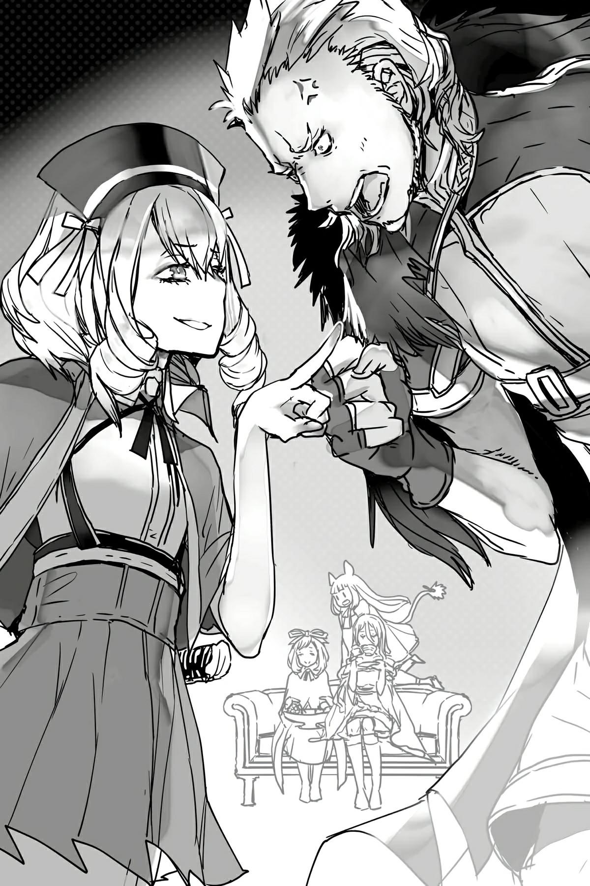

# Chương 4: Đặt chân lên Thiên giới
*(Arrival in Heaven)*

Ngủ, thức dậy, ăn, tạo tơ, ăn, lười biếng nằm ườn, ngủ.

Nơi này chính là thiên giới sao?

Bởi vì đây là tất cả những gì tôi hằng ao ước!

“Thế tóm lại là cô đã làm cái trò gì trong lúc tôi đang phải học xì khói đầu thế hả?”

À. Vampy đã tới, trán nổi đầy gân xanh, phá hỏng thiên đường hoàn hảo của tôi.

“Sao cô không cùng tôi học lễ nghi các thứ đi, đằng nào thì rõ ràng cô cũng có việc gì tốt hơn để làm đâu?”

Vampy vừa cười vừa cưỡng chế lôi tôi ra khỏi phòng.

Khônggg!

Tôi không muốn đi học đâu!

Nhưng chuyện này kể ra cũng hơi đáng buồn. Hiện tại tôi thậm chí còn chẳng có đủ sức lực để giằng ra khỏi tay của Vampy nữa.

Gừừ! Cái việc mất hết chỉ số định cứ phá hỏng cuộc đời tôi đến bao giờ nữa đây?!

Thế là, tôi bị ép phải đi cùng với Vampy.

À nhân tiện, nếu bạn thắc mắc tại sao con nhóc ma cà rồng lại có thể tự tiện ra vào phòng tôi ngay từ đầu như thế, thì đó là vì ngay sau khi Kẻ Du Côn kia tấn công phòng tôi, con bé cũng nhảy vào tấn công tôi luôn.

Phải, tôi nói thế đấy. Con bé không hề đến an ủi tôi đâu nhé. Nó đến để tấn công tôi.

Đành rằng con bé có chạy đến khi nghe thấy tiếng động, nhưng phản ứng đầu tiên của nó là nở một nụ cười như một ác nhân cấp cao rồi bảo: “Ồ, tốt quá. Giờ thì mình có thể vào rồi.”

Rồi con bé ngang nhiên xông vào phòng tôi cứ như thể đã chờ đợi khoảnh khắc này từ lâu lắm rồi, lườm tôi cháy mặt rồi tuyên bố: “Hy vọng cô đã rút ra bài học cho mình. Đừng có mà mơ chặn cái cửa đó lại lần nữa.”

Tôi đoán con nhóc này cũng chẳng mấy vui vẻ gì với việc chúng tôi cứ ru rú trong phòng.

Tôi phải nghe lời con bé, bằng không nó sẽ giết tôi mất!

Riel và Fiel hình như cũng có chung cảm giác đó, vì hai đứa đang bám chặt lấy cánh tay tôi và run rẩy bần bật.

Một đứa con nít làm cho những đứa con nít khác sợ phát khiếp.

Đúng là đáng sợ thật mà...

Khoan đã, chẳng phải Riel và Fiel mạnh hơn Vampy nhiều sao?!

Tại sao tụi nhóc các người lại SỢ hả?!

Nhưng trong khoảnh khắc đó, nỗi sợ hãi đã khiến chúng tôi phải đầu hàng trước lời đe dọa của Vampy.

Chết tiệt! Chuyện đáng lẽ không được diễn ra như thế này!

Và giờ khi phòng tôi đã mở cửa đón khách, cứ có cơ hội là Vampy lại đến tấn công chúng tôi.

Phải, tôi nói thế đấy. Không phải ghé chơi. Là tấn công.

Nếu con bé đến vào buổi sáng khi chúng tôi đang tạo tơ, nó sẽ phá bĩnh công việc của chúng tôi và cản đường cản lối; còn nếu con bé đến vào giờ trà chiều thanh nhã của chúng tôi, nó sẽ cướp sạch bánh kẹo và bánh kem.

Không có người giám hộ Mera ở bên, con bé đang dần trở thành một bạo chúa!

Và giờ thì mọi chuyện đã đi đến nước này: bắt cóc tôi một cách thô bạo.

Đến cả tính cách nổi tiếng là hiền dịu ôn hòa của tôi cũng không chịu đựng nổi chuyện này nữa rồi, biết chưa hả?

Nhưng tôi chỉ giữ suy nghĩ đó cho riêng mình thôi.

Tôi chắc chắn là Vampy cũng đang thấy cô đơn.

Con bé bị tách khỏi chỗ dựa tinh thần yêu dấu của mình là Mera, chưa kể đến người thầy Ma Vương.

Cuộc sống đồng hành cùng nhau trên đường của chúng tôi khá là nhộn nhịp, thế nên sự tương phản rõ rệt với cuộc sống ở đây chắc chắn đã làm con bé thấy cô đơn, đó là lý do tại sao nó lại giận cá chém thớt như thế này.

Yep, chắc chắn là vậy rồi.

Nhưng đừng lo. Người chị lớn ở đây cực kỳ tốt bụng và kiên nhẫn nhé.

Tôi hoàn toàn có thể chiều theo những ý muốn ích kỷ của một đứa trẻ!

Trời ạ, sao tôi lại tốt tính thế không biết.

Thế là hành trình làm đôi bạn cùng tiến của tôi và Vampy bắt đầu.

...Ừm, xin lỗi nhé. Tôi bỏ cuộc bây giờ có được không? Cái gì? Không được á?

Đi màaa! Cái này siêu chán luôn!

Mấy buổi học kiến thức thông thường thì còn đỡ. Ma Vương đã giảng giải cho chúng tôi đủ thứ trên đường đi, thỉnh thoảng chúng tôi cũng đọc sách tự học nên tôi hiểu hầu hết nội dung bài học.

Nhưng còn cái hội thảo lễ nghi á? Cái đó thì chịu chết!

Cách đi đứng và ăn uống đúng chuẩn các thứ là sao hả trời?

Hic, cái này siêu cấp khó luôn!

Cái trò này chắc là dùng nhóm cơ khác hẳn với đi bộ bình thường, vì toàn thân tôi ê ẩm hết cả lên!

Còn về quy tắc ăn uống trên bàn ăn, bạn phải để ý đủ thứ chuyện phiền phức trong lúc ăn, thế nên chẳng thể thưởng thức đồ ăn một cách đàng hoàng được nữa! Tôi không được ăn uống thỏa thích cho đến khi căng bụng như trước đây nữa!

Nếu ban ngày đã không được ăn nhiều, thì ít nhất tôi cũng muốn được nhâm nhi hương vị đồ ăn trong lúc ăn chứ, nhưng giờ thì đến cả chuyện đó cũng không làm được!

Sao người ta lại có thể phá hỏng cả việc ĂN UỐNG như thế chứ?!

Và rồi món tráng miệng kinh dị xuất hiện—học khiêu vũ!

Trông tôi có giống người có thể chịu đựng được cường độ vận động mạnh như thế này không?

Tính giết tôi hay gì?!

Thế nên mỗi lần được Vampy lôi về phòng, tôi chỉ còn là cái xác không hồn.

Nếu tôi phải tập luyện chiến đấu các thứ nữa chắc tôi ngủm củ tỏi thật quá.

May thay, gia sư riêng của Vampy đã từ bỏ tôi trước khi chúng tôi tiến đến phần luyện tập chiến đấu.

Không biết tôi có thể thuyết phục các giáo viên khác từ bỏ tôi luôn được không nhỉ?

Đặc biệt là mấy giáo viên dạy lễ nghi ấy.

Nhân tiện! Nếu bạn hỏi tôi, thì lễ nghĩa chắc chắn là thứ mà Vampy đang cần nhất.

Giống như tôi, Vampy đã học được rất nhiều thứ từ Ma Vương rồi, nên con bé cũng tiếp thu rất tốt các bài học thông thường.

Chưa kể chúng tôi còn có mớ kiến thức khuyến mãi từ kiếp trước, nghĩa là não bộ của Vampy đi trước những đứa trẻ cùng trang lứa tới vài dặm.

Giáo viên thậm chí còn tấm tắc khen con bé là một thần đồng cơ mà.

Nhưng còn lễ nghi á? Thì không hẳn.

Kiếp trước chúng tôi rõ ràng đâu cần học mấy quy tắc lễ nghĩa cầu kỳ sang chảnh này, và Ma Vương thì cũng chẳng thèm dạy chúng tôi, vì về mặt lý thuyết cô ta cũng đâu phải quý tộc.

Thỉnh thoảng Mera có giảng giải sơ qua cho con nhóc ma cà rồng khi cậu ta rảnh rỗi, nhưng cái đó cũng không đi sâu lắm. Có khi cặp đôi ma cà rồng đó lúc nào cũng tập trung vào huấn luyện chiến đấu hơn là lễ nghi nữa ấy chứ.

Đúng là một đám ưa bạo lực mà.

Thế nên lễ nghĩa của Vampy chỉ ở mức vừa tầm tuổi, hoặc có khi là cao hơn một chút.

Lũ trẻ quý tộc chắc là bị nhồi nhét lễ nghi từ lúc mới lọt lòng rồi. Nghĩ thôi đã thấy đáng sợ đúng không?

Dù vậy tôi vẫn thấy ấn tượng khi lễ nghĩa của Vampy gần như sánh ngang với lũ trẻ quý tộc thực thụ lớn lên trong môi trường đó.

Còn tôi á?

Thì trông tôi đã giống như một học sinh trung học rồi còn gì!

Giáo viên dạy lễ nghi nhìn tôi một cái là kêu lên “Ôi chao ôi!” ngay lập tức, rõ chưa?!

Bà ấy chắc là nghĩ rằng sẽ thật thú vị khi được dạy một học sinh bằng ngần này tuổi đầu rồi mà vẫn chưa biết tí quy tắc lễ nghĩa nào!

Ủa, xin lỗi nhé? Tôi biết ngoại hình của mình không giống lắm, nhưng thực chất tôi cũng trạc tuổi Vampy thôi nhé!

Đừng có để ngoại hình đánh lừa.

Tôi chỉ là một cô bé đáng yêu thôi!

Thế nên làm ơn nhẹ tay với tôi một chút, xin cảm ơn rất nhiều.

Nhưng bên cạnh đống bài học lễ nghi kinh dị hàng ngày làm tôi đau nhức xương cốt ra, thì còn có hai chuyện khác nữa làm tôi muốn phát điên.

Một là nỗ lực khôi phục sức mạnh của tôi vẫn chưa đi đến đâu cả.

Còn chuyện kia... Ừm, đúng hơn là một người chứ không phải một chuyện.

“Yo.”

“Biến đi.”

Chính là tên Kẻ Du Côn quen thuộc của chúng ta, kẻ luôn nhận được sự tiếp đón lạnh nhạt từ Vampy mỗi lần hắn tới.

Phải, đúng thế đấy.

Chẳng hiểu sao cái tên cuồng phóng hỏa ngu ngốc mà tôi cứ ngỡ sẽ không bao giờ phải gặp lại kia lại liên tục vác mặt đến đây suốt ngày.

Này, ông quản gia trưởng ơi?

Chẳng phải ông đã hứa sẽ không để tên này đến gần tôi nữa sao?

Nhưng giận lây sang ông quản gia trưởng thì cũng không đúng chỗ lắm.

Tên du côn này xảo quyệt hơn vẻ bề ngoài của hắn, vì hắn lúc nào cũng canh lúc quản gia trưởng không có mặt mới mò tới.

Vì quản gia trưởng phụng sự chủ nhân Balto, nên thỉnh thoảng ông ấy phải đến lâu đài Ma Vương.

Vừa làm trợ lý cho Balto vừa quán xuyến cái dinh thự này, quản gia trưởng cực kỳ bận rộn.

Kẻ Du Côn đã tận dụng kẽ hở đó để đến tấn công lúc chúng tôi không được bảo vệ.

Mấy gia nhân khác có vẻ không cản được hắn, dù sao hắn cũng là em trai của chủ nhà mà, thế nên mấy cô hầu gái đành phải dẫn hắn đến đây với vẻ mặt đầy ái ngại.

Thấy chưa, đây chính là lý do tại sao cấm được trao bất kỳ quyền hành nào cho lũ trẻ rắc rối đấy!

“Xéo đi. Trẻ con thì lo việc của trẻ con đi, đừng có chĩa mũi vào chuyện của người lớn.”

“Thế thì có lẽ anh cũng nên tự lo việc của mình đi. Vì rõ ràng đầu óc của anh cũng chỉ ngang một đứa con nít mà thôi.”

Một luồng gió lạnh đột ngột thổi qua căn phòng.

Và tôi không nói theo nghĩa bóng đâu nhé. Có gió thổi trong phòng thật đấy.

Ma lực thoát ra từ Vampy và Kẻ Du Côn, hai kẻ mang thuộc tính Băng và Hỏa tương ứng, đang va chạm vào nhau và tạo thành gió do sự chênh lệch nhiệt độ quá lớn.

Vì trong phòng lạnh buốt nên có vẻ sức mạnh của Vampy đang áp đảo Kẻ Du Côn rồi. Tuyệt.

Nhân tiện, lạnh cóng cả người rồi đây này, dừng lại giùm cái được không?

Tại sao giờ trà chiều quý giá của tôi lại biến thành chiến trường thế này?

Tôi không hiểu nổi. Thực sự không hiểu nổi...

Mà thôi, nếu không hiểu chuyện gì thì tốt nhất là cứ bơ đi đúng không?

Với suy nghĩ đó, tôi nhấp một ngụm trà đã hơi nguội đi vì bầu không khí lạnh giá.

Riel và Fiel vẫn tiếp tục nhồi bánh ngọt đầy họng, hoàn toàn lờ tịt Kẻ Du Côn đi.

Hai đứa này mang tiếng là vệ sĩ của tôi, nhưng Kẻ Du Côn cứ ngang nhiên xông vào thường xuyên đến mức chúng thèm không thèm để ý đến hắn nữa rồi.

Cảm ơn hai nhóc nhiều nhé.

Còn anh nữa, Kẻ Du Côn. Cảm giác lườm nguýt cháy mặt một đứa con nít như Vampy thế nào hả?

Con bé rõ ràng là ghét hắn tận xương tủy rồi.

Nhưng đứng dưới góc nhìn trung lập, cảnh tượng một gã to con thô kệch và một cô bé hạt tiêu trừng mắt lườm nhau trông cực kỳ kỳ cục.

Úi chà. Giờ hai đứa chuyển sang đấu khẩu rồi à?

Nội dung đống lời lăng mạ đó thì tôi xin phép để các bạn tự tưởng tượng nhé.

Thực tình thì, chỉ tại tụi nó đấu khẩu con nít quá, chẳng bõ công thuật lại chi tiết cho các bạn nghe làm gì.

Người ta bảo những người cùng đẳng cấp mới cãi nhau được mà...

“Sael.” Do quá nóng máu, Vampy gắt gao gọi tên Sael.

Sael, đứa nãy giờ vẫn đang ngồi bất động với chiếc tách trên tay, lập tức đứng bật dậy.

Khoan đã, dừng lại! Hết giờ rồi!

Tôi dùng cử chỉ tay ra hiệu cho Sael ngồi xuống trở lại.

Rất biết nghe lời, con bé ngồi xuống ngay.

Phùuu.

Nghe này Vampy. Tôi không cần biết nhóc đang nổi khùng thế nào; nhưng cấm không được lôi Sael vào việc này nhé.

Nhóc đó không biết đùa đâu, rõ chưa?

Nếu nhóc bảo nó tấn công, nó sẽ thực sự giết chết tên kia ngay tại chỗ đấy.

Bất kể nhóc có đưa ra mệnh lệnh điên rồ nào trong lúc giận quá mất khôn, Sael cũng sẽ chấp hành mệnh lệnh đó bằng mọi giá.

Đây là sản phẩm cần "đọc kỹ hướng dẫn sử dụng trước khi dùng" đấy, rõ chưa? Phải cực kỳ cẩn thận khi ra lệnh cho Sael, bằng không thì hậu quả tự chịu nhé!

...Và dĩ nhiên, tôi hoàn toàn không hề thầm nghĩ rằng nếu con bé thực sự thịt luôn tên Kẻ Du Côn phiền phức kia thì cũng chẳng sao đâu nhé.

Tôi cũng tuyệt đối không hề nghĩ mình có thể đổ hết tội lỗi lên đầu Vampy nếu chuyện đó xảy ra đâu.

Không hề. Một chút cũng không nhé.

“Thực sự chứ, anh mò đến đây làm cái quái gì thế hả?! Biến đi cho rảnh nợ!”

“Câm miệng đi, chết tiệt! Tao không đến đây để nói chuyện với mày, cái đó là chắc chắn! Với cả, đây là nhà của tao nhé, chết tiệt!”

Aiiih, thật là yên bình quá đi.

Quay mặt đi hướng khác để tránh hai đứa Vampy và Kẻ Du Côn, tôi cắn một miếng bánh ngọt.

“Còn cô kia nữa! Đừng có bơ tao nữa coi, chết tiệt!”

Á! Giờ hắn lại quay sang tôi hả?!

Tôi không muốn dây dưa với hắn đâu, thế nên tôi sẽ cứ nhìn đăm đăm vào tuần sau và giả vờ như điếc.

“Phụt! Thấy chưa, cô ấy thậm chí còn chẳng buồn nhìn mặt anh kìa. Đáng thương chưa.”

“Hự!”

Vampy cười chiến thắng đầy đắc ý, điều đó chỉ càng làm Kẻ Du Côn điên máu hơn.

Mà sao con bé lại tự hào về chuyện đó thế nhỉ?

Quan trọng hơn là, Kẻ Du Côn không biến đi giùm cái được sao?

Thực sự phiền phức quá đi.

“Hôm nay tao chỉ đến để đưa cái đống này thôi! Biến đây!”

Kẻ Du Côn gần như nện mạnh một cái chai nào đó xuống bàn, rồi dậm chân huỳnh huỵch bỏ đi.

Chắc cuối cùng hắn cũng nhận ra là tôi cực kỳ không chào đón hắn ở đây rồi.

Nếu đã biết thế, tôi ước gì hắn đừng có lần nào tới cũng gây gổ với Vampy.

Hay quan trọng hơn là, tốt nhất đừng có vác mặt đến đây nữa.

Khác với sự bực bội thầm kín của tôi, Vampy nhìn theo bóng hắn bỏ đi rồi thở hắt ra một tiếng rõ to.

Thực tình, tôi cũng ước gì nhóc đừng có lần nào cũng gây sự với hắn nữa.

Lạnh buốt cả phòng rồi kìa, theo đúng nghĩa đen ấy.

“Cái gì đây nhỉ? Hửm? Rượu sao?”

Sự chú ý của Vampy nhanh chóng chuyển từ Kẻ Du Côn sang cái chai hắn để lại trên bàn. Con bé nhấc chai lên và nheo mắt dò xét một cách nghi ngờ.

“Có vẻ không có độc. Chỉ là rượu thường thôi.”

Chắc con bé đã dùng Thẩm định để kiểm tra rồi.

Nhưng tại sao lại tặng rượu chứ?

Này, Kẻ Du Côn của tôi ơi. Ai lại đi tặng rượu cho phái nữ thế hả?

Ồ, hay là vì người đồng hành Ma Vương của tôi lúc nào cũng nốc rượu như nước trong lâu đài Ma Vương chăng?

Ừ thì, tôi cũng không biết có đúng thế không. Nhưng ngoài lý do đó ra thì tại sao hắn lại chọn rượu làm quà tặng chứ?

Chắc không phải đâu... đúng không?

Một kẻ nghiện rượu thì chắc là sẽ vui lắm khi nhận được món quà này, nhưng tôi là một đứa trẻ ngoan ngoãn và lành mạnh nhé.

Tôi cực kỳ lành mạnh luôn, rõ chưa? Chỉ là thể chất có hơi yếu ớt một tẹo thôi.

Mà thôi, chuyện này chắc chỉ đơn giản là Kẻ Du Côn đã cạn kiệt ý tưởng tặng quà rồi.

Lúc đầu, hắn mang đến mấy bó hoa.

Mặc dù Vampy lập tức đóng băng đống hoa đó rồi đập tan tành xuống sàn nhà ngay.

Sau đó hắn mang đến đủ loại quà cáp khác nhau, nhưng có vẻ tất cả nghiên cứu của hắn đều dẫn đến kết luận rằng đồ ăn thức uống là thứ chúng tôi thích nhất.

Ý tôi là, hắn không sai.

Dẫu vậy tôi vẫn nghĩ tặng rượu là một nước đi khá là kỳ quặc.

“...Chắc là thử một chút cũng không sao.”

Chẳng hiểu sao Vampy lại mở nắp chai ra rồi ghé mũi ngửi thử.

“Hự!”

Chỉ riêng việc đó thôi đã đủ làm con bé loạng choạng suýt ngã rồi.

À phải rồi. Vampy cực kỳ không chịu được cồn.

Trong chuyến hành trình, Ma Vương mua cả thùng rượu về nốc tì tì mỗi ngày.

Thỉnh thoảng chúng tôi cũng tham gia cùng, nhưng Vampy dĩ nhiên không được phép uống vì con bé vẫn còn là trẻ sơ sinh.

Dù vậy thỉnh thoảng con bé vẫn lén uống trộm vài hớp khi Ma Vương lơ là cảnh giác.

Nhưng lần nào uống xong con bé cũng lăn ra bất tỉnh nhân sự ngay lập tức.

Tôi đoán thể chất siêu yếu trước chất cồn này chắc là do di truyền rồi.

Theo lời Mera kể, mẹ của Vampy cũng chỉ cần nhấp một tí cồn là lăn ra ngủ ngay, nên con bé chắc chắn đã thừa hưởng gen đó từ mẹ rồi.

Dựa vào phản ứng hiện tại của Vampy, đến cả ngửi thôi con bé cũng không chịu nổi.

Đúng là yếu sên mà.

Nhận ra mình không thể uống được, Vampy tỏ vẻ không hài lòng đặt cái chai xuống bàn.

...Hừmmm.

Nghĩ lại thì, hình như tôi chưa uống giọt rượu nào kể từ khi thần hóa thì phải.

Hồi còn là arachne, thỉnh thoảng tôi cũng uống cùng Ma Vương, nhưng sau khi vụ thần hóa xảy ra, cô ta cấm tiệt tôi uống rượu vì thể chất yếu ớt lúc bấy giờ.

Tôi nhớ cô ta đã bảo đại loại như: “Ừm, không được đâu, tôi nghĩ từ giờ trở đi White không nên uống rượu nữa đâu.”

Và ừ thì, cô ta không sai.

Lý do duy nhất tôi có thể uống rượu ngon lành hồi còn là arachne là nhờ có các chỉ số và kỹ năng kháng tính hỗ trợ.

Không có mấy thứ đó, cơ thể tôi siêu yếu ớt và không được bảo vệ.

Thế nên kết luận rằng tôi không nên uống rượu trong tình trạng này là hoàn toàn hợp lý.

Thú thật, ngay cả tôi cũng dám chắc là uống rượu bây giờ sẽ làm tôi ốm liệt giường luôn!

Nhưng khoan đã!

Chẳng phải thế nghĩa là tôi nên đương đầu với thử thách sao?!

Nếu cả đời cứ sống trong sợ hãi, thì làm sao tôi có thể tiến bước về phía trước được?!

Bây giờ chính là lúc để thực hiện bước đi đầu tiên!

Nói cách khác, ý tôi muốn nói là tôi muốn uống rượu trở lại.

Bản tính của con người là cứ bị cấm làm gì lại càng muốn thử làm cái đó. Mặc dù tôi là nhện chứ không phải người.

Ký ức của tôi xung quanh việc uống rượu chẳng hiểu sao lại hơi mơ hồ, nhưng tôi nhớ là mình đã cực kỳ hạnh phúc khi uống nó.

Và giờ khi Ma Vương không có ở đây để canh chừng, đây chẳng phải là cơ hội hoàn hảo để tìm lại niềm hạnh phúc bị chôn giấu sâu trong ký ức xa xưa sao?

Thế nên là—thử một tí thôi nào!

Vì đã uống cạn chén trà trong tách, tôi rót rượu vào tách thay thế.

“Cô định uống thật đấy à? Uống từ từ thôi nhé?”

Vampy nhìn tôi với vẻ trách móc.

Mấy cái ánh mắt cún con đó không cản được tôi đâu nhé, con nhóc kia!

May mắn là có vẻ Riel và Fiel cũng không có ý định ngăn cản tôi.

Thực ra, hai đứa đang chìa tách ra như thể đang chờ đến lượt mình vậy.

Được rồi, thế thì các nhóc sẽ làm đồng phạm với tôi nhé.

Chuẩnnn, chào mừng đến với bóng tối. Hắc hắc hắc.

Tôi rót rượu vào tách của Riel và Fiel.

Cả của Sael nữa, mặc dù tôi không biết con bé có thực sự định uống hay không.

Chất lỏng trong tách trông giống như rượu vang đỏ sẫm.

Mùi hương dĩ nhiên là cực kỳ nồng.

Phải rồi. Ngửi thôi cũng đủ làm người ta say ngà ngà rồi.

Nếu muốn tặng rượu cho phái nữ, ít nhất cũng phải chọn loại nào dễ uống một chút chứ?

Cái tên du côn ngu ngốc kia đúng là chẳng hiểu sự đời gì cả.

Mà thôi kệ đi, cạn ly nào!

Chúng tôi cụng tách vào nhau rồi nốc cạn sạch.

Phùuu! Mạnh kinh khủng!

Hương vị và nồng độ cồn đều mạnh một cách điên rồ!

Là do tôi tưởng tượng hay thứ này thực sự chỉ dành cho những người sành rượu cực kỳ sành sỏi vậy?

Cổ họng tôi có cảm giác hơi kỳ kỳ, đầu óc bắt đầu quay cuồng, và... Hửm?

Hửmmm? Sao Vampy cứ lắc qua lắc lại như quả lắc đồng hồ thế kia?

Ủa?

Cái đó mới lạ đời chứ.

Vampy học được cái trò làm cho cả thế giới chao đảo như thế từ bao giờ vậy?

Tôi thậm chí còn chẳng biết có loại kỹ năng đó tồn tại luôn đấy.

Để gây ra một thảm họa thiên nhiên tầm cỡ thế này, chắc chắn phải là một loại thổ ma pháp siêu nâng cao hay gì đó tương tự rồi!

“Dừnngg lạii! Đừng có lắc nữa! Nhóc định phá hủy thế giới đấy à!”

“Hả? Cô đang nói cái gì thế?”

“Oaaa! Dừng lạiii đi!”

“Ý cô là sao?! N-Này, cô có sao không đấy?”

Dĩ nhiên là không rồi! Thế nên tôi mới bảo nhóc dừng lại!

Xem ra tôi không còn lựa chọn nào khác ngoài việc tự mình ngăn nhóc lại rồi!

Hây da!

“...?! Em không biết chuyện gì đang xảy ra, nhưng có vẻ chuyện này nguy hiểm lắm! Sael!”

Chẳng hiểu sao Sael lại lao thẳng về phía tôi.

Phải thừa nhận là, thật ấn tượng khi con bé có thể di chuyển tự do trong cái không gian chao đảo này.

Nhưng không! Tôi sẽ không để một cú húc như thế ngăn cản mình đâu!

Xích Lực, kích hoạt!

“Hả?!”

Năng lực Xích Lực Tà Nhãn của tôi thổi bay Sael đi khi con bé đang định nhảy bổ về phía tôi.

Cùng lúc đó, tôi giơ hai tay về phía Riel và Fiel, hai đứa đang định lén lút tiếp cận tôi từ hai phía.

Ăn Hắc Sóng Thần Công của ta đi!

Những luồng sóng hắc ám phóng ra từ tay tôi, đánh bật Riel và Fiel văng thẳng vào tường.

Ha ha ha!

Các nhóc còn non và xanh lắm mới muốn đánh bại tôi nhé!

Bây giờ khi ba con nhện rối đã bị vô hiệu hóa, tôi dùng tơ trói chặt ba đứa lại và treo ngược chúng lên trần nhà.

Sẵn tiện, treo luôn cả Vampy lên đó đi, đằng nào thì chuyện này ngay từ đầu cũng là lỗi của con bé mà!

“Cái quái gì—?!”

Vampy lơ lửng ngược đầu giữa không trung, váy của con bé bị lật ngược hoàn toàn lên trên.

Con bé đang cố giữ váy lại, nhưng tôi có thể nhìn thấy rõ mồn một cái quần lót đáng yêu của nó.

“Thả tôi xuống! Thả tôi xuống mau!”

Ha ha ha!

Đừng có tốn công dùng ma pháp đóng băng tơ của tôi làm gì.

Kháng Ma Tà Nhãn của tôi sẽ làm nhiễu loạn ma lực của nhóc trước khi nhóc kịp niệm xong một phép thuật nào đó đấy.

Ủa, mà tại sao thế giới vẫn chưa ngừng chao đảo thế này?

Không thể tin nổi con bé lại tùy tiện sử dụng một phép thuật mạnh đến mức không chịu dừng lại ngay cả khi người niệm phép đã bị vô hiệu hóa!

“Cứ treo ở trên đó một lát mà suy nghĩ lại những việc mình đã làm đi!” Tôi hét lên.

“Ý cô là sao chứ?! Tại sao cô lại làm thế này với tôi?!”

Tiếng la hét tuyệt vọng của Vampy nghe thật êm tai làm sao.

Chẳng hiểu sao cái vẻ mặt đẫm lệ của con bé lại làm tôi muốn bật cười.

Tôi hơi muốn làm cho con bé khóc thêm chút nữa quá đi.

Thế là tôi ve vẩy đống tơ tạo thành hình một chiếc lông vũ nhỏ.

“Hả? Khoan đã! Cô định làm gì với thứ đó thế?! Dừng lại! Khônggg!”

Chọt vào mũi con bé nè.

“Ứ hự! H-Hắt xì! Hắt xì! Oaaa...”

Được rồi, giờ đến giờ cù lét nhé.

Nhột nè nhột nè nhột nè.

“Áaaa! Không muốn đâuuu!”

A ha ha ha ha haaa!

...Hự.

Đau quá. Ưưư...

Chào buổi sáng.

Trời đất ơi, đầu tôi đau như búa bổ ấy.

Nước...

Tôi tạo ra một sợi tơ để kéo cái bình nước lại gần tay mình.

Ủa, tôi không có cốc.

Mà thôi kệ đi.

Tôi rót nước từ trong bình ra, rồi điều khiển dòng nước lơ lửng giữa không trung để đưa vào miệng.

Phù. Đỡ hơn nhiều rồi.

...Hả?

Hửm? Hửm? HỬMMM?!

Xin lỗi nhé?! Tôi vừa mới làm cái trò gì thế?!

Tôi kéo bình nước bằng tơ và điều khiển nước di chuyển giữa không trung á?

Tôi thử làm lại lần nữa nhưng nhận ra trong bình đã hết sạch nước mất rồi.

Nhưng chuyện đó không quan trọng vào lúc này.

Tôi lật lòng bàn tay lại.

Nhìn chằm chằm vào lòng bàn tay, tôi có thể nhìn thấy thứ mà bấy lâu nay tôi luôn cố gắng nhìn thấy nhưng không thể: sự chuyển động của năng lực.

Tôi điều khiển nó và tạo thành một thuật thức.

Giống như những thuật thức mà kỹ năng ma pháp của tôi trước đây hay tạo ra.

Ngay khi thuật thức hoàn thành, nó triệu hồi ra một quả cầu bóng tối đúng như tôi hình dung.

Một khối năng lượng trôi nổi, to cỡ quả bóng tennis.

Tôi nắm tay lại và bóp nát quả cầu trong lòng bàn tay.

Một vụ nổ nhỏ xảy ra ngay bên trong nắm tay tôi.

Nhưng khi mở tay ra lại, lòng bàn tay tôi hoàn toàn không hề có lấy một vết xước.

Bởi vì tôi đã cường hóa khả năng phòng ngự của mình để chặn đứng nó.

“Tôi đã trở lại rồi.”

Không kìm được, tôi thốt ra thành tiếng.

Cuối cùng tôi cũng đã trở lại.

Tôi không biết chính xác nguyên nhân là gì, nhưng cuối cùng tôi cũng có thể sử dụng lại năng lực của mình rồi!

Tôi không nghĩ mình có thể sử dụng năng lực tự do tự tại như hồi ở đỉnh cao sức mạnh, nhưng thế này vẫn tốt hơn nhiều so với việc bất lực không thể làm được trò trống gì.

Aaaaah! Tôi làm được rồi!

Húuuu! Húuuu-hoooo!

Tôi đã trở lại! Tôi đã trở lại rồi!

Tôi có thể cảm nhận được nó. Tôi có thể cảm nhận được nguồn năng lượng đang tràn trề bên trong cơ thể mình!

Và tôi có thể nhìn thấy nó. Tôi có thể sử dụng lại các Tà Nhãn của mình, và tôi có thể nhìn thấy những thứ mà trước đây tôi không thể... nhìn... thấy...?

Trong lúc đang mải mê nhìn ngắm xung quanh, tôi nhận ra những cơ thể đang nằm bất tỉnh nhân sự khắp nơi quanh mình.

Vampy đang treo ngược đầu với một vẻ mặt cực kỳ khó coi, còn Sael, Riel và Fiel cũng đang lủng lẳng trên trần nhà.

Ủa? Các người đang làm cái trò mèo gì ở trên đó thế kia?

---

[◀ Chương trước: Chương 3: Kẻ du côn xuất hiện](03_arrival_of_the_hooligan.md) | [Chương tiếp theo: Đoạn phụ: Bài học nửa đêm của Công chúa Ma cà rồng ▶](interlude_the_vampire_princesss_midnight_lesson.md)
