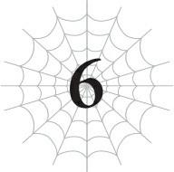
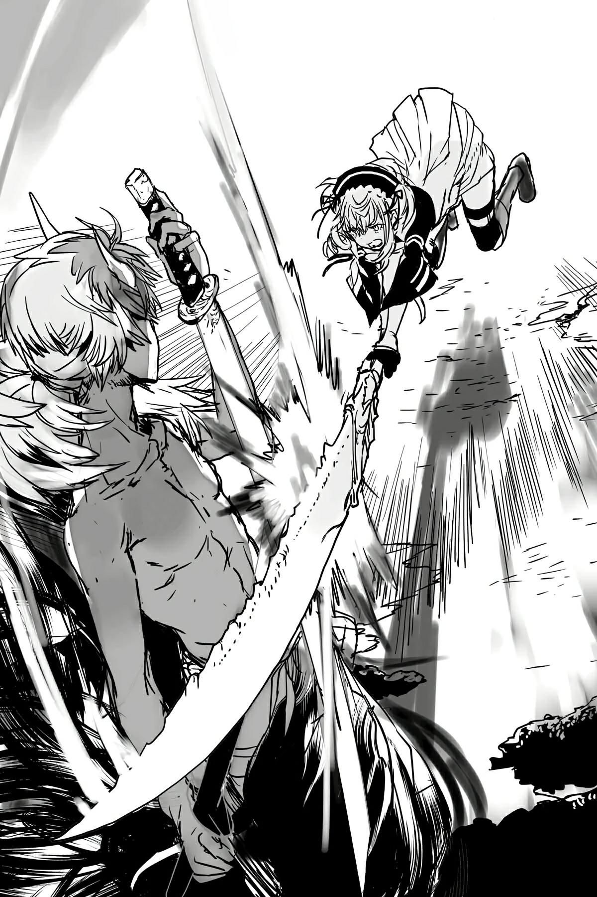

# Chương 6: Đến nơi của anh Quỷ
*(ARRIVAL AT MR. ONI’S PLACE)*

---

Tội phạm không xảy ra trong phòng họp.

Nó xảy ra ở một nơi nào đó rất xa chúng ta, nhưng bằng cách nào đó chúng ta vẫn bị cuốn vào.

Đó là sự thật tôi đã ngộ ra.

Hoặc đại loại thế. Tôi đang trích dẫn mấy phim cảnh sát hay thám tử gì đó ấy mà, mặc dù tôi chả thực sự hiểu nó nghĩa là gì.

Nói cách khác, tôi đang ở giữa một giấc mơ trốn tránh thực tại.

“Graaaah!”

Trước mặt tôi là một cậu nhóc đang gầm rú với đôi mắt đỏ ngầu.

Nhìn thoáng qua thì cậu ta trông giống một cậu bé, nhưng tiếng gầm đó và bầu không khí đáng sợ xung quanh lại chứng minh điều ngược lại. Tiếng gầm làm rung chuyển cả không khí lẫn màng nhĩ của tôi, và luồng khí thế tỏa ra bóp méo cả cảnh vật xung quanh.

Thực tế, hơi nóng tỏa ra từ một trong hai thanh ma kiếm trên tay cậu ta đang làm tầm nhìn của tôi bị dao động theo đúng nghĩa đen.

Thanh còn lại thì phát ra những tia sét màu tím nổ đùng đoàng khắp cơ thể.

Nhìn cậu ta cứ như một siêu ác nhân vừa thức tỉnh cơn cuồng nộ sát nhân vậy...

Chào nhé, anh Quỷ.

Mới không gặp có một thời gian ngắn mà trông anh hoang dại thế này rồi cơ à.

Ý tôi là, lần trước anh trông đã khá hoang dại rồi, nhưng xem ra anh vẫn chưa dừng lại ở đó.

Chà, anh thực sự đã vượt xa kỳ vọng của tôi đấy, anh bạn ạ.

Ha-ha-ha!

...Giờ sao đây?

Tại sao tôi lại rơi vào tình cảnh này?

Tóm lại, tất cả là tại cái gã tên Güli-güli đó.

Đúng vậy. Güli-güli chính là thủ phạm!

Nếu đây thực sự là một bộ phim cảnh sát hay thám tử, thế là xong chuyện rồi đấy, nhưng tôi đoán mọi chuyện đâu có dễ dàng kết thúc như thế, đúng không?

Hãy quay ngược thời gian một chút để tìm hiểu xem làm thế nào tôi lại vướng vào mớ bòng bong này.

Güli-güli đột ngột xuất hiện từ hư không.

“Ta có một thỉnh cầu.”

Một nhân vật bí ẩn vận toàn đồ đen bỗng dưng chen ngang vào buổi trà chiều vốn đã trở thành nghi thức hằng ngày của chúng tôi.

Bình thường tôi sẽ phàn nạn về hệ thống an ninh của dinh thự công tước, nhưng trong trường hợp này, tôi không thể trách họ được.

Dù sao gã này cũng là một vị thần hàng thật giá thật mà.

Hệ thống an ninh có nghiêm ngặt đến mấy cũng chẳng thể ngăn hắn tự tiện dịch chuyển thẳng vào đây nếu hắn muốn.

Vì Güli-güli xuất hiện đột ngột và đưa ra yêu cầu cũng đột ngột không kém, hiển nhiên tôi chẳng biết phải phản ứng thế nào ngay lập tức.

Vả lại, nếu cứ ai bắt chuyện là tôi lại phun ra câu trả lời ngay tắp lự, tôi sẽ mất đi hình tượng ngầu lòi, ít nói mất, chết tiệt thật!

Trong lúc tôi đang đứng hình trong hoảng loạn, Fiel chẳng hiểu sao lại đi lấy một chiếc ghế cho Güli-güli, thế là hắn tham gia luôn vào buổi tiệc trà của chúng tôi.

Riel rót trà vào một chiếc tách phụ rồi đưa cho Güli-güli.

Người đàn ông mặc giáp đen thanh lịch đưa tách trà lên môi.

Một đám nhóc tì và một gã đàn ông trưởng thành mặc giáp đen, ngồi quây quần bên bàn tiệc trà.

Cảnh tượng này có thể siêu thực đến mức nào nữa đây?!

Đúng là không thể tin nổi.

“Yêu cầu này có liên quan đến chính người tái sinh mà các ngươi đã chạm trán ở Dãy núi Huyền Bí. Ta muốn các ngươi ngăn cậu ta lại.”

Sau khi nhấp một ngụm trà, Güli-güli đi thẳng vào vấn đề.

Nghe thấy vậy, đôi mắt Vampy lóe lên một tia nguy hiểm.

“Ngài có phiền cung cấp thêm chi tiết không?”

Ơ, chắc rồi, cứ tự nhiên quyết định thay cho tất cả chúng ta đi nhé, tôi đoán thế.

Güli-güli ngập ngừng một lát, mắt nhìn đi chỗ khác.

“...Ta cho rằng việc này vẫn nằm trong giới hạn cho phép,” hắn lầm bầm.

Nghe đáng ngại thật đấy. Hắn đang lo lắng về cái gì thế?

Chà, tôi đoán trên đời này chỉ có một người duy nhất đủ sức khiến Güli-güli phải đổ mồ hôi hột như vậy thôi!

Tên tà thần thối nát đó rốt cuộc lại bày ra trò gì nữa đây...?

Thực ra, thừa biết tính cô ta, chẳng phải vị tà thần đó lúc này cũng đang nghe lén hay sao?

Tại sao anh lại lầm bầm kiểu đó chứ?

Hay anh cố ý muốn cô ta nghe thấy?

“Ta nghĩ mình nên thể hiện chút thiện chí trước khi nhờ các ngươi giúp đỡ.”

Güli-güli uống thêm một ngụm trà.

Sau đó hắn đặt tách xuống và giơ tay lên.

Với một cái phẩy tay nhẹ, hắn tạo ra một cổ tự rune.

Cổ tự rune đó có vẻ là một loại ma pháp kiến tạo hình ảnh, vì nó tạo ra một hình chiếu giữa không trung.

Nó hiển thị thứ trông giống như ảnh chụp vệ tinh, một góc nhìn từ trên không trung xuống hành tinh.

Cụ thể, đó là cảnh tượng Dãy núi Huyền Bí được bao phủ trong tuyết trắng và băng giá.

Ồ. Hóa ra Dãy núi Huyền Bí nhìn từ trên cao trông như thế này sao?

Tôi biết đó là một chuỗi núi cực kỳ cao nằm san sát nhau, nhưng chà, dãy núi này lớn hơn tôi tưởng nhiều.

Nhìn từ trên cao như thế này, tôi nhận ra những ngọn núi tôi thấy dưới mặt đất chỉ là một phần nhỏ của một tổng thể khổng lồ.

Tuyến đường chúng tôi đi từ lãnh thổ loài người sang Lãnh địa Quỷ theo đúng nghĩa đen chẳng qua chỉ là một góc nhỏ của vùng núi băng giá này.

Trong lúc tôi đang ngơ ngác nhìn bức ảnh, tôi nhận ra một điều.

Có một vùng đất bằng phẳng nằm bên kia dãy núi.

Nó không thuộc về lãnh thổ loài người hay Lãnh địa Quỷ.

Đó là một nơi hoàn toàn khác biệt, bị ngăn cách với cả hai bên bởi những ngọn núi và đại dương.

Hửm?

Nơi này là đâu? Vùng đất chưa được khám phá sao?

“Sau khi chiến đấu với các ngươi, cậu ta đã đi lang thang trong Dãy núi Huyền Bí cho đến khi tới được nơi này,” Güli-güli bắt đầu giải thích. “Đây là một khu vực an nghỉ dành cho các linh hồn do chính ta tạo ra.”

Tôi chắc chắn không phải là người duy nhất xuất hiện dấu chấm hỏi lơ lửng trên đầu sau lời tuyên bố đó.

Khu vực an nghỉ dành cho các linh hồn?

Ý anh là sao?

“Có vẻ như cách diễn đạt của ta chưa đủ rõ ràng. Các ngươi đều biết về phương thức thu thập năng lượng của hệ thống, đúng chứ? Nó chắc chắn là một cuộc cách mạng nếu chỉ nhìn vào những con số, nhưng không phải là không có vấn đề. Cụ thể là sự suy kiệt dần của các linh hồn.”

Vẻ nhăn mặt trên khuôn mặt Güli-güli cho thấy rõ ràng hắn nghĩ điều này là vô nhân đạo, ngay cả khi hắn không thể nói thẳng ra.

Hừm. Linh hồn bị suy kiệt sao?

Vampy và lũ nhện rối vẫn còn dấu chấm hỏi trên đầu, nhưng tôi nghĩ mình phần nào đã hiểu ra.

Hệ thống bóc lột linh hồn của những người sống trong thế giới này.

Và nếu điều đó kéo dài đủ lâu, việc linh hồn của họ bị tổn hại cũng không có gì đáng ngạc nhiên.

Vậy chuyện gì sẽ xảy ra nếu hệ thống cứ tiếp tục sử dụng họ mà không cho họ thời gian để hồi phục?

Cuối cùng, nó sẽ dẫn đến việc những linh hồn đó bị tiêu biến hoàn toàn.

Một con đường dẫn đến sự hư vô tuyệt đối, vượt qua cả cái chết.

Güli-güli chắc hẳn đã tạo ra điểm nghỉ dưỡng nhỏ này để tạm thời che chở cho những người có linh hồn bị lạm dụng quá mức nhằm tránh thảm cảnh đó.

Hừm. Tôi đoán điều đó có nghĩa là hắn phải đảm bảo những người ở đây không chiến đấu và hạn chế nhận kỹ năng nhiều nhất có thể?

Đây chắc chắn không phải là giải pháp lâu dài, nhưng là một biện pháp tình thế không tồi.

“...Ngươi đã hiểu chỉ dựa trên lời giải thích ngắn ngủi đó sao? Vậy thì mọi chuyện dễ dàng hơn rồi.”

Tuy nhiên, Güli-güli trông chẳng có vẻ gì là vui mừng cả.

Nếu có thì hắn có vẻ còn thấy bất tiện nữa là đằng khác.

Xem nào, hắn có lẽ đã kể cho tôi chi tiết về điểm dừng chân nhỏ này—thứ mà bình thường hắn sẽ giữ bí mật—như một cách thể hiện thiện chí.

Nhưng dù vậy, việc tôi hoàn toàn hiểu rõ mục đích của nó có lẽ không phải là điều hắn mong muốn.

Bởi vì nó chỉ càng làm nổi bật tình thế ngặt nghèo của thế giới này mà thôi.

Nên tôi đoán mặc dù muốn thể hiện thành ý, hắn vẫn hy vọng tôi thực chất sẽ không hiểu nổi lời giải thích của hắn.

“Hầu hết những người ở đây đều không thể chiến đấu. Nên nếu cậu ta đến được đó trong trạng thái điên cuồng vì kỹ năng Phẫn Nộ, ngươi có thể hình dung chuyện gì sẽ xảy ra rồi chứ?”

Hừm. Phải, sẽ là một cuộc thảm sát đẫm máu.

Và nếu những người này chết hết, họ sẽ từ cuộc sống yên bình ở khu an dưỡng này quay lại ngay với việc bị bào mòn linh hồn.

Mặc dù thành thật mà nói, trong thâm tâm tôi có một phần đang nghĩ: Có sao không?

Nhưng chuyện này rõ ràng là rất quan trọng đối với Güli-güli. Nếu không hắn đã chẳng đến đây để cầu xin sự giúp đỡ của chúng tôi.

“Ta không thể động thủ với một người tái sinh vì giao kèo với D. Nhưng ta cũng không thể trơ mắt nhìn thảm họa này xảy ra. Nên ta muốn nhờ các ngươi ngăn cậu ta lại thay ta.”

À, hóa ra là D đã cản hắn. Biết ngay mà.

Với tính cách của Güli-güli, hắn chắc chắn đã từng tự mình thử ngăn cản anh Quỷ vào một lúc nào đó rồi.

Nhưng D hẳn đã cản đường hắn.

Bởi vì đối với cô ta, làm vậy thì còn gì vui nữa, tôi chắc chắn thế.

Đó chính xác là kiểu trò đùa mà vị thần thối nát đó sẽ bày ra.

Và giờ đây, vì bản thân Güli-güli không thể làm gì được, hắn đành phải đến đây nhờ chúng tôi giúp đỡ.

Hắn cần những người mà D sẽ cho phép can thiệp, đồng thời cũng phải đủ mạnh để ngăn cản anh Quỷ điên cuồng kia.

Nói cách cách khác, là Vampy và tôi.

Tôi chắc chắn Güli-güli đã biết tôi lấy lại được sức mạnh của mình, và dù ghét phải thừa nhận, có vẻ tôi khá được D cưng chiều.

Nên D có lẽ sẽ không trách phạt một trong những món đồ chơi yêu thích của cô ta vì đã tham gia vào chuyện này.

Thậm chí, cô ta có khi còn thấy phấn khích nữa là đằng khác.

Chuẩn luôn. Xem ra tôi là sự lựa chọn hoàn hảo rồi!

“Các ngươi sẽ chấp nhận thỉnh cầu của ta chứ?”

“Tất nhiên rồi!”

Tự nhiên như thường lệ, người trả lời nhanh nhảu là Vampy chứ không phải tôi.

Này nghiêm túc đấy, việc đó tự bao giờ đã trở thành quyết định của em cho cả hai chúng ta thế hả?

Nhưng tôi đoán thế cũng được, vì dù sao tôi cũng định đồng ý rồi.

“Cảm ơn các ngươi. Vậy nếu không phiền, ta muốn chúng ta xuất phát ngay lập tức. Các ngươi đã sẵn sàng chưa?”

“Hả? Ngay bây giờ á?”

Giọng Vampy có vẻ hốt hoảng. Con bé chắc hẳn không ngờ tới chi tiết này.

“Đúng vậy. Càng sớm càng tốt. Ta sẽ đưa các ngươi đến đó bằng dịch chuyển và đưa về bằng cách tương tự, nên không cần mang theo nhu yếu phẩm hành trình. Hãy chỉ mang theo những gì cần thiết cho trận chiến. Chúng ta sẽ xuất phát ngay khi các ngươi sẵn sàng.”

Nghe thấy thế, Vampy lập tức lao biến ra khỏi phòng, có lẽ là để đi lấy thanh đại kiếm yêu quý của mình.

Lần trước con bé không có vũ khí, điều đó khiến trận chiến trở nên khó khăn hơn mức cần thiết.

“Ngoài ra, đối với trận chiến này, ta muốn chỉ có những người tái sinh các ngươi tham gia.”

Tôi đang định nằm ườn ra chờ Vampy quay lại, thì Güli-güli lại ném thêm một quả bom vào tôi.

Cái gì cơ?!

Ý anh là chỉ có Vampy và tôi đối đầu với gã đó thôi sao?

“Nếu mang theo các quyến thuộc của Ariel, chắc chắn các ngươi sẽ thắng dễ dàng. Nhưng làm thế có thể sẽ phá hỏng niềm vui của D. Việc ta đưa các ngươi đến đó, dù ta không trực tiếp chiến đấu, vốn dĩ đã là chạm đến giới hạn chịu đựng của cô ta rồi. Ta biết đây là một yêu cầu quá đáng, nhưng làm ơn.”

Ư hự! Tôi đoán hắn nói cũng có lý.

Tôi chắc chắn đã định mang theo ba nhện rối. Chỉ riêng Sael cũng đủ sức cầm cự với anh Quỷ rồi, và nếu cộng thêm Riel và Fiel nữa thì tôi đoán chắc chắn chiến thắng sẽ nằm gọn trong lòng bàn tay.

Nhưng liệu D có thực sự cho phép một chiến thắng được đảm bảo chắc chắn như thế không?

Đương nhiên là không rồi!

Một trận chiến nhàm chán như thế làm sao thỏa mãn nổi vị tà thần khó ưa kia chứ.

Ngay khi Güli-güli đưa chúng tôi vào, cô ta sẽ lấy đó làm cái cớ để cản trở chúng tôi bằng mọi cách có thể!

Nhìn từ góc độ đó, mang theo lũ nhện rối có khi lại càng nguy hiểm hơn.

Tôi không chắc liệu chỉ có Vampy và tôi thì có đánh bại được anh Quỷ không, nhưng cố tình chọc giận D thì còn ngu ngốc hơn nhiều.

Vậy là chúng tôi không còn lựa chọn nào khác.

Lũ nhện rối đành phải ở nhà chơi một mình vậy.

Ngay lập tức, ba cặp mắt đổ dồn vào tôi với thông điệp câm lặng: *Ngài định bỏ tụi em lại sao?*

Trông chúng bằng cách nào đó như sắp khóc đến nơi, dù điều đó là bất khả thi.

Thôi đi mà!

Đừng nhìn tôi bằng ánh mắt đó nữa!

Mấy đứa làm ta khó rời đi quá đấy!

“Em sẵn sàng rồi!”

Trong lúc tôi đang tuyệt vọng chống chọi lại những lời cầu xin thầm lặng của ba cô nhóc đòi đi theo, Vampy đã quay trở lại với trang bị đầy đủ.

Mặc dù “đầy đủ” ở đây thực ra chỉ là con bé đã thay một bộ trang phục cơ động hơn và cầm theo thanh đại kiếm của mình.

Quần áo của con bé được dệt từ tơ của tôi, nên chúng có khả năng phòng thủ vượt trội hơn nhiều so với các loại giáp thông thường. Còn thanh đại kiếm—thứ còn dài hơn cả chiều cao của Vampy—được chế tác từ móng vuốt của quái vật cấp huyền thoại Fenrir.

Nhân tiện, tôi nghe nói Fenrir thực ra chưa hề bị đánh bại, nó chỉ tấn công một pháo đài của con người từ rất lâu trước đây và vô tình làm mất một chiếc móng vuốt trong quá trình đó. Tôi đoán vết thương đó chắc hẳn rất đau đớn, vì thế là đủ để khiến Fenrir phải rút lui.

Một thanh đại kiếm được làm từ chiếc móng vuốt hiếm có và quý giá như vậy hẳn phải thuộc tầm cỡ quốc bảo quan trọng.

Nghe nói, nó vốn được cất giữ cẩn thận trong kho báu của một quốc gia nào đó, nhưng sau đó nơi ấy đã phải chịu tổn thất nặng nề trong một trận chiến nào đó, buộc họ phải miễn cưỡng bán nó đi để chi trả cho việc sửa chữa.

Nghe đâu trận chiến đó có liên quan đến một đàn nhện trắng nổi loạn hay gì đó đại loại thế. Ngẫu nhiên ghê cơ nhỉ? Không biết kẻ nào đã gây ra chuyện đó đây...

Dù sao thì, đó là cách thanh đại kiếm này xuất hiện trên thị trường, và Ma Vương đã mua lại nó bằng khối tài sản khổng lồ đến phi lý của mình.

Sau đó Vampy thích nó và biến nó thành vũ khí cá nhân của con bé.

Thế là con bé có tơ của tôi để phòng thủ và thanh đại kiếm Fenrir để tấn công.

Ừm. Tôi không nghĩ có bộ trang bị nào tốt hơn thế này nữa đâu.

Và đúng vậy, tôi cũng đã chuẩn bị sẵn sàng chiến đấu. Tôi luôn mặc quần áo làm từ tơ của chính mình, và chiếc lưỡi hái khổng lồ cũng đã được trang bị đầy đủ.

Đi một mình nguy hiểm lắm, nên tôi mang theo cái này vậy!

“Tốt. Đi thôi.”

Güli-güli kích hoạt Dịch chuyển.

Chúng tôi dễ dàng lướt qua không gian, rồi Vampy và tôi thấy mình đang đứng ở một vùng đất lạ.

“Graaaah!”

Tôi chắc chắn nhận ra anh Quỷ đang giận dữ ngay trước mắt chúng tôi, nhưng mà.

Mọi chuyện diễn ra hơi bị nhanh quá rồi đấy, mọi người có nghĩ thế không?

*Kết thúc hồi tưởng.*

Không, thước phim cuộc đời tôi vẫn chưa bắt đầu chiếu chậm trước mắt đâu.

Có nghĩa là tôi vẫn có thể chết đấy!

Thế nên tôi nhanh chóng né tránh đòn tấn công của anh Quỷ khi cậu ta lao thẳng về phía tôi với tốc độ nhanh hơn cả mắt thường có thể theo dõi.

Ha-ha-ha! Lần này không giống như lần trước đâu nhé! Sức mạnh của tôi đã quay trở lại rồi!

Mặc dù, không giống như hồi tôi còn sở hữu các chỉ số này nọ, tôi không thể cứ liên tục cường hóa cơ thể mình mãi được.

Chỉ số sẽ tự động cường hóa cơ thể và thể trạng của bạn dựa trên các con số, nhưng với ma pháp kiến tạo, bạn phải tự mình điều khiển đống đó bằng tay.

Tôi vẫn chưa quen với việc kiến tạo ma lực, nên thật không dễ để duy trì tất cả cùng một lúc.

Thỉnh thoảng sức tấn công của tôi lại tăng vọt lên cao hơn dự định, và thế là phòng thủ của tôi tự sụp đổ trong nỗ lực bám đuổi kịp nó.

Phần phòng thủ là đặc biệt quan trọng. Cho dù di chuyển hay tấn công, tôi phải duy trì phòng thủ đủ cao để chịu đựng được tốc độ và sức mạnh đã được cường hóa của mình, nếu không tôi sẽ phải chịu phản phệ cực kỳ nghiêm trọng.

Vì vậy, giữ phòng thủ ở mức cao là ưu tiên hàng đầu của tôi.

Điều đó có nghĩa là tôi có lẽ sẽ ổn ngay cả khi bị anh Quỷ đánh trúng, nhưng nếu có thể né được, tôi vẫn muốn né hơn.

Vẫn còn quá nhiều điều chưa chắc chắn khi nói về ma pháp kiến tạo của tôi lúc này.

“Em sẽ là đối thủ của anh, cảm ơn nhiều nhé!”

Trong lúc đó, khi tôi đang cố giãn khoảng cách xa nhất có thể khỏi đòn tấn công của anh Quỷ, Vampy xông thẳng vào với thanh đại kiếm trên tay.

Con bé trông có vẻ khá hăng hái đối với một kẻ vừa bị đánh cho ra bã lần trước.

Mà khoan đã, dừng khoảng chừng là hai giây. Em học lễ nghi phép tắc ở dinh thự công tước nhiều hơn là huấn luyện chiến đấu mà, thế quái nào em lại tự tin thế hả?

Em thực sự nghĩ mình có thể đánh bại anh Quỷ lúc này sao, dù chúng ta mới chỉ có chút thời gian ngắn ngủi để luyện tập kể từ trận chiến trước?

Mặc dù anh Quỷ rõ ràng trông cũng đã mạnh lên rất nhiều trong khoảng thời gian ngắn đó.

“Hừm!”

Vampy vung thanh đại kiếm xuống từ trên đầu.

Ý tôi là, thanh kiếm đó to hơn cả người con bé, nên lựa chọn thực tế duy nhất của con bé chỉ là vung xuống hoặc chém ngang mà thôi.

Thay vì né tránh, anh Quỷ giơ một thanh katana lên để đỡ đòn.

Ôi thôi nào. Anh không thể thực sự nghĩ mình sẽ đỡ được đòn đó chỉ bằng một tay chứ?

Cậu ta hẳn là đang đánh giá cực kỳ thấp Vampy rồi.

Vampy nở nụ cười gian xảo, như thể con bé cũng có cùng suy nghĩ đó.

“Cái—?!”

Nhưng rồi nụ cười của con bé lập tức biến thành kinh ngạc.

Thanh katana của anh Quỷ dễ dàng gạt phăng cú vung kiếm của Vampy và hất thanh đại kiếm sang một bên.

Sau đó, lợi dụng lúc sơ hở khi phòng thủ của con bé hoàn toàn bị phá vỡ giữa cú vung kiếm, cậu ta ra đòn tàn nhẫn bằng thanh kiếm ở tay còn lại, nhắm thẳng vào cổ Vampy.

Theo lý thuyết, con bé lẽ ra phải kịp phản ứng.

Nhưng khi cậu ta gạt thanh đại kiếm, thanh ma kiếm dạng katana của cậu ta đã kích hoạt năng lực, truyền những tia sét chạy dọc theo lưỡi kiếm của Vampy.

Luồng điện giật khiến Vampy bị tê liệt trong tích tắc, nên giờ con bé chẳng thể làm gì để ngăn thanh kiếm rực lửa đang lao tới mình.

Khoan đã, anh Quỷ!

Từ khi nào một kẻ điên cuồng mất trí lại có thể thực hiện một chiến thuật khéo léo đến thế hả?!

Tôi lập tức phóng tơ ra quấn chặt lấy cánh tay anh Quỷ.

Hắc hắc. Tơ và Không gian Ma pháp là hai thứ tôi có thể kiến tạo và điều khiển tự do mà không cần lo nghĩ quá nhiều về chi tiết!

Xem ra tôi lại cứu mạng Vampy một lần nữa rồi. Tôi có ngầu lòi hay là khônggggggg—?!

“Graaaaah!”

Anh Quỷ chỉ đơn giản là vung kiếm bằng sức mạnh cơ bắp thuần túy, bất chấp việc cánh tay đã bị tơ của tôi quấn chặt!

Và mọi người nghĩ chuyện đó có nghĩa là gì?

Tôi bị kéo tuột theo sợi tơ và bay thẳng lên không trung!

Dù tôi có dùng cường hóa cơ thể để tăng cường thể trạng, điều đó không có nghĩa là cân nặng thực tế của tôi thay đổi.

Vampy và tôi đã quá tập trung vào sức mạnh của cánh tay đến mức quên béng mất đôi chân dưới đất.

Thế là tôi mất đà ngay lập tức và bị kéo bay đi.

Trời ạ, những lúc thế này tôi thực sự nhớ cái cách mà các chỉ số cường hóa toàn bộ cơ thể tôi một cách đồng đều biết bao!

Nhưng ngay cả khi tôi có cường hóa đôi chân đi chăng nữa, tôi nghi ngờ việc mình có thể đứng yên tại chỗ được. Xét đến cái sức mạnh quái dị kia, mặt đất dưới chân có khi cũng bị kéo bay lên không trung cùng với tôi luôn ấy chứ.

Nếu tôi sở hữu kỹ năng [Cơ động Không gian], tôi có lẽ đã tạo ra một điểm tựa trên không trung để dừng lại, nhưng tôi chưa đủ thành thạo để tái hiện lại nó theo ý muốn vào lúc này!

Trong lúc hoảng loạn giữa không trung, tôi kịp lấy lại thăng bằng và lật người đứng thẳng dậy.

Tôi cắt đứt sợi tơ nối tôi với anh Quỷ và đáp đất an toàn.

Phù. Nhưng ngay khi tôi thở phào nhẹ nhõm, tôi chợt nhận ra một chuyện cực kỳ hệ trọng.

Chết tiệt. Vampy có khi tiêu đời rồi.

Sự can thiệp của tôi cuối cùng chẳng giúp ích được bao nhiêu, nên nếu cậu ta hoàn thành cú vung kiếm đó, đầu Vampy có lẽ đã bị chém bay rồi.

“Ái đau! Vô duyên thế—đau chết đi được!”

Nhưng rồi tiếng hét tràn đầy năng lượng của Vampy đã xóa tan nỗi lo lắng của tôi.

Ơ, cái gì vậy?

Có vẻ như anh Quỷ đã đánh trúng và thổi bay Vampy giống như tôi, nhưng tôi chẳng thấy một vết xước nào trên cổ con bé cả.

Thay vào đó, những thứ trông giống như vảy đã xuất hiện.

Cái gì thế kia?

Trông không giống như chúng bị dính vào đó—mà giống như con bé tự mọc vảy ra hơn.

Mấy cái vảy đó đã bảo vệ con bé khỏi đòn tấn công của anh Quỷ sao?

Thế thì tốt thật đấy, nhưng tại sao lại là vảy?

Từ khi nào Vampy lại tiến hóa thành một con quái vật có vảy thế này?

Trong lúc đó, Vampy lại lao vào tấn công anh Quỷ một lần nữa.

Nhưng vì thanh đại kiếm chỉ có thể thực hiện những cú vung rất rộng, những đường kiếm nhanh thoăn thoắt của anh Quỷ dễ dàng ngăn không cho thanh kiếm của con bé tiếp cận gần mình.

Ngược lại, các đòn tấn công của anh Quỷ liên tục đánh trúng Vampy trực diện.

Nhưng nhờ lớp quần áo làm từ tơ của tôi và những lớp vảy bí ẩn kia, con bé không phải chịu bất kỳ sát thương nghiêm trọng nào.

Nó có làm thanh HP của con bé sụt giảm một chút, nhưng Vampy sở hữu một trong những kỹ năng tự phục hồi HP cao cấp, nên tôi không nghĩ tính mạng của con bé đang bị đe dọa nghiêm trọng.

Nói cách khác, đây có thể là một trận chiến kéo dài.

Vì các đòn tấn công của Vampy thậm chí còn không thể chạm vào anh Quỷ, trong khi các đòn của cậu ta ít nhiều vẫn gây ra sát thương, cậu ta đang chiếm thế thượng phong trong tình thế này.

Nhưng dù vậy, tôi chắc chắn Vampy không chỉ mù quáng tấn công mà không có kế hoạch, nên con bé hẳn phải có cơ hội chiến thắng.

“Áaaaa! Đủ rồi đấy! Đừng có né tránh lung tung nữa!”

...Con bé thực sự có kế hoạch chứ, đúng không? ...Phải không?

Tôi tin em đấy, Vampy.

Hơn nữa, xét đến việc con bé đột nhiên có được những chiếc vảy điên rồ đó, xem ra con bé thực sự đã mạnh lên từng ngày.

Ừ. Chắc là ổn thôi.

Thế nên tôi đoán mình có thêm chút thong thả để quan sát xung quanh.

Trong lúc Vampy và anh Quỷ đang trao đổi chiêu thức điên cuồng, một sinh vật khổng lồ, bê bết máu đang nằm gần đó.

Đó là một con rồng tuyệt đẹp với lớp vảy pha lê trong suốt.

Nhưng ngay lúc này, những chiếc vảy đó đã bị nhuộm đỏ bởi máu. Vẻ ngoài cận kề cái chết làm giảm đi phần nào vẻ đẹp của nó.

Và Güli-güli đang vươn tay về phía những vết thương của con rồng như thể đang chữa trị cho nó.

Cái tên khốn kiếp này! Hóa ra hắn đã trốn đến đó sau khi ném chúng tôi trước mặt anh Quỷ rồi biến mất sao!

Tôi đoán con rồng đó chắc hẳn đã chiến đấu với anh Quỷ cách đây không lâu, nhưng có vẻ tình hình đã đến mức ngàn cân treo sợi tóc rồi. Thảo nào Güli-güli lại vội vã đến thế.

Hắn hẳn đã dịch chuyển chúng tôi đến trước mặt anh Quỷ để thu hút sự chú ý của cậu ta khỏi con rồng đang hấp hối.

Tôi có vài lời “thân thương” muốn dành cho hành động đó đấy, nhưng hắn có lẽ không còn lựa chọn nào khác trong tình cảnh đó, nên tôi đoán mình sẽ tha thứ cho hắn vậy.

Chà, tôi thật là rộng lượng quá đi mà!

Hừm.

Nhìn thoáng qua thì con rồng đó trông khá là mạnh đấy chứ.

Ý tôi là, nó trông rất giống với những gì Ma Vương mô tả về con rồng là thủ lĩnh tối cao của Dãy núi Huyền Bí, nhưng... không thể nào, đúng không?

...Nhưng tôi đoán vì Güli-güli đã ở đây, ngay cả khi hắn không thể can thiệp trực tiếp, thì khả năng cao con rồng đứng đầu cũng sẽ có mặt.

Theo những gì Ma Vương kể cho tôi, con rồng đứng đầu Dãy núi Huyền Bí thuộc cùng đẳng cấp với Hyuvan, con phong long đã giúp đỡ chúng tôi trong sự cố UFO. Vậy mà con rồng này vẫn bị đánh cho thảm hại thế kia sao?

Hả? Lẽ nào anh Quỷ mạnh hơn tôi tưởng nhiều?

Vampy đang gặp nguy hiểm rồi!

“Lên đi chứ! Cái đà hăng hái lúc nãy của anh đâu rồi?! Chết đi! Mau chết đi!”

Quay lại nhìn, tôi thấy Vampy đang điên cuồng tấn công, trong khi anh Quỷ đã chuyển hoàn toàn sang thế thủ.

Ồ. Được rồi.

Hóa ra tôi lo lắng vô ích.

Vampy đang vung vẩy thanh đại kiếm đủ mọi hướng đồng thời tấn công anh Quỷ bằng cả Băng Ma pháp và Thủy Ma pháp.

Thêm vào đó, đánh giá từ việc cả băng và nước đều có sắc đỏ nhạt, tôi đoán đó không phải là ma pháp thông thường. Vì nó có màu đỏ, tôi cá là nó có liên quan đến một loại khả năng thao túng máu của ma cà rồng, dù tôi không biết chính xác nó hoạt động thế nào.

Da của anh Quỷ có vài chỗ bị tấy đỏ lên, nên có lẽ đó là một loại axit chăng?

Kinh thật đấy, Vampy. Người tuy nhỏ mà siêu mạnh.

Nhờ lớp vảy chặn các đòn tấn công của anh Quỷ và lớp nước băng màu đỏ kia, xem ra Vampy đã tiến bộ về nhiều mặt mà tôi không hề hay biết.

Con bé trở nên mạnh mẽ thế này từ khi nào vậy?

Ý tôi là, tôi luôn biết con bé rất mạnh, nhưng con bé chắc chắn trông còn mạnh mẽ hơn nhiều chỉ trong một khoảng thời gian ngắn.

Lần trước anh Quỷ đã đập con bé và Mera ra bã dưới đất, nhưng giờ con bé đang tự mình chiến đấu sòng phẳng với cậu ta, điều đó chứng minh con bé đã trưởng thành đến nhường nào.

Trên thực tế, có vẻ anh Quỷ cũng đã mạnh lên, nghĩa là tốc độ tăng trưởng của Vampy thậm chí còn ấn tượng hơn nữa.

Con bé chắc phải uất ức lắm vì bị đánh bại lần trước nhỉ...?

Sử dụng cay đắng của thất bại làm động lực để trưởng thành nghe giống như việc của một nhân vật chính trong shonen manga vậy.

“CHẾẾẾẾẾẾẾẾẾT ĐIIIIIIII!!”

Nhân vật chính... Phải rồi...

Ừm, tôi sẽ để mặc việc xử lý sự phát triển tâm lý của con bé cho Ma Vương vậy.

Chúc may mắn nhé.

Tôi không muốn liên quan đến chuyện đó đâu, cảm ơn.

Tôi cố phớt lờ những dấu hiệu cảnh báo về xu hướng tính cách đang phát triển của Vampy khi tiếp tục quan sát trận chiến của con bé.

Cái gì cơ? Tôi có định giúp con bé không á?

Cái gì, mọi người muốn TÔI hợp tác với người khác á?

Không đâu, tôi chỉ đùa chút thôi. Tôi chắc chắn mình có thể làm được nếu muốn, được chứ?

Tôi có thể, nhưng đối với một trận chiến dữ dội thế này, việc hỗ trợ con bé thực ra là khá khó khăn.

Vampy và anh Quỷ liên tục di chuyển khắp nơi, thay đổi vị trí xoành xoạch.

Nếu tôi cố xen vào đó trong lúc vẫn đang chật vật điều khiển sức mạnh của mình, nó rất dễ dẫn đến việc Vampy bị dính đòn “thân thiện” từ đồng đội.

Kiểm soát tơ thì không thành vấn đề, nhưng hiện tại họ di chuyển nhanh đến mức tôi chẳng tìm thấy sơ hở nào để can thiệp.

Hợp tác là thứ bạn chỉ có thể làm khi bản thân ít nhất cũng mạnh ngang ngửa với người mà mình đang cố gắng chiến đấu cùng, mọi người hiểu chứ?

Và thật không may, tôi không nghĩ mình có thể bắt kịp tốc độ của Vampy và anh Quỷ với tình trạng hiện tại.

Khi anh Quỷ thổi bay tôi lúc nãy, tôi đã hiểu ra một điều chắc chắn rằng chỉ riêng cường hóa thể chất sẽ không cho phép tôi di chuyển và chiến đấu tự do như trước đây.

Giờ đây tôi đã hiểu rõ rằng mình chỉ có thể làm được điều đó nhờ vào sự hỗ trợ của các chỉ số, cộng với các kỹ năng như [Cơ động Chiều không gian].

Hiện tại, tôi sẽ phải vừa tăng cường di chuyển, vừa cường hóa phòng thủ để chịu lực phản phệ từ di chuyển đó, rồi lại phải dự đoán trước ảnh hưởng của các yếu tố ngoại cảnh như mặt đất dưới chân để đưa ra phương án giải quyết trước tất cả những điều đó.

Chỉ khi đó tôi mới thực sự có thể thử sức với một trận chiến tốc độ cao.

Lúc này, chỉ riêng việc làm một trong những điều đó thôi đã đủ khiến tôi kiệt sức rồi, nên tôi không nghĩ mình có thể thực hiện tất cả cùng một lúc sớm được đâu.

Trời ạ, chỉ số và kỹ năng quả thực là những thứ tuyệt vời.

Thực ra, nghĩ lại thì có vẻ hơi kỳ lạ khi hệ thống áp dụng những thứ đó tự động cho tất cả những ai sống ở thế giới này.

Tôi thì đang phải còng lưng ra để kiểm soát ma pháp kiến tạo ở đây, trong khi mọi người khác chỉ việc làm bất cứ thứ gì họ muốn và hệ thống tự động lo liệu đống rắc rối đó hộ họ! Thật không công bằng chút nào!

Tôi cứ lẩm bẩm phàn nàn một mình trong lúc theo dõi trận đấu giữa Vampy và anh Quỷ.

Nhìn qua thì có vẻ như Vampy đang dẫn trước.

Phải, anh Quỷ dễ dàng gạt phăng thanh đại kiếm của con bé, nên con bé thậm chí còn chẳng tạo được vết xước nào bằng thứ đó.

Nhưng trong lúc đó, luồng nước nhuốm sắc đỏ đang xoay quanh cơ thể Vampy, và nó sẽ lao thẳng về phía anh Quỷ bất cứ khi nào cậu ta cố gắng phản công.

Bất kỳ chỗ nào nước chạm vào người cậu ta, da của anh Quỷ lại xèo xèo bốc khói và bỏng rát.

Và nếu cậu ta phớt lờ nó quá lâu, nó cũng sẽ đóng băng luôn.

Việc đóng băng dường như không ngăn được nước ăn mòn da cậu ta, vì mỗi khi anh Quỷ dùng ngọn lửa từ ma kiếm để làm tan băng, lớp thịt bên dưới lại lộ ra một cách thảm hại.

Tôi nghĩ Vampy hẳn phải đang kết hợp kỹ năng [Axit Công Kích] với Thủy Ma pháp và Băng Ma pháp.

Có khi con bé còn đang sử dụng cả [Niệm lực] hay gì đó đại loại thế nữa kia.

Điều đó có nghĩa là con bé hiện đang kiểm soát nhiều kỹ năng cùng một lúc.

Thế thì thật là bất công, xét đến việc tôi còn đang chật vật kiểm soát từng thứ một đây này.

Không giống như đại kiếm, các đòn tấn công từ nước đỏ rất khó dự đoán, nên anh Quỷ không thể né tránh hoàn toàn mà không bị trúng đòn.

Chà, đúng thế. Đó là nước mà. Nó có thể tự do thay đổi hình dạng, và nếu Vampy điều khiển nó bằng [Niệm lực], con bé có thể dùng nó để tấn công theo ý muốn.

Tấn công điểm, tấn công tia, tấn công diện rộng—bất cứ thứ gì con bé thích.

Né tránh toàn bộ đống đó là điều bất khả thi.

Chỉ bị trúng một vài giọt nước bắn tung tóe thì không gây ra bao nhiêu sát thương, nhưng nếu cậu ta thực sự bị sũng nước đỏ, axit sẽ làm bỏng nghiêm trọng những mảng da lớn.

Và trên hết, nước đóng băng sẽ khiến chuyển động của cậu ta trở nên khó khăn hơn, khiến cậu ta càng dễ bị trúng đòn hơn nữa.

Đúng là một chiêu hiểm hóc.

Và ý tôi không chỉ là cái vẻ ngoài của làn da bị bỏng axit đâu. Bản thân chiến thuật này cũng cực kỳ hiểm.

Tất nhiên, anh Quỷ không đời nào chịu khoanh tay đứng nhìn.

Cậu ta đang sử dụng các thanh ma kiếm trên tay để cố gắng đánh tan dòng nước đỏ bằng lửa và sét.

Nhưng thật không may cho cậu ta, đây không phải là một cặp đấu có lợi.

Lửa và sét rất tuyệt để tiêu diệt và gây thương tích, nhưng không thích hợp lắm để đánh chặn các đòn tấn công, vì cả hai đều không có khối lượng vật lý.

Nếu muốn chặn đứng hoàn toàn đòn tấn công vật lý của dòng nước đỏ, cậu ta sẽ tốt hơn nếu dùng phòng thủ của Thổ Ma pháp hoặc thứ gì đó tương tự.

Dù cho sức nổ của lửa và sét có thể làm bắn tung tóe những giọt nước đỏ, một phần trong số đó chắc chắn vẫn rơi trúng người anh Quỷ, và phần nước còn lại lại tụ hợp về xung quanh Vampy.

Thêm vào đó, trong lúc cậu ta đang chật vật phòng thủ, Vampy có thể dễ dàng tạo thêm nước đỏ để thay thế cho lượng đã bị phân tán.

Tôi không biết việc sử dụng sức mạnh của các thanh ma kiếm đó tiêu tốn bao nhiêu MP, nhưng đối với tôi thì có vẻ Vampy đang tiêu tốn ít hơn cậu ta nhiều.

Cậu ta phải chặn các đòn tấn công của con bé hoặc chịu sát thương lớn, nhưng làm vậy lại khiến cậu ta mất đi lượng MP nghiêm trọng.

Nhưng cậu ta cũng chẳng thể cứ thế mà tấn công được.

Dòng nước đỏ của Vampy thực sự có thể chặn đứng lửa và sét của anh Quỷ.

Đúng thế. Đó là nước. Nên nó có khối lượng.

Ngay cả đứa trẻ tiểu học ngốc nhất cũng biết nước khắc hỏa, và dòng điện của sét cũng không thể dễ dàng truyền qua nó.

Công thủ toàn diện. Đối thủ không thể chặn đòn của con bé, nhưng con bé lại có thể chặn đòn của cậu ta.

Ừm, phải thừa nhận là nó quá hiểm đi mà.

Thực ra mới chỉ có một thời gian ngắn kể từ trận chiến cuối cùng của chúng tôi với anh Quỷ.

Tôi không nghĩ Vampy có đủ thời gian để nâng cấp độ của mình trong dinh thự của công tước, và tôi cũng chưa từng thấy con bé trải qua khóa huấn luyện khắc nghiệt nào.

Nên các chỉ số và kỹ năng của con bé có lẽ chẳng thay đổi bao nhiêu.

Điều đó có nghĩa là lợi thế hiện tại của con bé là nhờ vào việc rút kinh nghiệm từ thất bại trước, xem xét lại các chiến lược của mình và đưa ra các phương pháp mới chuyên biệt để đánh bại anh Quỷ.

Đúng như người ta vẫn thường nói: Biết người biết ta, trăm trận trăm thắng.

Phân tích kẻ thù của bạn, trau chuốt chiến thuật và biện pháp đối phó, đồng thời rèn luyện kỹ năng của mình đến giới hạn. Nếu làm được điều đó, miễn là không có sự chênh lệch sức mạnh quá lớn, bạn sẽ có cơ hội chiến thắng cực kỳ lớn.

Đó là cách tôi giành chiến thắng trong nhiều trận đấu với những đối thủ mạnh hơn mình.

Mặc dù hầu hết trong số đó, ngoại trừ Araba, chỉ là các đòn tấn công bất ngờ, nên tôi chẳng có chiến thuật hay biện pháp đối phó thực tế nào đáng kể cả!

Nhưng tôi đã có Giáo sư Thẩm định lo liệu đống đó hộ rồi mà!

Dòng nước đỏ tiếp tục tấn công anh Quỷ, và nó chắc chắn đang gây sát thương lên cậu ta.

Cậu ta có vẻ có một kỹ năng tự động hồi phục HP nào đó, nên các vết thương đang dần lành lại theo thời gian, nhưng cậu ta lại phải nhận thêm vết thương mới nhanh hơn tốc độ các vết thương cũ kịp lành.

Cứ đà này, sớm muộn gì Vampy cũng thắng thôi.

Nhưng tôi tự hỏi liệu mọi chuyện có thực sự dễ dàng thế không?

“Hự! Gừừừừừừừ—!”

Anh Quỷ gầm lên một tiếng thậm chí còn đáng sợ hơn thường ngày.

Đồng thời, luồng hào quang quanh cậu ta phình to lên gấp nhiều lần.

Lửa và sét nhảy múa điên cuồng quanh cơ thể cậu ta, khiến tôi thậm chí có thể cảm nhận được hơi nóng dù đang đứng cách đó một khoảng.

Anh Quỷ tiến lên phía trước, thu hẹp khoảng cách giữa mình và Vampy chỉ trong tích tắc. Cú lao lên của cậu ta thôi cũng đủ để phân tán bức tường phòng thủ bằng nước đỏ, và cả hai lưỡi kiếm cùng lúc chém xuống cơ thể Vampy.

Đôi mắt mở to vì ngạc nhiên, Vampy không kịp né tránh, và ngay cả những chiếc vảy mới của con bé cũng không thể chặn nổi đòn tấn công toàn lực từ những thanh kiếm của anh Quỷ, nên cơ thể con bé đã bị chém thành từng mảnh... suýt nữa thì như vậy.

Trong thực tế, Vampy hiện đang đứng cạnh tôi trong trạng thái bàng hoàng.

Đòn tấn công lớn của anh Quỷ chỉ chém vào không khí.

As nếu để trút cơn giận dữ không có nơi giải tỏa, cậu ta phóng ra lửa và sét phát nổ dữ dội ngay trên mặt đất nơi Vampy vừa đứng vài giây trước.

Anh Quỷ bị cuốn vào vụ nổ khi những làn sóng xung kích quét qua khu vực với một tiếng *RẦM* chấn động.

Chết tiệt, suýt soát thật đấy!

Ngay cả Vampy cũng sẽ bị thổi bay thành cát bụi nếu trúng trực diện một đòn như thế!

“Ủa? Cái gì? Sao lại thế?”

Vampy hết nhìn bãi vụ nổ lại nhìn sang tôi, rõ ràng là vô cùng bối rối không hiểu chuyện gì vừa xảy ra.

Mọi người hỏi tôi đã làm gì á? Cũng chẳng có gì to tát cả.

Tôi chỉ cảm thấy tình hình có vẻ không ổn, nên đã dịch chuyển Vampy về phía mình.

Tôi không thể dịch chuyển một mục tiêu ở xa lại gần mình khi còn sở hữu kỹ năng [Dịch chuyển], nhưng giờ đây tôi có thể làm những chuyện như thế một cách dễ dàng.

Phải. Khi nói về tơ và dịch chuyển, tôi có thể làm nhiều điều hơn cả lúc còn kỹ năng, ngay cả khi tôi gần như vô dụng ở tất cả những khía cạnh khác.

Vì vậy, mặc dù tôi không thể nhảy vào trận chiến, tôi chắc chắn vẫn có thể cứu một người cần cứu.

Đó là lý do tại sao tôi chỉ ngồi yên xem trận chiến từ một khoảng cách an toàn.

Nhưng mà chết tiệt thật đấy, anh Quỷ.

Ai mà ngờ anh vẫn còn một màn cường hóa nữa ẩn giấu chứ? Đáng sợ thật.

Khả năng phòng thủ của Vampy có thể cao, nhưng tôi nghi ngờ việc nó cao hơn con rồng đang nằm bê bết máu dưới đất kia.

Đặc biệt là khi tôi khá chắc chắn những chiếc vảy của Vampy là một loại kỹ năng dòng [Long Lân].

Tôi không biết bằng cách nào con bé lại học được một kỹ năng vốn chỉ giới hạn cho loài rồng như vậy, nhưng tôi thực sự thấy nghi ngờ khi anh Quỷ không thể xuyên thủng phòng ngự của Vampy trong khi cậu ta lại có thể đánh bại một con rồng thực sự.

Vì vậy, tôi đoán cậu ta có thể đang giấu một quân bài tẩy nào đó, nhưng tôi chắc chắn không bao giờ ngờ nó lại là một đợt tăng sức mạnh đột biến như thế này!

Cái gì đây? Dạng thứ ba của anh à?

Có nghĩa là cuối cùng anh sẽ hóa xanh rồi tiến vào dạng thứ tư và cũng là dạng tối thượng luôn hay sao?

Xin lỗi nhé, nhưng tôi không phải là kẻ cuồng chiến đấu, nên điều đó chả làm tôi phấn khích nổi đâu.

Hửm?

Nhưng làm sao chính xác thì các đợt tăng sức mạnh của anh Quỷ hoạt động như thế nào vậy?

Em có thể cho chúng ta biết gì về điều đó bằng kỹ năng Thẩm định quý giá của mình không hả, cô nhóc ma cà rồng?

“Thẩm định.”

“Hả? ...Ồ, phải rồi.”

Dù sao thì [Thẩm định] cũng đã cứu nguy cho chúng tôi nhiều lần trước đây rồi mà. Ít nhất thì lần này con bé đã hiểu được yêu cầu của tôi, ngay cả khi phải mất một giây định thần.

“Kỹ năng [Đấu Thần Đấu Pháp] cấp mười? Đó là một trong số ít kỹ năng ở cấp độ cực cao. Có lẽ đây là hiệu ứng có được từ danh hiệu [Kẻ Thống Trị Phẫn Nộ]? Dù thế nào đi nữa, đó hẳn là thứ anh ta vừa kích hoạt. [Phẫn Nộ] cũng giúp cường hóa mức độ tăng chỉ số do [Đấu Thần Đấu Pháp] mang lại.”

Vampy phân tích kết quả Thẩm định của anh Quỷ.

Ồ, ra vậy.

Khi được kích hoạt, kỹ năng dòng phẫn nộ của anh Quỷ sẽ tiêu tốn MP, SP và những thứ tương tự để gia tăng chỉ số.

Chúng có vẻ khá hiệu quả, và một khi chúng tiến hóa thành kỹ năng tối thượng của dòng này là [Phẫn Nộ], lượng tăng tiến sẽ trở nên khổng lồ theo cấp số nhân.

Và kỹ năng [Đấu Thần Đấu Pháp] cũng tiêu hao SP để tăng chỉ số.

[Đấu Thần Đấu Pháp] cấp 10 cộng thêm khoảng 1.000 vào mỗi chỉ số, tôi đoán thế.

Và sau đó con số đó được nhân lên bởi [Phẫn Nộ], nên tất nhiên các chỉ số của cậu ta sẽ tăng vọt đến mức điên rồ.

Tôi tò mò muốn biết chính xác chúng có thể cao đến mức nào.

“Chỉ số?”

“...Sức tấn công vật lý của anh ta vượt quá hai mươi ngàn.”

Lạy chúa tôi.

Có lẽ việc chúng tôi không mang lũ nhện rối theo thực sự là điều tốt nhất.

Hai mươi ngàn thậm chí còn cao hơn chỉ số tốt nhất của tụi nhện rối.

Lần trước chiến đấu với anh Quỷ, Sael vẫn có thể tự mình cầm cự sòng phẳng, điều đó có nghĩa là cậu ta đã nâng cấp độ của mình lên rất nhiều trong khoảng thời gian ngắn ngủi này.

Nếu cả ba nhện rối cùng chiến đấu, tôi chắc chắn chúng sẽ thắng, nhưng có thể sẽ có đứa bị thương.

Tôi không biết liệu mình có thể dịch chuyển nhiều mục tiêu ra khỏi vòng nguy hiểm cùng một lúc hay không.

*RẦM!* Một tiếng nổ thổi bay bụi cát mịt mù vào không trung.

Anh Quỷ xuất hiện từ tâm vụ nổ, trông bị thương nghiêm trọng nhưng hoàn toàn không màng tới vết thương của mình.

Cậu ta thậm chí còn không quan tâm liệu bản thân có bị nổ tung hay không.

Có vẻ như tâm trí cậu ta đã hoàn toàn bị hủy hoại rồi.

Ngay khi đôi mắt đỏ ngầu giận dữ đó khóa chặt vào chúng tôi, cậu ta lao thẳng về hướng này.

“Hự! Câu giờ cho em một lát đi! Kỹ năng [Đố Kỵ] của em sẽ sớm vô hiệu hóa được [Phẫn Nộ] của anh ta thôi!”

Hửm?

Có phải Vampy vừa mới thản nhiên ném vài quả bom tấn vào tôi không đấy?

Chờ chút đã.

Bảo tôi câu giờ thì thôi không nói, nhưng [Đố Kỵ]?

Con bé vừa nói [Đố Kỵ] phải không? Chứ không phải [Ghen Tị]?

“Graaaaah!”

Im lặng một giây đi, anh Quỷ.

Khi cậu ta lao về phía chúng tôi, tôi dùng [Dịch chuyển] ném cậu ta bay biến đi mất dạng.

Vampy chớp mắt ngơ ngác, nhìn quanh tìm kiếm đối thủ giận dữ vốn chỉ còn cách vài bước chân cách đây một giây.

Đừng tốn công, Vampy ơi. Cậu ta giờ không có ở đây đâu.

Vào lúc này, những kỹ thuật duy nhất tôi có thể kiểm soát thành thạo chỉ là tơ và dịch chuyển, nhưng thành thật mà nói, điều đó có nghĩa là tôi sẽ không thua bất cứ ai trong thế giới này.

Làm sao thua nổi chứ?

[Dịch chuyển] là một khả năng cực kỳ đáng sợ khi nó không bị giới hạn, giúp tôi trốn chạy rất dễ dàng.

Và ném đối thủ đi nơi khác cũng dễ như ăn kẹo.

Ngay cả khi tôi không có cách nào thắng được ai đó, tôi chỉ việc bỏ chạy bằng dịch chuyển hoặc tống khứ họ đi bằng cách tương tự, thế là xong chuyện.

Tôi sẽ không thắng, nhưng tôi cũng không thua.

Tại thời điểm này, tôi nghi ngờ việc có ai đó nằm trong phạm vi của hệ thống có thể đánh bại được tôi, ngoại trừ Ma Vương chăng?

Mặc dù vẫn có những thực thể nằm ngoài hệ thống như Güli-güli và Potimas, nên tôi không hoàn toàn là vô địch thiên hạ.

Rõ ràng, lý do duy nhất tôi chấp nhận thỉnh cầu của Güli-güli trong tình thế không ổn định này là vì tôi có cơ hội chiến thắng. Nếu không, tôi đã từ chối thẳng thừng rồi.

Nếu quân bài tẩy của anh Quỷ là sự kết hợp giữa [Phẫn Nộ] và [Đấu Thần Đấu Pháp], thì chiến thắng xem như đã nằm chắc trong túi của chúng tôi rồi.

Kỹ năng [Đấu Thần Đấu Pháp] tiêu tốn SP là một chuyện.

Không giống như MP, SP không tự động phục hồi. Nó chỉ hồi phục khi bạn ăn thức ăn.

Vì vậy, nếu chúng tôi ngăn cậu ta bổ sung năng lượng đủ lâu, cậu ta cuối cùng sẽ cạn kiệt SP và tự gục ngã.

Và kỹ năng dịch chuyển của tôi là hoàn hảo để câu giờ.

Tôi không thể tưởng tượng nổi chúng tôi sẽ thua thế nào được, mọi người biết đấy?

Nhưng quan trọng hơn cả.

“Ý em là sao khi nói [Đố Kỵ]?”

Trước khi anh Quỷ quay lại, có một chuyện tôi cần phải làm rõ ở đây.

Khi tôi cúi đầu nhìn xuống con bé, Vampy đứng hình.

“Ồ, ơ... đúng rồi! Nó chỉ là, ngài biết đấy, một cách nói ví von thôi mà!”

Ừ hử. Được rồi. Chắc thế.

Có lẽ cảm nhận được cơn giận dữ đang kiềm chế của tôi, Vampy vội vàng lùi lại một bước.

Nhưng khoảng cách bao nhiêu cũng vô nghĩa khi tôi đang sở hữu dịch chuyển.

Nếu em định chạy trốn bây giờ, tôi sẽ truy đuổi em đến tận cùng địa ngục và bắt em phải khai ra tất cả!

“Hự...” Trước sự kiên quyết của tôi, Vampy đành bỏ cuộc và khai ra sự thật. “E-Em xin lỗi được chưa ạ?! Em đã dùng điểm kỹ năng để nâng cấp kỹ năng [Ghen Tị] tiến hóa thành [Đố Kỵ]!”

À... Con bé thực sự đã làm thế sao?

Kỹ năng [Ghen Tị] mà Vampy sở hữu bấy lâu nay là dạng cấp thấp của một trong các kỹ năng Thất Đại Tội, giống như kỹ năng [Phẫn Nộ] của anh Quỷ vậy.

Và giờ con bé lại nói rằng mình đã dùng điểm kỹ năng để biến nó thành kỹ năng đặc trưng của dòng Thất Đại Tội là [Đố Kỵ].

Hầu hết các kỹ năng Thất Đại Tội đều mang lại những lợi ích vô cùng mạnh mẽ, nhưng đổi lại, chỉ việc sở hữu chúng thôi cũng đủ ảnh hưởng đến tâm trí của bạn. Nên nếu có thể, tốt nhất là không nên động vào chúng.

Chỉ cần nhìn cái cách anh Quỷ hoàn toàn mất trí là đủ để chứng minh điều đó.

Ngay cả khi không đến mức cực đoan như vậy, việc Vampy hiện tại cũng sở hữu một kỹ năng Thất Đại Tội có nghĩa là nó chắc chắn đang gây ảnh hưởng đến tâm trí của con bé.

Sự điên cuồng mà con bé thể hiện trong trận chiến này thậm chí có thể là vì lý do đó.

Hả? Mọi người hỏi không phải bình thường con bé đã luôn như vậy rồi sao?

...Không, tôi không nghĩ vậy đâu. Chắc thế.

Thật tình. Ma Vương và tôi đã cảnh báo con bé hết lần này đến lần khác là không được lấy kỹ năng Thất Đại Tội, thế mà giờ con bé vẫn tự tiện làm.

Phải thừa nhận rằng, vì [Đố Kỵ] có thể vô hiệu hóa kỹ năng của mục tiêu, nên nó là một đối sách cực kỳ tốt để chống lại anh Quỷ.

[Phẫn Nộ] là lý do chính khiến cậu ta mạnh đến thế. Nếu con bé có thể vô hiệu hóa nó, cậu ta sẽ bị suy yếu đáng kể, và chúng tôi thậm chí có thể giúp cậu ta lấy lại lý trí.

Trên hết, khi bạn đạt được một kỹ năng Thất Đại Tội, bạn sẽ nhận được danh hiệu tương ứng.

Các danh hiệu mang lại những điểm cường hóa riêng biệt, cũng như một số kỹ năng thưởng vô cùng mạnh mẽ.

Khi tôi đạt được danh hiệu [Kẻ Thống Trị Ngạo Mạn] ngày trước, nó đã đi kèm với Ma pháp Vực sâu, dạng tối thượng của [Ma pháp Hắc ám].

Hầu hết các danh hiệu Thất Đại Tội này cũng mang lại những kỹ năng mạnh mẽ tương tự.

Dự đoán của Vampy rằng kỹ năng [Đấu Thần Đấu Pháp] của anh Quỷ đi kèm với danh hiệu [Kẻ Thống Trị Phẫn Nộ] có lẽ là hoàn toàn chính xác.

Tôi không biết những kỹ năng nào đi kèm với [Kẻ Thống Trị Đố Kỵ], nhưng chúng có lẽ cũng mạnh mẽ tương tự.

Hửm? Ồ, có lẽ là những chiếc vảy đó chăng?

Đó là sự khác biệt lớn nhất có thể nhìn thấy bằng mắt thường mà tôi nhận thấy trong trận chiến này.

Tôi không biết tại sao Vampy lại sở hữu kỹ năng dòng [Long Lân] vốn thường chỉ giới hạn cho loài rồng, nhưng điều đó có vẻ hợp lý nếu nó đi kèm với [Đố Kỵ].

Hừm. Trong trường hợp đó, Vampy có lẽ đã được tăng sức mạnh rất lớn nhờ sở hữu [Đố Kỵ].

Nhưng dù vậy, tôi không thể tin nổi con bé lại thực sự dùng điểm kỹ năng để nâng cấp nó tiến hóa lên.

Con bé chắc hẳn đã rất uất ức về thất bại trước đó, uất ức đến mức dám bất tuân mệnh lệnh của Ma Vương và tôi.

Nhưng đó không phải là lý do bào chữa.

Về nhà con bé chắc chắn sẽ bị phạt cho biết tay.

“Á!”

Tôi còn chưa nói câu nào, thế mà Vampy đã la toáng lên như thể con bé đánh hơi thấy điềm chẳng lành sắp tới.

Ồ? Gì thế này?

Cái nhuệ khí và nghị lực phi thường lúc chiến đấu với anh Quỷ biến đâu mất rồi hả?

Hửm?

“E-Em xin lỗi mà!”

...Ơ, tại sao trông con bé như sắp khóc thực sự thế kia?

Con bé sợ tôi đến thế sao? Từ khi nào tôi lại đáng sợ đến mức làm trẻ con khóc thét thế này nhỉ?

Tôi không hiểu nổi.

“D-Dù sao thì! Đó không phải là vấn đề cấp bách nhất lúc này! Anh ta biến đâu mất rồi?”

Chà. Con bé chuyển chủ đề nhanh thật đấy.

Nhưng tôi đoán hình phạt dành cho con bé có thể gác lại sau. Hiện tại, con bé muốn biết anh Quỷ đã đi đâu?

Tôi lặng lẽ chỉ tay lên trời. Vampy làm theo tôi và ngước nhìn lên.

Ngay khoảnh khắc đó, có thứ gì đó đang rơi từ trên cao xuống.

Nã đâm thẳng xuống đất mà không hề giảm tốc độ, tạo ra một tiếng động trầm đục vang dội.

“Hả?”

Vampy trông đờ đẫn cả người, nhưng thành thật mà nói, chính tôi cũng có chút bối rối.

Này, xin chàooo?

Anh không sở hữu kỹ năng [Cơ động Không gian] sao, anh Quỷ?

Nếu mọi người thắc mắc tôi đã dịch chuyển anh Quỷ đi đâu, câu trả lời là: bầu trời.

Cụ thể là ở độ cao khoảng ba dặm.

Güli-güli yêu cầu chúng tôi bảo vệ những người sống ở đây khỏi anh Quỷ, nên tôi không thể cứ dịch chuyển cậu ta đi thật xa rồi thả ra được.

Tôi phải câu giờ nhưng vẫn đảm bảo cậu ta sẽ quay lại đây.

Thế là tôi nghĩ cách nhanh nhất là cứ ném thẳng cậu ta lên không trung, nơi mà rõ ràng cậu ta sẽ rơi ngược trở lại đây.

Dù cho có bị gió thổi bay đi một chút, cậu ta cũng không thể đi quá xa đến mức chúng tôi không đuổi kịp.

Bên cạnh đó, tôi đoán anh Quỷ kiểu gì cũng sẽ cố quay lại tìm chúng tôi mà thôi.

Nhưng tôi lại không nghĩ tới khả năng cậu ta không có kỹ năng [Cơ động Không gian] và cứ thế rơi tự do xuống đất cắm đầu.

Hừm. Giờ nghĩ lại, nếu không có [Cơ động Không gian] hay [Phi hành] hay thứ gì đó tương tự, việc dịch chuyển cậu ta lên trời cao đồng nghĩa với việc cậu ta hoàn toàn bất lực không thể ngăn mình rơi xuống.

Tôi đoán đó là một chiêu khá bẩn của tôi.

Ối. Lỗi tôi, lỗi tôi.

“Kinh thật...”

Khi Vampy cuối cùng cũng hiểu ra tôi đã làm gì, con bé lùi xa khỏi tôi với vẻ mặt e ngại.

Xin lỗi nhé, em có quyền gì mà phản ứng kiểu đó hả? Bản thân em lúc chiến đấu cũng chơi bẩn bỏ xừ ra đấy thôi.

Vả lại, tại sao trên đời này anh Quỷ lại không có [Cơ động Không gian] chứ?

Cậu ta chiến đấu sòng phẳng với Vampy như thế, vậy mà ngay cả một kỹ năng cơ bản thiết yếu như vậy cũng không có sao? Anh bị sao thế hả, anh bạn?

Tôi đã đinh ninh cậu ta có [Cơ động Không gian] khi dịch chuyển cậu ta lên trên cao, nên tôi chỉ muốn câu giờ chứ không định gây sát thương thực tế nào cả.

Thế mà giờ có vẻ như tôi vừa giáng một đòn kết liễu luôn rồi!

...Khoan đã, thế là, kiểu như, cậu ta chết rồi à?

Sao cậu ta cứ nằm im không nhúc nhích thế kia?

Hê-lô? Anh còn thở ở đó không đấy?

Khi tôi thận trọng tiến lại gần, tôi có thể thấy cậu ta vẫn đang thở rất, rất yếu ớt.

Đúng nghĩa là chỉ còn hơi tàn, nhưng ít nhất vẫn còn sống.

Dù có đang ở trạng thái cuồng loạn vì [Phẫn Nộ], cậu ta lúc này thậm chí còn không thể nhấc nổi một ngón tay.

Hừm.

Tôi ngập ngừng một lát, rồi vẫy tay gọi Vampy, con bé rón rén tiến lại gần.

Đến đây đi—tôi có làm gì em đâu mà sợ.

“Đố Kỵ.”

“Dạ?”

“Phẫn Nộ.”

“Gì cơ ạ?”

Ôi, thôi nào! Tôi có cần phải đánh vần từng chữ ra cho em hiểu không hả?!

Động não chút đi chứ!

“Dùng [Đố Kỵ] lên [Phẫn Nộ] của cậu ta.”

“À.”

Cuối cùng cũng hiểu ra, Vampy đưa tay ra hướng về phía anh Quỷ.

Tôi không nghĩ con bé thực sự cần phải làm thế để kích hoạt kỹ năng, nhưng làm vậy trông có vẻ hợp hoàn cảnh hơn.

Trong lúc con bé đang cố gắng vô hiệu hóa kỹ năng [Phẫn Nộ] của anh Quỷ bằng [Đố Kỵ], tôi dùng tơ thu hồi các thanh ma kiếm trên tay cậu ta, đề phòng trường hợp cậu ta đột nhiên vùng vẫy trở lại.

Mọi người hỏi tại sao phải dùng tơ á?

Tôi không muốn lơ là cảnh giác rồi bị chém thành trăm mảnh đâu, cảm ơn nhiều.

Sau khi thu hồi kiếm xong, tôi dùng tơ trói cậu ta lại cho chắc ăn.

Tôi nghi ngờ việc cậu ta còn sức để chiến đấu, nhưng cẩn tắc vô ưu vẫn hơn.

Xuất phát từ lòng trắc ẩn của một chiến binh, tôi quấn thêm vài vòng tơ quanh eo cậu ta nữa.

Thì... mọi người hiểu mà?

Những ngọn lửa của anh Quỷ và mấy thứ tương tự bay loạn xạ lúc nãy, nên quần áo của cậu ta có chút... Ừm.

Tôi sẽ hạn chế đi sâu vào chi tiết vì danh dự của anh Quỷ vậy.

“Xong rồi ạ.”

Trong lúc tôi đang hoàn tất việc đó, Vampy thông báo rằng con bé đã vô hiệu hóa thành công kỹ năng [Phẫn Nộ].

Luồng khí thế đáng sợ từ từ tan biến xung quanh anh Quỷ.

Không có nó, cậu ta trông chỉ giống như một thiếu niên bình thường đang nằm đó thoi thóp cận kề cái chết.

Cậu ta có khi sẽ chết thật nếu chúng tôi cứ bỏ mặc như vậy, nên tôi quyết định chữa trị cho cậu ta.

Những chi bị gãy trở lại bình thường, phần xương bị lộ ra do bỏng axit được da thịt mới bao phủ, và làn da khỏe mạnh bắt đầu hình thành.

Ma pháp kiến tạo trị liệu có lẽ là khá cao cấp, nhưng vì trước đây tôi từng sở hữu ma pháp trị liệu cấp độ cao nhất là [Kỳ Tích Ma Pháp], tôi có thể dễ dàng tái hiện lại nó để chữa lành ngay cả những vết thương chí mạng thế này!

Khi các vết thương biến mất, khuôn mặt đang ngủ của anh Quỷ trông có vẻ thanh thản hơn... hoặc là không.

Thành thật mà nói thì chẳng có gì thanh thản ở cái biểu cảm nhăn nhó đầy đau đớn đó cả.

Nhưng mà, thôi thì ít nhất cậu ta cũng đang ngủ rồi! Tôi làm tốt lắm!

Tôi không biết cậu ta sẽ phản ứng thế nào khi thức dậy, nhưng ít nhất chúng tôi đã đánh ngất được cậu ta lúc này.

“Vậy là đã xong.”

Giờ đây mọi chuyện tạm thời đã lắng xuống, Güli-güli tiến lại gần cùng với con rồng của hắn, có vẻ như hắn đã chữa lành hoàn toàn cho nó khỏi tình trạng thảm hại lúc nãy.

Güli-güli bước đến trước mặt tôi và đứng im lặng ở đó.

Có phải chỉ mình tôi thấy thế không, hay chúng tôi đã từng rơi vào tình huống này trước đây rồi nhỉ?

Lần trước, tôi khá chắc là cả lũ cứ đứng im không nói câu nào cho đến khi Ma Vương xuất hiện, nhưng anh biết lần này cô ta không đến đây mà, đúng chứ?

“Thực sự, các ngươi đã cứu mạng ta. Cho phép ta bày tỏ lòng biết ơn thay cho chủ nhân của mình. Cảm ơn.”

Con rồng đứng phía sau Güli-güli đã chấm dứt sự im lặng ngượng ngùng của chúng tôi.

“Ta là Băng Long Nia. Rất vui được gặp các ngươi. Ta dành phần lớn thời gian để lười biếng ở Dãy núi Huyền Bí này, nên cứ đến thăm ta bất cứ lúc nào nhé. Và đương nhiên là phải mang theo lễ vật rồi.”

Là sao vậy trời? Nó đang cảm ơn hay đang đòi cống nạp thế?

“Nia.”

“Ta biết rồi, biết rồi mà. Giờ thì bớt ngượng ngùng đi và cảm ơn họ luôn đi chứ, chủ nhân.”

Ngượng ngùng? Đó là biểu cảm ngượng ngùng đấy hả?

Güli-güli thở dài một tiếng thườn thượt, trông hắn có vẻ khó chịu hơn là ngượng ngùng.

“Cảm ơn các ngươi. Các ngươi đã giúp ích rất nhiều.”

Ồ, hắn thực sự đã cảm ơn tôi kìa.

Nhưng sau đó hắn lại im bặt.

Cái gì vậy chứ?! Sự im lặng này đang giết chết tôi đấy, anh bạn!

Phải, bị bắt chuyện thì mệt mỏi thật đấy, nhưng tôi cũng đâu có thích bị nhìn chằm chằm trong im lặng thế này đâu!

“Dù vậy, ta từng nghĩ việc này phải mất ít nhất một trăm năm.”

Ngay khi tôi tưởng sự im lặng này sẽ kéo dài mãi mãi, Güli-güli lầm bầm điều gì đó.

Một trăm năm? Ý anh là sao?

“Có vẻ như ngươi đã làm chủ được ma pháp kiến tạo khá tốt rồi. Giả định ban đầu của ta là ngươi sẽ không có chút sức mạnh nào trong vòng một trăm năm hoặc hơn, nhưng rõ ràng ta đã lầm.”

Nói xong, hắn lại thở dài một tiếng đầy chán nản.

Ơ. Được rồi.

Tôi đoán Güli-güli, tiền bối đi trước của tôi trong giới thần thánh, từng nghĩ tôi sẽ không thể lấy lại sức mạnh của mình trong vòng ít nhất một trăm năm nữa.

Một trăm năm á? Anh đùa tôi à?

Và chờ chút đã, điều đó có nghĩa là tôi vẫn sẽ còn sống sau một trăm năm nữa sao?

Tôi không biết tuổi thọ của mình thế nào sau khi thần hóa, nên về mặt lý thuyết thì điều đó hoàn toàn khả thi...

“Theo những gì ta thấy, ngươi có khả năng nắm bắt ma pháp không gian thậm chí còn vượt trội hơn cả ta. Với sức mạnh đó, ta chắc chắn ngươi có thể dễ dàng rời khỏi hành tinh này.”

Cái gì cơ?! Ý anh là bậc thầy không gian Güli-güli đang đóng dấu chứng nhận cho ma pháp không gian của tôi sao?! Trời ạ, tôi tài năng đến mức tự bản thân tôi cũng thấy đáng sợ luôn đấy!

Nhưng cũng chẳng có gì đáng ngạc nhiên. Dù sao tôi cũng luôn là một thiên tài mà!

Thế nhưng, anh bảo tôi có thể rời khỏi hành tinh này sao?

Chi tiết này tôi chưa từng nghĩ tới đấy.

Hử. Ra là nếu sử dụng ma pháp không gian, tôi thực sự có thể rời khỏi hành tinh này.

Nghĩ lại thì cũng hợp lý thôi. Với [Dịch chuyển], tôi có thể băng qua không gian và thậm chí đi đến một hành tinh khác.

Nghĩa là tôi có thể rời khỏi hành tinh này bất cứ khi nào tôi muốn.

“Cá nhân ta sẽ hoàn toàn không có ý kiến gì nếu ngươi rời đi. Trên thực tế, điều đó còn rất đáng được hoan nghênh, vì nó đồng nghĩa với việc loại bỏ một yếu tố không thể lường trước.”

Ơờ... Được rồi.

Ngài Güli-güli ơi, đó có phải là một cách nói vòng vo để bảo rằng ngài sẽ dễ thở hơn nếu tôi biến mất không thế?

Tôi đoán nó chả vòng vo tí nào cả.

Nên cơ bản là anh đang bảo tôi hãy biến đi cho khuất mắt chứ gì?

“Chủ nhân, nói vậy có hơi bất lịch sự...”

“Tất nhiên rồi. Xin lỗi nhé.”

Trước lời nhắc nhở của Nia, Güli-güli nói lời xin lỗi.

Ừm, tôi đoán thế cũng được.

Dù sao thì bây giờ suy nghĩ thực sự của Güli-güli về tôi đã rõ rành rành ra rồi đấy.

“Ta sẽ để các ngươi xử lý tên người tái sinh đó. Còn về phần thưởng...”

“Á?!”

Güli-güli đột nhiên giựt phắt một chiếc vảy của Nia, rồi bước về phía Vampy, con bé đang trốn sau lưng tôi.

“Cho ta xem cái đó.”

Güli-güli chỉ vào thanh đại kiếm của Vampy.

Miễn cưỡng, con bé chìa món vũ khí ra cho hắn.

Güli-güli đón lấy thanh kiếm và ấn chiếc vảy vào đó. Rồi chiếc vảy tan biến vào trong thanh kiếm.

“Ta đã truyền sức mạnh của Băng Long Nia vào đây. Vì ngươi có thiên hướng bẩm sinh với thuộc tính Băng, nó sẽ giúp ích rất nhiều cho ngươi.”

Chà chà.

Hắn hẳn phải sử dụng quyền năng quản trị viên hay gì đó đại loại thế để nâng cấp thanh đại kiếm của Vampy.

Nó vốn đã là một món vũ khí mạnh mẽ được chế tác từ nguyên liệu của quái vật cấp huyền thoại Fenrir, và giờ nó còn có thêm nguyên liệu của con Băng Long Nia mạnh mẽ này nữa.

Thứ này chắc chắn đã được nâng lên cấp thần thoại rồi.

Tôi có thể nhận ra từ khuôn mặt của Vampy khi đón lấy thanh kiếm trở lại rằng nó lúc này hẳn là mạnh khủng khiếp lắm.

Đôi mắt ngốc nghếch của con bé đang sáng lấp lánh như sao sa.

“Đây là tất cả những gì ta có thể đề nghị. Ngươi có mong muốn điều gì tương tự như thế không?”

Güli-güli nhìn tôi.

Hừm. Tôi không biết nữa—đó là một câu hỏi khó đấy.

Tôi không dùng đến vũ khí trong trận chiến này, nhưng tôi vẫn có cây lưỡi hái khổng lồ của mình.

Và bất cứ thứ gì khác tôi muốn, tôi có lẽ cũng tự kiếm được mà chẳng cần đến sự giúp đỡ của Güli-güli.

“Vậy thì, có lẽ ta có thể trao cho ngươi một phần thưởng.”

Đột nhiên, toàn thân tôi run rẩy như thể mọi hơi ấm đã bị rút sạch ra ngoài.

Giọng nói đó vang lên trực tiếp trong đầu tôi.

Chiếc điện thoại thông minh thường phát ra giọng nói đó thì chả thấy tăm hơi đâu.

Dù muốn hay không, sự khác biệt này khiến tôi còn lo lắng hơn cả bình thường.

“Ta muốn tặng ngươi một phần thưởng cực kỳ đặc biệt vì đã cống hiến cho ta một màn biểu diễn đầy tính giải trí thế này.”

Trong lúc đó, giọng nói vẫn tiếp tục vang lên.

Xinh đẹp và điềm tĩnh, nhưng lại đủ để khiến bất kỳ ai nghe thấy cũng phải ngập tràn lo âu.

“Nên hãy mau chóng đến gặp ta nhé.”

Một luồng khí lạnh thấu xương chạy dọc sống lưng tôi, như thể một cột băng vừa bị cắm thẳng vào tủy sống.

“Có chuyện gì sao?”

Güli-güli nhìn tôi với vẻ mặt bối rối.

Hắn là một vị thần thực sự, vậy mà có vẻ ngay cả hắn cũng không nghe thấy giọng nói đó.

“Không cần đâu.” Tôi thậm chí còn chả biết mình có đang đứng vững hay câu trả lời có thực sự phát ra từ miệng mình hay không. “Tôi không cần phần thưởng. Chúng tôi sẽ lo liệu cậu ta, nên tôi muốn anh đừng can thiệp vào nữa. Anh có thể hứa chuyện đó thay cho phần thưởng được không?”

“Đ-Được thôi.”

Tôi cố gắng hết sức để giữ cho mình không bị run rẩy.

Thành thật mà nói, tôi chỉ muốn đi thẳng về nhà và trùm chăn đi ngủ mà thôi.

Nhưng tôi không thể nói thế được.

“Sophia. Đừng ngừng dùng [Đố Kỵ] để chế ngự kỹ năng [Phẫn Nộ] của cậu ta cho đến khi cậu ta tỉnh dậy.”

“V-Vâng ạ.”

Sau khi đưa ra mệnh lệnh cần thiết, tôi vác anh bạn Quỷ đang bất tỉnh lên vai.

“Tôi kể cho Ma Vương nghe về nơi này được chứ?”

“...Ta muốn ngươi đừng kể thì tốt hơn, nhưng ta sẽ để quyết định đó cho ngươi.”

Tôi đoán mình có quyền tự do lựa chọn có kể cho Ma Vương nghe về khu an dưỡng linh hồn này hay không.

Có vẻ cá nhân Güli-güli không muốn tôi kể, nhưng vì hắn đã nói với tôi như một cử chỉ thiện chí, hắn sẽ không cấm đoán tôi làm việc đó.

“Được rồi. Vậy giờ chúng tôi về đây.”

“Được. Cảm ơn sự giúp đỡ của các ngươi.”

Vampy, anh Quỷ và tôi cùng nhau dịch chuyển trở lại dinh thự của công tước.

Lũ nhện rối chạy ào ra đón chúng tôi.

“Riel. Đưa cậu ta vào phòng của em. Và canh chừng đấy. Có chuyện gì xảy ra thì báo ta.”

Lũ nhện rối đứng hình tại chỗ khi tôi đưa ra mệnh lệnh.

Riel và Fiel đều có phòng riêng, nhưng tụi nó toàn rủ nhau qua tụ tập ở phòng tôi, nên giờ tận dụng một phòng xem ra là hợp lý đấy.

Riel nhìn tôi với ánh mắt kính nể, rồi từ từ bế anh Quỷ lên mang về phòng mình theo đúng hướng dẫn.

Cậu ta đã bị trói bằng tơ của tôi, nên dù có thức dậy trong trạng thái bạo lực thì vẫn ổn thôi.

Mấy cô nhóc còn lại cũng đang nhìn tôi chăm chăm, nhưng tôi chả có thời gian để chiều tụi nó lúc này.

“Đi ngủ đây.”

Nói xong, tôi ngã vật xuống giường.

Rồi tôi giăng tơ bao phủ kín cả chiếc giường, cách biệt hoàn toàn bản thân với thế giới bên ngoài.

Tôi cuộn tròn người lại như một quả bóng, cố gắng xua đuổi giọng nói vẫn đang vang vọng trong tai.

Nhưng những từ ngữ đó không chịu rời khỏi đầu tôi.

*Nên hãy mau chóng đến gặp ta nhé.*

Câu nói đó quấn lấy tâm trí tôi như một lời nguyền.

Tôi lấy tay bịt tai lại.

Dù biết chả ích gì, nhưng tôi vẫn cứ phải làm thế mà thôi.

Tôi biết rõ điều đó.

Tôi không thể cứ chạy trốn mãi được.

Sớm muộn gì tôi cũng sẽ phải gặp mặt kẻ đứng sau giọng nói đó.

Tôi sẽ phải đối diện với D.

---

[◀ Chương trước: Chương X3: Băng Long Nia](x3_ice_dragon_nia.md) | [Chương tiếp theo: Chương O: Wrath](o_wrath.md)
