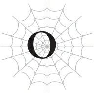
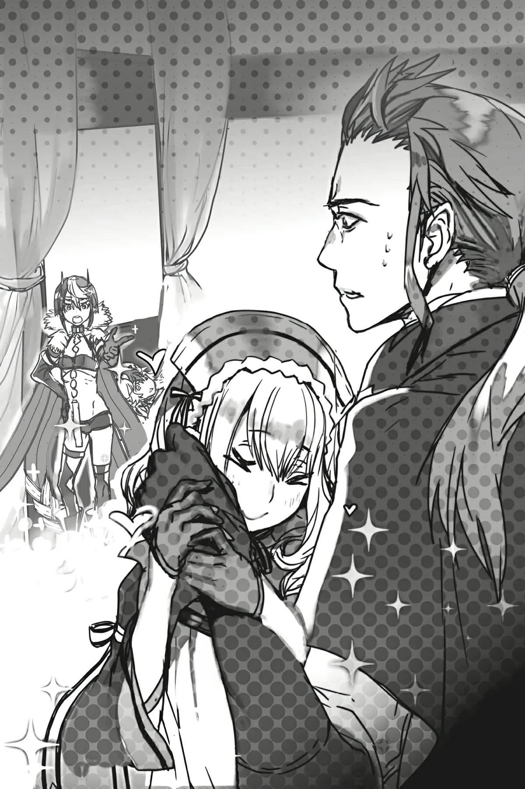

# Chương O: Wrath

---

Gian xưởng cũ kỹ, quen thuộc đó.

Đây là phòng riêng của tôi trong một trò chơi trực tuyến.

Trò chơi mà tôi bắt đầu tham gia sau khi những người bạn mới quen ở trường cấp ba, Shun và Kanata, rủ tôi chơi cùng.

Vì họ đã bắt đầu trước, tôi chọn nghề thợ rèn, một vai trò hỗ trợ, để làm tròn đội hình của nhóm. Đó có vẻ là cách tốt nhất để tránh cản trở các nhân vật của Shun và Kanata, vốn đều thuộc kiểu thuần chiến đấu.

Mặc dù ý định đó của tôi cuối cùng lại hóa thừa thãi, vì cả hai luôn đối xử rất tốt và tận tình chỉ bảo cho một tân binh như tôi.

Điều đó khiến tôi thực sự hạnh phúc.

Khi họ chiến đấu bên cạnh tôi và điều chỉnh nhịp độ cho khớp với tôi thay vì chỉ kéo cấp (power-level) cho tôi, tôi biết mình sẽ có thể xây dựng một tình bạn đẹp với hai người họ.

Chúng tôi cùng nhau đi thu thập nguyên liệu rèn và săn những con quái vật rơi ra vật phẩm cần thiết để cường hóa vũ khí của chúng tôi.

Khi một người trong nhóm bận không thể online, hai người còn lại sẽ chơi cùng nhau, và trong những dịp hiếm hoi khi cả hai đều không thể chơi, tôi sẽ tự mình rèn đồ một mình.

Đó là một lối chơi khá thỏa mãn.

Khi thấy hai người họ sử dụng vũ khí hay giáp do chính tay tôi chế tạo, chỉ riêng điều đó thôi cũng đủ làm tôi cảm thấy tuyệt vời rồi.

Các nghề chế tạo thực sự không tệ chút nào.

Cha và ông nội tôi từng vận hành một xưởng cơ khí nhỏ.

Khi còn nhỏ, tôi không biết chính xác họ sản xuất cái gì ở đó, nhưng tôi đoán đó là một loại linh kiện máy móc nào đó.

“Chúng ta làm ra những thứ này vì mọi người cần chúng, nhưng giờ những nhà sản xuất lớn cũng làm ra chúng, thế là lũ khốn đó đều chạy sang phe đối thủ hết.”

Ông nội tôi thường xuyên phàn nàn về chuyện này.

Rõ ràng là đã xuất hiện một nhà máy lớn hơn có thể sản xuất hàng loạt các linh kiện đó, thế nên các công ty vốn vẫn mua hàng từ xưởng của gia đình tôi đã chấm dứt hợp đồng với chúng tôi.

Ngay cả những khách hàng lâu năm cũng quay lưng, ruồng bỏ ông nội tôi để đem cơ hội kinh doanh sang nơi khác.

Ông nội tôi bị đả kích dữ dội và tìm đến rượu chè sau khi xưởng phá sản, rồi qua đời vì ung thư gan chỉ vài năm sau đó.

Cha tôi chắc hẳn đã sớm nhận ra những ngày tàn của xưởng; ngay khi các hợp đồng bị hủy bỏ, ông quyết định bán xưởng và xin việc tại một công ty khác.

Mỉa mai thay, chúng tôi lại sống sung túc hơn nhờ mức lương mới của cha so với khi ông còn điều hành xưởng.

Có lẽ điều đó cũng khiến ông nội tôi muộn phiền.

Nhưng không phải là cha tôi không cảm thấy gì khi bán đi nhà xưởng.

Không giống như ông nội, ông không phải kiểu người hay nói, nhưng tôi thường thấy ông lặng im nhìn về phía nền đất cũ nơi xưởng từng đứng với biểu cảm đầy phức tạp.

Đó chắc chắn không phải là gương mặt của một người đàn ông đã chấp nhận những gì xảy ra.

Tôi nghĩ lý do mình có ý thức mạnh mẽ về đúng sai như vậy là vì tôi lớn lên khi chứng kiến cha và ông nội mình.

Cả hai đều cảm thấy tự hào và gắn bó sâu sắc với nhà xưởng của họ.

Nhưng rồi nó bị nghiền nát chỉ vì sự tiện lợi của những công ty đã đơn phương hủy bỏ hợp đồng với họ.

Vậy mà những công ty đó chỉ đơn giản là ký hợp đồng mới với một nhà máy lớn hơn và kết quả là việc kinh doanh của họ ngày càng phát triển.

Thật bất công.

Cha và ông nội tôi đã thầm lặng cống hiến hết mình để làm ra các linh kiện máy móc, giống như những chiến binh thề trung thành, nhưng đổi lại, họ chỉ đơn giản là bị vứt bỏ.

Liệu có công lý nào trong chuyện đó không?

Không hề.

Tôi chắc chắn những công ty đó có lý do bào chữa của riêng họ, chẳng hạn như chi phí và thông lệ kinh doanh.

Nhưng thật khó để tôi chấp nhận điều đó khi nó bắt cha và ông nội tôi phải chịu đựng bao nhiêu đau khổ, trong khi những công ty chịu trách nhiệm lại hoàn toàn vô can.

Đó là lý do tại sao khi nhìn thấy điều gì đó sai trái—ngay cả khi nó không bị luật pháp cấm đoán, ngay cả khi người khác ngoảnh mặt làm ngơ—tôi vẫn không thể trơ mắt nhìn.

Nhưng nghĩ lại, tôi đoán mình đã luôn có chút gì đó như vậy ngay cả trước khi xưởng phá sản, vì vậy có lẽ tôi vẫn sẽ là kiểu người đó ngay cả khi không có tầm ảnh hưởng từ cha và ông nội.

Nhưng biến cố đó chắc chắn là thứ đã thúc đẩy tôi tiến sâu hơn trên con đường ấy.

Tôi luôn cố gắng làm những gì đúng đắn.

Và tôi luôn cố gắng sửa chữa những điều có vẻ sai trái.

Nhưng thế giới thực không hề đơn giản như vậy.

Nếu chỉ làm điều đúng đắn là đủ để mọi việc diễn ra tốt đẹp, thì xưởng đã không phải đóng cửa.

Tương tự như thế, ngay cả khi tôi làm những điều mình nghĩ là đúng, nó thường khiến tình hình trở nên tồi tệ hơn hoặc dẫn đến việc tôi bị coi là kẻ xấu.

Một phần của vấn đề là tôi thường cố gắng giải quyết mọi việc bằng bạo lực thuần túy.

Có lẽ điều đó chấp nhận được đối với những trận đánh nhau giữa lũ trẻ con, nhưng trong trường hợp của tôi, phương pháp của tôi vẫn chẳng hề thay đổi ngay cả khi đã lớn hơn.

Đó là lý do tại sao người ta gọi tôi là “tiểu quỷ” và tức giận với tôi.

Bạo lực không phải là câu trả lời.

Ai cũng biết điều đó, nhưng tôi vẫn luôn chọn câu trả lời đó mỗi khi muốn làm những gì mình cho là đúng. Tôi sẽ là người đầu tiên thừa nhận, tôi đầy rẫy những mâu thuẫn.

Tôi mất nhiều thời gian hơn những đứa trẻ khác để nhận ra điều đó.

Thế nên lên cấp ba, tôi quyết định trở nên hiền lành hơn.

Ngay khi tôi làm vậy, cuộc sống hoang dã của tôi đã thay đổi hoàn toàn.

Tôi đã có thể tận hưởng một cuộc sống thường nhật yên bình, không có bạo lực.

Chỉ bằng cách từ bỏ bạo lực và ngoảnh mặt làm ngơ trước những điều tôi thấy bất công, tôi đã có thể sống một cuộc sống như bất kỳ học sinh cấp ba bình thường nào khác.

Tôi thậm chí còn may mắn có được tình bạn với Shun và Kanata và bắt đầu yêu thích việc đi học.

*Nhưng cậu thực sự ổn với chuyện này sao?* Một giọng nói vang lên hỏi tôi từ tận sâu thẳm tâm can.

Tôi không có câu trả lời cho câu hỏi đó.

Giờ đây, bằng cách nào đó, tôi đang ở trong căn phòng của mình tại ngôi làng goblin.

Thực ra, gọi là phòng riêng của tôi thì không đúng lắm, vì đó là căn phòng duy nhất trong nhà, nơi cả gia đình cùng sinh hoạt.

Kiến trúc của loài goblin không thể gọi là tiên tiến được, và vì chúng tôi sinh sống trong môi trường khắc nghiệt và nghèo nàn của Dãy núi Huyền Bí, một căn nhà chỉ độc một phòng cho mỗi gia đình đã là giới hạn tốt nhất có thể rồi.

Ở góc căn phòng dột nát này, tôi đang chế tạo vũ khí.

Mọi thứ đã thay đổi rất nhiều sau khi tôi phát hiện ra kỹ năng [Tạo Vũ khí] của mình.

Những vật dụng tôi tạo ra bằng kỹ năng này, chẳng hạn như dĩa và dao, được phân phát khắp làng, và tôi cũng có thể chế tác cả công cụ làm nông, giúp cuộc sống của chúng tôi trở nên dễ dàng hơn.

Đúng như tên gọi, kỹ năng [Tạo Vũ khí] chỉ có thể làm ra những thứ có thể sử dụng làm vũ khí, nhưng thực chất tôi vẫn có thể chế tạo được rất nhiều loại công cụ nông nghiệp đa dạng. Có lẽ là do trong lịch sử chúng từng được dùng làm vũ khí trong các cuộc nổi dậy hay gì đó tương tự.

Và rồi có cả mục đích sử dụng thực sự của kỹ năng: chế tạo vũ khí thực chiến.

Một khi tôi học được cách rèn ra những vũ khí chất lượng tốt, hiệu suất săn bắn của cả làng tăng lên đáng kể.

Nhờ vậy, những thợ săn goblin mang về nhiều thịt quái vật hơn và giảm thiểu tình trạng chết đói trong làng, đồng thời phạm vi khám phá và săn bắn của họ cũng được mở rộng.

Dù vậy, điều đó không nghĩa là mọi thứ đều trở nên tốt đẹp.

Những con goblin tầm tuổi tôi vẫn thỉnh thoảng chết cóng hoặc bị ăn thịt bởi các loại rau ngoài đồng nếu thu hoạch sai thời điểm.

Bạn chắc hẳn đang nghĩ chuyện này thật vô lý, nhưng loại rau duy nhất đủ sức sinh trưởng trong cái lạnh của Dãy núi Huyền Bí lại chính là những loài thực vật quái vật ăn thịt người...

Lần đầu tiên nhìn thấy cảnh tượng đó, tôi suýt chút nữa là ngất đi vì sốc.

Và cũng có những con goblin khác mà tôi hằng kính trọng như các đàn anh lớn đã ra đi săn và không bao giờ trở về, vân vân.

Nhưng bên cạnh đó, vẫn có những khoảng thời gian tốt đẹp, chẳng hạn như khi anh trai tôi may mắn tiến hóa thành một hobgoblin.

Gia đình tôi gồm có cha mẹ, bốn người anh trai, sáu người chị gái, tôi, và một người em trai cùng một người em gái út, tổng cộng là mười lăm người.

Đối với con người thì đó là một đại gia đình, nhưng đối với goblin, chuyện này khá là bình thường.

Thời gian thai nghén của họ rất ngắn và tỷ lệ sinh sản cao, nên rất nhiều đứa trẻ có thể chào đời trong một khoảng thời gian ngắn.

Dù vậy, tỷ lệ tử vong của goblin cũng rất cao.

Theo những gì tôi được nghe kể lại, đáng lẽ tôi còn có thêm bốn người anh chị nữa, và tôi từng có một người em trai bị chết lưu.

Đó quả là một khoảng thời gian vô cùng khó khăn.

Cậu nhóc đáng lẽ sẽ là đứa em trai đầu tiên của tôi.

Nhưng em ấy đã không thể qua khỏi.

Cả gia đình chúng tôi đã khóc cùng nhau, và tôi mất hết cảm giác thèm ăn trong một thời gian.

Người đã an ủi tôi vào lúc đó chính là anh cả của tôi, Raza-Raza.

Mặc dù tôi không biết liệu có thực sự nên gọi hành động đó là “an ủi” hay không.

Vì những gì anh ấy thực sự làm là đấm tôi một cú.

“Mày không thể cứ ngồi đó mà ủ rũ mãi được. Ăn đi và sống cho đàng hoàng. Đó là nghĩa vụ của những kẻ vẫn còn được sống.”

Nói đoạn, anh ép tôi phải ăn.

Theo đúng nghĩa đen—anh nạy miệng tôi ra và nhét thức ăn thẳng xuống họng.

Kể từ thời điểm đó, nếu tôi có vẻ buồn rầu vào giờ ăn, anh ấy lại ép tôi ăn tiếp.

Tôi từng nghĩ việc đó thực sự có thể giết chết mình, nhưng ít nhất nó cũng kéo tôi ra khỏi sự trầm uất.

Raza-Raza’s word was law, và quan trọng hơn, mẹ tôi lúc bấy giờ đã mang thai một đứa con mới.

Loài goblin có một ý chí sinh tồn thật đáng kinh ngạc.

Và chẳng mấy chốc, em gái nhỏ của tôi chào đời.

Ngay lập tức, tôi thề rằng mình sẽ bảo vệ con bé.

Cũng là vì đứa em trai xấu số đã không có cơ hội được sống của tôi.

Thực tế thì tôi cũng có thêm một em trai không lâu sau đó, nhưng tôi vẫn yêu chiều em gái mình nhất. Không phải tôi không yêu thương em trai, nhưng vì lời thề đã lập, tôi dành nhiều sự quan tâm nhất cho con bé.

Đáp lại, con bé cũng rất bám tôi, và hai anh em luôn quấn quýt bên nhau.

Mỗi khi tôi chế tạo đồ vật bằng kỹ năng [Tạo Vũ khí], em gái tôi lại ngồi cạnh bên và lặng lẽ quan sát.

Và khi món vũ khí hoàn thành, con bé sẽ vỗ tay reo hò phấn khích như thể không có điều gì khác làm nó tự hào hơn thế.

Nên hiển nhiên là tôi không thể ngừng yêu thương con bé được.

Sự cổ vũ đó càng khiến tôi quyết tâm tiếp tục rèn thêm nhiều thứ nữa.

Giống như lúc tôi rèn đồ trong trò chơi trực tuyến kia vậy, việc tạo ra những thứ có ích cho người khác thực sự rất vui. Nó mang lại cho tôi cảm giác việc mình làm có giá trị.

Không có gì thỏa mãn hơn việc thấy những thứ do chính tay mình tạo ra được mọi người cần đến và hữu dụng.

Có lẽ đó cũng là cảm giác của cha và ông nội tôi khi họ điều hành xưởng cơ khí của mình.

Cảnh tượng lại thay đổi lần nữa.

“Chạy đi!”

Anh trai tôi, Raza-Raza, là một trong những chiến binh giỏi nhất làng.

Anh ấy là một High Goblin, hình thái tiến hóa của hobgoblin, nên các chỉ số của anh cao hơn hẳn so với bất kỳ con goblin bình thường nào khác.

Tôi đã rất tự hào về anh trai mình.

Tất cả những người anh em khác của tôi đều ngưỡng mộ Raza-Raza.

Nhưng lúc này, cơ thể anh đầy rẫy vết thương và anh đang hét lớn bảo mọi người chạy đi.

Thế nên tôi nghe theo, nắm lấy tay em gái và bỏ chạy.

Con người đang tấn công ngôi làng.

Đã có những dấu hiệu cảnh báo trước về việc này. Thời gian gần đây, các đội săn liên tục nhìn thấy con người xuất hiện thường xuyên hơn.

Do sở hữu những vũ khí tôi chế tạo, những thợ săn được trang bị tốt hơn đã mở rộng phạm vi khám phá của họ.

Và cuối cùng, nó đã chạm tới vùng rìa của một ngôi làng con người mới được thành lập dưới chân Dãy núi Huyền Bí.

Con người cảm thấy bị đe dọa bởi điều đó, thế nên họ quyết định chủ động tấn công.

Hậu quả của những đợt tấn công đó là phần lớn các chiến binh goblin đã tiến hóa trong các đội săn đều đã tử trận.

Và giờ đây, con người đang tấn công vào căn cứ chính của goblin, chính là ngôi làng của chúng tôi.

Bằng chính những món vũ khí do chính tay tôi tạo ra trên tay họ.

Thật kinh khủng.

Tôi tạo ra những vũ khí đó là để dành cho các đội đi săn.

Chúng không bao giờ được dùng để con người tấn công chính ngôi làng của chúng tôi!

Họ đã cướp đoạt từ tay các thợ săn những món vũ khí tôi tự tay rèn dũa tỉ mỉ, rồi dùng chính chúng để tàn sát ngôi làng.

Sự thật đó làm tôi vô cùng căm phẫn.

Và cả việc bản thân tôi quá yếu đuối để ngăn cản họ nữa.

Tôi lớn nhanh so với các goblin khác, nhưng tôi vẫn còn quá nhỏ.

Là một goblin bình thường chưa tiến hóa, công dụng duy nhất của tôi chỉ là chế tạo vũ khí.

Nếu ngay cả những thợ săn lành nghề còn không chống lại nổi những con người này, thì tôi chắc chắn chẳng có chút cơ hội nào.

Thế nên tôi chạy trốn.

Thật nhục nhã, nhưng tính mạng của em gái nhỏ đang nằm trong tay tôi.

Tôi đã thề bằng cả mạng sống của mình rằng sẽ bảo vệ con bé.

Nhưng rồi một gã đàn ông xuất hiện chặn đường chúng tôi như muốn cười nhạo vào quyết tâm đó.

Không một chút do dự, tôi ném một món vũ khí vừa rèn trong ngày về phía hắn rồi định bỏ chạy theo hướng khác.

Nhưng gã đàn ông đó dễ dàng tránh được cú ném của tôi và nhanh chóng lướt qua để chặn đường chúng tôi lần nữa.

Chỉ nhìn qua chuyển động của hắn cũng đủ biết các chỉ số của gã này cao hơn tôi rất nhiều.

“Hửm?”

Tôi đã hết đường lui.

Trong lúc tôi đang tuyệt vọng tìm lối thoát, gã đàn ông nhìn tôi với vẻ mặt đầy thích thú.

Sau đó, hắn đặt tay lên một chiếc vòng cổ bằng đá trên cổ mình và lầm bầm điều gì đó.

Tuy nhiên, thứ ngôn ngữ đó khác với tiếng của loài goblin, nên tôi không thể hiểu nổi hắn đang nói gì.

Dù vậy, luồng ớn lạnh chạy dọc sống lưng như thể đang bóp nghẹt xương tủy mách bảo tôi rằng hắn đang làm gì đó với mình.

Gã đàn ông nheo mắt lại.

Tôi không biết hắn đang làm gì, nhưng đây là cơ hội của tôi.

Tôi định quay người bỏ chạy, nhưng gã đàn ông đã tóm lấy đầu tôi trước khi tôi kịp cử động và đè nghiến tôi xuống đất.

“Ư… Guh?!”

Một tiếng hét thảm thiết thoát ra khỏi môi tôi trước khi tôi kịp kiềm chế.

Đó không chỉ là cơn đau do bị đè xuống đất, mà còn là một cảm giác kỳ lạ đang len lỏi vào cơ thể tôi từ bàn tay của gã đàn ông kia.

Chuyện gì đang xảy ra thế này?!

Cơn đau và sự bất an ập đến tấn công tôi, giống như có một luồng dị vật đang chảy vào trong cơ thể mình.

Đồng thời, tôi cảm nhận được một cảm giác xa lạ, như thể tâm trí tôi đang bị một thứ gì đó vấy bẩn.

Tôi nghiến răng, cố gắng chống cự lại nó.

Sự phản kháng đó đủ giúp tôi giữ lại được lý trí của mình, nhưng cơ thể tôi bắt đầu không còn nghe theo mệnh lệnh nữa.

Tôi ra sức giãy giụa để thoát khỏi bàn tay của hắn, nhưng sức lực của tôi nhanh chóng bị rút cạn.

Nơi khóe mắt, tôi thấy em gái mình đang đứng chết trân tại chỗ.

*Chạy đi!*, tôi muốn hét lên như thế, nhưng miệng tôi không thể mấp máy nổi.

Gã đàn ông buông tay ra.

Nhưng cơ thể tôi vẫn không chịu hoạt động theo ý muốn.

Tôi cố gắng gượng đứng dậy, nhưng ngay cả một ngón tay cũng không thể nhúc nhích.

Cứ như thể cơ thể này không còn thuộc về tôi nữa.

Và thực tế, đó chính xác là những gì đang xảy ra vào khoảnh khắc ấy.

Và rồi, và rồi...

Cảnh tượng thay đổi.

Bên trong một ngôi nhà, được xây dựng chắc chắn hơn nhiều so với bất kỳ ngôi nhà nào ở làng goblin.

Đây là làng của con người nằm dưới chân Dãy núi Huyền Bí, căn cứ của những kẻ đã hủy diệt làng goblin của chúng tôi.

Tại đây, tôi đang bị ép buộc phải chế tạo vũ khí.

Em gái tôi không còn ở bên cạnh tôi nữa.

Thay vào đó, tôi nhận được hai danh hiệu mới: [Kẻ Sát Đồng Minh] và [Kẻ Ăn Thịt Đồng Tộc].

Tôi đã bị nô dịch bởi Buirimus, một trong những kẻ đã tấn công làng goblin.

Điều đó hoàn toàn trái với ý muốn của tôi.

Tôi bị ép buộc phải phục tùng và thực hiện bất cứ yêu cầu nào của hắn.

Thật bất công.

Tại sao chuyện này lại xảy ra chứ?

Dù có vắt óc suy nghĩ bao nhiêu đi chăng nữa, tôi cũng chẳng tìm ra câu trả lời.

Mỗi khi tôi hoàn thành việc chế tác một món vũ khí, Buirimus lại nhìn nó với vẻ hài lòng rồi lấy đi mất.

Viên đá đeo trên cổ Buirimus là một Đá Thẩm định cao cấp.

Ở làng goblin cũng có một Đá Thẩm định, đó là lý do giúp chúng tôi phát hiện ra tôi có kỹ năng [Tạo Vũ khí], nhưng viên của Buirimus có chất lượng cao hơn hẳn.

Kỹ năng của tôi chính là lý do hắn nô dịch tôi thay vì giết tôi.

Thà rằng hắn giết tôi đi còn hơn.

Kỹ năng [Tạo Vũ khí] của tôi không phải để phục vụ cho những kẻ như các người.

Nhưng ngày qua ngày, tôi vẫn bị ép rèn vũ khí, và từng món một đều rơi vào tay những con người đó.

Tôi vô cùng uất ức.

Và trên hết, tôi cực kỳ giận dữ.

Dù lòng thù hận dâng trào trong lồng ngực, tôi vẫn không thể thoát khỏi sự khống chế của Buirimus, nên đành phải tiếp tục rèn vũ khí.

Cảnh tượng lại thay đổi lần nữa.

Ở Dãy núi Huyền Bí, Buirimus ép tôi phải giết chết những con quái vật mà hắn đã thuần hóa.

Đó gọi là kéo cấp (power-leveling).

Kỹ năng [Tạo Vũ khí] tiêu tốn MP của tôi để tạo ra vũ khí.

Vì vậy, nếu tôi tăng cấp độ và tiến hóa, tôi sẽ có nhiều MP hơn, đồng nghĩa với việc tôi có thể chế tạo được nhiều vũ khí hơn với chất lượng tốt hơn.

Khi quá trình này lặp đi lặp lại, tôi sớm tiến hóa thành một hobgoblin.

Sự tiến hóa này mang một ý nghĩa vô cùng quan trọng đối với loài goblin.

Một goblin bình thường có tuổi thọ cực kỳ ngắn, thường chưa đến mười năm.

Nhưng nếu một goblin tiến hóa thành hobgoblin, họ sẽ có được tuổi thọ ngang bằng với con người.

Thế nên goblin luôn tham gia vào các đội săn trong một khoảng thời gian để tiêu diệt quái vật, nâng cấp độ và tiến hóa thành hobgoblin.

Theo một cách nào đó, đây cũng là một nghi thức trưởng thành.

Vượt qua thử thách này, một goblin mới lần đầu tiên được công nhận là người lớn.

Dĩ nhiên, rất nhiều goblin đã bỏ mạng trong quá trình đó.

Nên săn bắn không chỉ đơn thuần là cách kiếm thức ăn, mà còn là một dạng nghi lễ thiêng liêng.

Ấy vậy mà, tôi bị ép phải tiến hóa thành hobgoblin mà chẳng hề có bất kỳ nghi lễ hay cảm xúc nào.

Tôi đã luôn ao ước một ngày nào đó được tham gia vào đội săn và cùng sát cánh chiến đấu chống lại quái vật với các thợ săn đồng bào.

Nhưng điều đó đã không bao giờ xảy ra.

Đó là một sự tiến hóa trống rỗng, không có chút cảm giác tự hào hay thành tựu nào.

Thay vì có em gái ở bên để chúc mừng sự tiến hóa của tôi, chỉ có Buirimus đứng đó quan sát và gật đầu với vẻ đắc thắng.

Và đứng bên cạnh hắn là anh trai tôi, Raza-Raza, với đôi mắt hoàn toàn mất đi ánh sáng của sự sống.

Tôi không phải là người duy nhất bị Buirimus nô dịch.

Raza-Raza cũng là một nạn nhân của hắn.

Sự khống chế của Buirimus đối với Raza-Raza sâu sắc hơn nhiều so với tôi; sự phản kháng của anh lúc ban đầu sớm biến mất, và giờ đây anh đi theo Buirimus như một con rối không có ý chí của riêng mình.

Người này từng là chiến binh vĩ đại nhất làng, là người anh trai mà tôi hằng ngưỡng mộ, được mọi người kính trọng.

Những người khác trong làng sẽ nói gì nếu họ thấy anh lúc này?

Họ có thấy anh thật thảm hại không?

Hay họ sẽ đau buồn và thương xót cho anh?

Họ có nổi giận với Buirimus vì đã biến anh thành thế này không?

Tất cả những gì tôi có thể làm là tự hỏi.

Bởi vì mọi người khác trong làng đều đã nằm xuống.

Ý nghĩ rằng một ngày nào đó mình cũng sẽ kết thúc giống như Raza-Raza khiến tôi ngập tràn trong sợ hãi.

Nhưng cảm xúc chiếm trọn trái tim tôi lúc này lại là sự căm thù tột cùng đối với Buirimus và những con người khác.

Ngay cả khi hắn có thể điều khiển cơ thể tôi, tôi sẽ không bao giờ để hắn chiếm đoạt tâm trí mình.

Cảnh tượng thay đổi.

Lần này là một cảnh tượng khác đáng lẽ không bao giờ nên tồn tại.

Lúc đó, tôi đã nghi ngờ chính đôi mắt của mình.

Tôi đã nghĩ đó hẳn là trò đùa gì đó, một trò đùa vô cùng tồi tệ.

Hoặc có lẽ là một màn kịch để khiến kẻ thù lơ là cảnh giác.

Nhưng không phải. Tôi biết rất rõ điều đó.

Anh trai tôi, Raza-Raza, đang cười đùa.

Cùng với kẻ thuần thú Buirimus. Kẻ thù đã hủy diệt ngôi làng của chúng tôi.

Trông anh ấy như thể thực sự đang có một khoảng thời gian vui vẻ.

Thế nên còn có cả sự tôn trọng và yêu mến thực sự trong mắt anh.

Chủ yếu việc đó thôi đã là điều không bao giờ nên xảy ra rồi, nhưng thứ khiến mọi chuyện tồi tệ hơn chính là những bông hoa ép mà anh cầm trên tay.

Những bông hoa đó vô cùng quan trọng trong văn hóa goblin. Khi một goblin đi săn, họ sẽ mang theo một bông hoa như một lá bùa may mắn.

Đối với goblin, săn bắn là một nghi thức thiêng liêng.

Thế nên khi các thợ săn lên đường, những người ở lại sẽ tặng họ những bông hoa ép bằng tay để chúc may mắn.

Việc tìm thấy những bông hoa đang nở trong cái lạnh buốt giá của Dãy núi Huyền Bí là một việc vô cùng khó khăn.

Nhưng họ vẫn luôn tặng các thợ săn những lá bùa hoa đó.

Và giờ đây Raza-Raza đang cầm trên tay vài bông hoa quý giá như vậy.

Mỗi thợ săn chỉ được tặng duy nhất một bùa hoa, nên chúng không thể nào là của Raza-Raza được. Hơn nữa, đã một thời gian dài trôi qua kể từ khi ngôi làng của chúng tôi bị hủy diệt.

Dù có được ép đi chăng nữa, lá bùa của Raza-Raza đáng lẽ cũng đã phải héo tàn từ lâu.

Vậy thì những bông hoa bùa hộ mệnh kia là của ai mà anh trai tôi lại đang giữ?

Tôi không muốn nghĩ về điều đó, nhưng chỉ có một câu trả lời khả dĩ duy nhất.

Những bông hoa Raza-Raza cầm chắc chắn thuộc về những chiến binh của một ngôi làng goblin khác, không phải làng chúng tôi.

Và việc Raza-Raza giữ chúng có nghĩa là anh ấy đã tấn công ngôi làng đó, và rất có thể là đã tiêu diệt nó.

Tầm nhìn của tôi nhuốm một màu đỏ ngầu.

Tại sao? Tại sao? Tại sao? Tại sao? Tại sao?

Tại sao? Tại sao? Tại sao? Tại sao? Tại sao? Tại sao? Tại sao?

Tại sao? Tại sao? Tại sao? Tại sao?

Tại sao? Tại sao? Tại sao? Tại sao? Tại sao? Tại sao? Tại sao? Tại sao?

Tại sao? Tại sao? Tại sao?

Anh ấy đã phản bội chúng tôi.

Anh ấy đã vấy bẩn lòng tự tôn của chính mình.

Tôi không thể tha thứ cho chuyện này.

`<Độ thông thạo đã đạt mức yêu cầu. Kỹ năng [Cuồng Nộ LV 9] đã trở thành [Cuồng Nộ LV 10].>`

`<Điều kiện thỏa mãn. Kỹ năng [Cuồng Nộ LV 10] đã tiến hóa thành kỹ năng [Phẫn Nộ].>`

`<Độ thông thạo đã đạt mức yêu cầu. Kỹ năng [Cấm kỵ LV 3] đã trở thành [Cấm kỵ LV 5].>`

`<Điều kiện thỏa mãn. Nhận được danh hiệu [Kẻ Thống Trị Phẫn Nộ].>`

`<Nhận được các kỹ năng [Đấu Thần Đấu Pháp LV 10] [Enma] nhờ hiệu quả của Danh hiệu [Kẻ Thống Trị Phẫn Nộ].>`

Giờ đây khi nghĩ lại, tôi có thể suy đoán rằng Raza-Raza hành động như thế chỉ vì sự khống chế của Buirimus đối với anh đã tiến sâu đến mức đó, và chắc chắn anh sẽ không bao giờ muốn làm vậy nếu còn tỉnh táo.

Nhưng vào thời điểm đó, tôi đã quá điên cuồng vì giận dữ để có thể suy nghĩ sâu xa như vậy.

Cơn thịnh nộ tích tụ bên trong tôi như một luồng nhiệt đỏ rực thiêu rụi mọi thứ khác, đe dọa thiêu đốt cả cơ thể tôi.

Đồng thời, phép trói buộc của kẻ thuần thú đang hạn chế tôi cũng bị thiêu rụi hoàn toàn.

Aaa. Tôi tự do rồi.

Giờ thì hắn không thể ngăn cản tôi được nữa.

Tôi dùng toàn bộ sức lực của mình để tạo ra một món vũ khí có sức hủy diệt khủng khiếp nhất có thể.

Nó tạo ra một thanh hỏa kiếm đáng sợ, như được định hình bởi những suy nghĩ xấu xa, xấu xí bên trong tôi.

Không một giây do dự, tôi chém mạnh nó xuống kẻ phản bội trơ trẽn kia.

Không kịp phản ứng, người mà tôi từng gọi là anh trai bị chém thành từng mảnh và bị nuốt chửng bởi một vụ nổ lửa.

Tôi lập tức quay sang để chém chết Buirimus tiếp theo, nhưng đúng như dự đoán, hắn đã kịp lùi ra xa tôi.

Những gã đàn ông khác rầm rập lao tới bao vây lấy tôi.

Buirimus bắt đầu triệu hồi một con quái vật mới.

Có sao đâu chứ.

Tôi chẳng quan tâm liệu mình có mất mạng trong quá trình này hay không.

Những kẻ này sẽ phải nếm trải cơn thịnh nộ của tôi.

Và chẳng mấy chốc...

“Hóa ra đây là quả báo mà ta phải gánh chịu...”

Tôi cúi nhìn xuống Buirimus trong những khoảnh khắc cuối cùng của đời hắn.

Hắn và tôi là hai kẻ duy nhất còn sống sót ở nơi này.

Tôi đã giết sạch tất cả những kẻ khác.

Kẻ địch sở hữu lực lượng quân sự vượt trội hơn nhiều. Nhưng tôi đã bù đắp điều đó bằng kỹ năng [Phẫn Nộ], [Đấu Thần Đấu Pháp], và trên hết là khả năng hồi phục hoàn toàn độc nhất vô nhị mỗi khi thăng cấp của mình.

Và việc tiêu diệt dù chỉ một vài kẻ địch cũng đủ để nâng cấp độ của tôi lên, có lẽ vì cấp độ ban đầu của tôi quá thấp.

Tôi vắt kiệt HP, MP, và SP của mình đến cận kề cái chết, rồi hồi phục hoàn toàn nhờ việc thăng cấp.

Sau đó tôi tiếp tục chiến đấu cho đến khi cận kề cái chết một lần nữa và lặp lại quá trình đó.

Mọi chuyện dễ dàng hơn một phần là vì ban đầu, họ đã nương tay để không giết chết tôi.

Kỹ năng [Tạo Vũ khí] của tôi vô cùng giá trị đối với họ.

Họ không thể chấp nhận việc mất đi năng lực đó.

Ý đồ của họ rất rõ ràng khi cố gắng vô hiệu hóa tôi trong trận chiến thay vì cố sát hại tôi.

Và tôi đã tận dụng triệt để lợi thế đó.

“Thật nhục nhã.”

Buirimus, kẻ sống sót cuối cùng, rất mạnh.

Cả với tư cách một kẻ thuần thú lẫn một chiến binh.

Hắn vượt trội hơn hẳn so với bất kỳ kẻ nào khác chỉ tính riêng về sức mạnh thuần túy.

Nhưng giờ đây hắn đang nằm rạp dưới đất và khóc lóc.

“Cậu... hận ta lắm sao?”

Tôi không trả lời câu hỏi của Buirimus.

Không phải vì tôi không thể. Tôi đã học được ngôn ngữ của họ trong thời gian làm nô lệ cho Buirimus.

Nhưng trả lời cũng chẳng để làm gì.

Thay vào đó, tôi chỉ đơn giản là vung thanh kiếm đang giơ cao trên đầu xuống.

“Xin lỗi...”

Nói đoạn, Buirimus trút hơi thở cuối cùng.

Những lời cuối của hắn trĩu nặng sự ngoan cường cố chấp, như thể hắn vẫn cố bám víu lấy sự sống bằng mọi giá.

Hắn chắc hẳn phải có điều gì đó rất muốn thực hiện, ngay cả khi điều đó đồng nghĩa với việc tiêu diệt tận gốc loài goblin chúng tôi.

Đó là kết cục xứng đáng cho hắn.

Ấy vậy mà, trái tim tôi vẫn trĩu nặng vô cùng.

Tôi cảm nhận được một cảm giác mất mát và bất lực kinh khủng.

Và cả một cơn giận dữ âm ỉ cháy bỏng bên dưới tất cả những điều đó.

Tôi giật lấy Đá Thẩm định trên xác Buirimus và dùng nó để [Thẩm định] chính mình.

Ở đó, tôi đọc được dòng chữ `<Có thể Tiến hóa>`.

Tôi có hai lựa chọn: `<High Goblin>` và `<Oni>`.

Tôi đã đưa ra lựa chọn của mình.

Đồng thời, tôi sử dụng kỹ năng [Đặt tên] để đổi tên mình thành một cái tên mới: Wrath.

Loài goblin rất tự hào về tên gọi của họ.

Tôi hầu như chỉ sử dụng kỹ năng [Đặt tên] để đặt tên cho các vũ khí mình chế tạo bằng [Tạo Vũ khí], giúp gia tăng hiệu năng của vũ khí. Nhưng tôi cũng có thể dùng nó để đổi tên của một goblin, việc này sẽ giúp tăng các chỉ số của họ.

Tuy nhiên, chưa từng có goblin nào chấp nhận điều đó.

Tộc goblin coi trọng tên của mình đến mức đó đấy.

Tên của goblin luôn là hai âm tiết giống nhau lặp lại, theo tên của một goblin huyền thoại đã chiến đấu và hy sinh dũng cảm trên chiến trường.

Chẳng hạn như Raza-Raza hay Razu-Razu.

Razu-Razu từng là tên cũ của tôi.

Nhưng tôi không còn bất kỳ quyền gì để tự xưng là một goblin nữa.

Lòng tự tôn và những lời cầu nguyện của tôi đều đã bị thiêu rụi bởi cơn thịnh nộ này.

Vì vậy, tôi không thể là một goblin được nữa.

Giờ đây, tôi sẽ là một con quỷ.

Một con quỷ đơn thuần, bị chi phối không bởi thứ gì khác ngoài sự phẫn nộ.

Tôi hú lên một tiếng vang động thấu trời xanh cho đến khi quá trình tiến hóa khiến tôi mất đi ý thức.

Cảnh tượng lại thay đổi lần nữa.

Tôi không còn là một goblin, mất đi bạn bè và gia đình, và giờ đây ngay cả mục tiêu trả thù của tôi cũng đã biến mất.

Thành thật mà nói, tôi đã mất đi mọi lý do để tồn tại.

Nhưng tôi vẫn tiếp tục sống.

Tôi không muốn ở lại ngôi làng nơi Buirimus đã nô dịch mình, nhưng giờ đây khi không còn là goblin nữa, tôi cũng cảm thấy không phải khi quay trở lại một ngôi làng goblin. Vì vậy, bằng phương pháp loại trừ, tôi chọn con đường đi ra xa khỏi Dãy núi Huyền Bí.

Con đường dẫn đến vùng đất do con người kiểm soát, và một khi tôi đã tiến hóa thành một con quỷ, các mạo hiểm giả liền xông vào tấn công tôi không chút do dự.

Tôi liên tục lật ngược thế cờ và giành chiến thắng trước bọn họ, cho đến khi một nhóm mạo hiểm giả quy mô lớn tấn công tôi cùng một lúc.

Nhưng tôi đã ngăn chặn được bọn họ bằng những cạm bẫy và ma kiếm chuẩn bị sẵn từ trước.

Tôi đã mất đi phương hướng và ý nghĩa của việc tồn tại, nhưng tôi vẫn tiếp tục chiến đấu và sống sót, được thúc đẩy bởi cơn giận và sự cố chấp do kỹ năng [Phẫn Nộ] mang lại.

Sau đó, khi đã đánh bại nhóm mạo hiểm giả kia, đối thủ tiếp theo của tôi lại là một đội quân chính quy. Lão kị sĩ và lão ma pháp sư dẫn đầu quân đội đã chiếm thế thượng phong trước tôi, buộc tôi phải bỏ chạy.

Trong lúc tôi chạy trốn, một gã đàn ông bí ẩn đã gieo rắc các hiệu ứng trạng thái bất thường [Sợ hãi] và [Ảo giác] lên tôi, khiến tôi chạy loanh quanh trong trạng thái nửa điên nửa tỉnh.

Khi nhận ra, tôi thấy mình đã quay trở lại đúng ngôi làng nơi Buirimus từng giữ chân tôi.

Tôi quét sạch toán quân rõ ràng là đang mai phục sẵn ở đó để phục kích tôi, và chỉ đến lúc đó, sự thật mới cuối cùng thức tỉnh tôi.

Tôi không muốn chiến đấu nữa. Chẳng có lý do gì để làm vậy cả.

Nực cười thật đấy, tôi biết chứ.

Tôi đã tiếp tục chiến đấu suốt một thời gian dài, được đẩy đi bởi cơn thịnh nộ và sự cố chấp, mà thậm chí còn không nhận ra điều đó.

Rồi khi đã hoàn toàn kiệt sức, tôi gạt bỏ mọi lòng tự tôn và danh dự sang một bên để cố gắng quay lại ngôi làng goblin cũ. Nơi đó chắc chắn đã bị bỏ hoang, không còn ai sống sót, nhưng tôi nghĩ mình có thể thử ẩn cư và sống một mình ở đó.

Nhưng trên đường đi, tôi lại đánh mất mục tiêu của mình lần nữa.

Kỹ năng [Phẫn Nộ] đã xói mòn tâm trí tôi sâu sắc đến mức suy nghĩ của tôi lại bị kéo về phía chiến đấu.

Tôi tấn công các quái vật sống ở Dãy núi Huyền Bí và quên bẵng mất mục tiêu ban đầu là quay trở về ngôi làng goblin.

Rồi một con rồng vô cùng mạnh mẽ đã thể hiện sự thương hại đối với tôi.

A, nhưng chẳng phải thực ra nó đang nói tôi hãy chết đi một cách gián tiếp sao?

Sau đó, tôi chiến đấu với một cô bé có sáu chi, và một cô bé khác tuy nhỏ nhắn nhưng lại mang đến áp lực đe dọa vô cùng khủng khiếp, cùng một người đàn ông tuy có gương mặt nhợt nhạt nhưng lại rất mạnh mẽ.

Và vì lý do nào đó, Wakaba, người bạn học cùng lớp kiếp trước của tôi, cũng có mặt ở đó.

Khoảng thời gian này, tôi bắt đầu cảm thấy những ký ức của mình có chút kỳ lạ và đáng nghi.

Trong một thế giới có những thứ như chỉ số, việc một cô bé sở hữu sức mạnh đáng kinh ngạc không phải là chuyện bất khả thi.

Và việc có sáu cánh tay có lẽ cũng có thể giải thích bằng vật phẩm nào đó.

Nhưng Wakaba xuất hiện sao? Chuyện đó không thể nào là thật được.

Đó hẳn phải là một giấc mơ hoặc một ảo giác.

Và sau đó, hiện thực của mọi chuyện càng trở nên mơ hồ hơn. Phần còn lại chắc hẳn chỉ là một giấc mơ hoặc thứ gì đó tương tự.

Tôi chiến đấu với quái vật ở Dãy núi Huyền Bí.

Và một kiếm sĩ già cực kỳ, cực kỳ mạnh mẽ.

Và rồi con rồng từng thương hại tôi trước đó đã đứng ra chặn đường tôi.

Cuối cùng, tôi đối đầu với cô gái có hai cánh tay và Wakaba.

...Được rồi, tôi đoán gọi là “cô gái có hai cánh tay” nghe bình thường hơn nhiều.

Có lẽ tất cả những giấc mơ này đã làm tâm trí tôi bị xáo trộn.

Hửm? Một giấc mơ sao?

Vì lý do nào đó, tôi đang bay trên bầu trời.

Không phải sải cánh tự do như một cánh chim.

Không, nó giống như tôi đang rơi tự do hơn là bay.

Mặt đất đang tiến gần lại theo từng giây.

Tôi cảm nhận được nỗi khiếp sợ khi sắp sửa đập mạnh xuống đáy vực.

Và quả thực, cơ thể tôi đâm sầm xuống đất với một tiếng *bịch* khô khốc.

Cảm giác như toàn bộ cơ thể tôi đã bị dập nát và gãy vụn.

Nếu đây thực sự là một giấc mơ, chẳng phải người ta thường sẽ thức giấc ngay trước khi chạm đất hay sao?

Khoan đã, cái gì cơ? Một giấc mơ sao?

Đúng vậy.

Tất cả những điều này chỉ là một giấc mơ mà thôi.

Một giấc mơ dài dằng dặc và khủng khiếp.

“Hả?!”

Tôi giật mình tỉnh giấc.

Có bình thường không khi trong một giấc mơ bạn chạm đất mà không tỉnh dậy, nhận ra đây chắc chắn phải là một giấc mơ, rồi sau đó mới thực sự thức giấc?

Tôi cảm thấy thật kinh tởm.

Toàn thân tôi ướt đẫm mồ hôi.

Nhưng tôi không hề bật dậy ngay khi tỉnh táo.

Hay nói đúng hơn là tôi không thể làm thế.

“Hửm? Chuyện gì thế này?”

Cơ thể tôi không chịu cử động, ngay cả khi tôi đã dốc hết sức để cố ngồi dậy.

Trong sự bối rối, tôi nhìn quanh để cố tìm hiểu xem chuyện gì đang xảy ra.

May mắn thay, ít nhất tôi vẫn có thể quay đầu qua lại, đủ để quan sát xung quanh.

Có vẻ như tôi đang nằm trên một chiếc giường.

Cơ thể tôi được đắp một tấm chăn, nên tôi không thể biết tình trạng của mình ra sao. Nhưng rõ ràng là tôi đang bị trói buộc bởi thứ gì đó.

Tiếp theo, tôi nhìn ngắm căn phòng.

Đó là một căn phòng rộng lớn, lộng lẫy hơn nhiều so với căn nhà dột nát ở làng goblin hay thậm chí là nhà trong làng của Buirimus.

Đây là hoàng cung hay gì đó tương tự sao?

Sự bối rối của tôi càng tăng lên khi tôi cố gắng hiểu tại sao mình lại nằm trong một căn phòng như thế này.

Rồi tôi chạm mắt với một cô bé đang ngồi gần giường của mình.

Đôi mắt trông có vẻ nhân tạo của con bé như thể đang nhìn thấu qua người tôi.

Vì lý do nào đó, con bé gợi cho tôi nhớ đến cô bé có sáu cánh tay.

Khoan đã.

Cô bé có sáu cánh tay sao?

Không, đó hẳn phải là một giấc mơ chứ, đúng không?

Làm sao có thể có một cô bé có sáu cánh tay trong thực tế được.

Tôi đang gặp khó khăn trong việc phân biệt xem phần nào trong những ký ức kia là giấc mơ và phần nào là hiện thực.

Khi nghĩ về chuyện đó, tôi nhận ra mình hoàn toàn không có ý niệm gì về việc làm thế nào tôi lại xuất hiện trong căn phòng sang trọng này. Ký ức gần đây nhất của tôi rất mơ hồ, như ranh giới giữa mơ và thực, hoàn toàn vô dụng.

Chuyện gì đã xảy ra, tại sao, và làm thế nào tôi lại đến được đây?

“Ơ... chào buổi sáng?”

Trong sự bối rối, những từ ngữ duy nhất tôi có thể thốt ra nghe thật ngốc nghếch ngay cả với chính bản thân tôi.

Nhưng tôi còn có thể nói gì khác được chứ?

Đáp lại, cô bé khẽ gật đầu một cách im lặng.

Sau đó, con bé nhặt một chiếc chuông đặt cạnh giường lên và rung nó một cách nhịp nhàng.

Cái đó dùng để gọi quản gia hay gì đó tương tự sao?

Tôi từng thấy kiểu này trong phim nước ngoài ở kiếp trước, nhưng tôi chưa bao giờ thực sự nhìn thấy nó được sử dụng ngoài đời thực.

Dù vậy, âm thanh cô bé tạo ra từ chiếc chuông đó vô cùng chói tai, khiến việc nghe nó thôi cũng đem lại chút áp lực stress.

Theo một cách nào đó, quả thực rất ấn tượng khi con bé có thể thể hiện rõ ràng việc mình không có năng khiếu âm nhạc chỉ bằng cách rung một chiếc chuông đơn giản.

Có lẽ đó cũng là một loại tài năng theo cách riêng.

Mặc dù tôi chẳng muốn nghe tiếp chút nào.

“Riel! Đừng có tạo ra cái tiếng ồn chói tai đó nữa trước khi nó làm tất cả chúng ta phát điên lên đấy!”

Cánh cửa đột ngột mở tung mà chẳng thèm gõ lấy một tiếng.

Đứng ở đó là cô gái có hai cánh tay.

...Nghiêm túc đấy, tại sao tôi lại cứ nghĩ về cô ấy theo cách đó nhỉ?

Ồ, kệ đi. Quan trọng hơn, điều này có nghĩa là cô gái xuất hiện trong những gì tôi nghĩ là một giấc mơ nay đã xuất hiện ngoài đời thực.

Vậy nghĩa là đó không phải là mơ sao?

“Ồ? Anh tỉnh rồi à.”

Đi sau cô gái đó là hai cô bé khác.

Tôi nhận ra một trong hai chính là cô bé có sáu cánh tay.

Mặc dù theo như tôi thấy thì con bé lúc này chỉ có hai cánh tay mà thôi.

“Sophia yêu quý của ta, thật chẳng lịch sự chút nào khi xông vào phòng của một quý ông mà không gõ cửa. Xã hội sẽ nghĩ gì về cháu với tư cách là một tiểu thư nếu cháu cứ làm như vậy chứ? Chúng ta sẽ phải tăng cường gấp đôi các bài học lễ nghi cho cháu thôi.”

Lại một cô gái khác nữa...

Bắt đầu cảm thấy hơi bực mình, tôi nhìn sang người vừa mới bước vào.

Ngay lập tức, một luồng ớn lạnh không thể tả nổi chạy dọc khắp người tôi.

“Hả?! Cái gì thế này—?!”

Cô ấy trông giống như một cô gái bình thường.

Có vẻ lớn tuổi hơn những đứa trẻ khác một chút, nhưng cùng lắm cũng chỉ ở độ tuổi từ giữa đến cuối niên thiếu.

Nhưng vì lý do nào đó, cô gái ấy lại tỏa ra sự hiện diện của một con quái vật tuyệt đối.

Chỉ nhìn vào cô ấy thôi cũng đủ khiến mạch tôi đập điên cuồng.

“Ồ hô hố. Cháu cũng khá đấy chứ khi có thể nhận ra ta mạnh thế nào mà không cần dùng đến [Thẩm định], nhóc con!”

Nụ cười vô tư của cô gái đó bằng cách nào đó trông giống như của một kẻ săn mồi tàn bạo.

Mọi bản năng đều hối thúc cơ thể tôi chạy trốn, nhưng có vẻ như tôi đang bị trói chặt vào lúc này, nên không thể thoát ra được.

“Hừm!”

“Guh?!”

Đột nhiên, tôi bị ném văng xuống sàn nhà.

“Anh cũng to gan lắm mới dám ngó lơ tôi đấy!”

Khi tấm chăn bị kéo lê theo tôi, kẻ chủ mưu đã ném tôi xuống sàn đang đứng khoanh tay nhìn xuống một cách kiêu ngạo.

Đánh giá theo cuộc trò chuyện trước đó của họ, cô gái này chắc chắn là Sophia.

Con bé này khá là khó ưa so với những cô bé khác, vốn chỉ đang đứng yên lặng một bên.

“Ôi, Sophia...”

“Nhưng cậu ta đã dám lờ em đi đấy, cô Ariel? Em đấy! Cô nghĩ em sẽ để yên cho cậu ta cứ nhìn chằm chằm vào cô suốt mà không thèm liếc nhìn em lấy một cái sao? Đương nhiên là không rồi. Không đời nào!”

“...Chà, ta đoán là [Đố Kỵ] đã bắt đầu ảnh hưởng đến cháu một chút rồi đấy. Oải thật. Cháu có thể bình tĩnh lại một giây được không? Ta đang cố nói chuyện ở đây mà.”

Cô gái mà Sophia gọi là cô Ariel lườm con bé một cách điềm đạm.

Đáp lại, Sophia khẽ giật mình và ngoan ngoãn im lặng. Ariel này chắc chắn là người mạnh nhất ở đây.

“Giờ thì, trò chuyện chút nào. Cháu có thể nói chuyện được chứ?”

Tôi không thể phủ nhận điều đó vào lúc này.

Áp lực mà cô ấy tỏa ra làm tôi khó lòng mở miệng, vì vậy tôi chỉ lặng lẽ gật đầu.

“Ồ vậy sao? Rất vui được nghe thế. Vậy là chúng ta đã vượt qua được trở ngại đầu tiên rồi đấy. Nhân tiện, chúc mừng cháu đã lấy lại được lý trí nhé. Và vì cháu có vẻ hiểu được ngôn ngữ con người, ta đoán chúng ta cũng đã vượt qua trở ngại thứ hai rồi.”

Cô Ariel mỉm cười vui vẻ.

Tôi không hoàn toàn hiểu hết những gì cô ấy nói, nhưng có vẻ như đó không phải là điều gì xấu đối với tôi.

“Chà, nói chuyện trong tư thế này chắc khó khăn lắm, nên chúng ta hãy... À, White không có ở đây, nên bọn ta thực sự không thể cởi trói cho cháu được.”

Ariel tiến lại gần chỗ tôi trên sàn và chạm vào sợi tơ đang trói tôi lại. Nó trông cực kỳ mảnh, nhưng lại được quấn thành vô số lớp, khiến tôi trông chẳng khác nào một con sâu trong kén.

Bảo sao tôi không thể cử động nổi.

“Đúng vậy, chịu thôi. [Điều khiển Tơ] không có tác dụng với thứ này. Ta cũng không nghĩ mình có thể giật đứt nó, còn đốt đi thì quá nguy hiểm, nên phương án đó cũng bỏ. Ta chắc chắn White có thể cởi nó ra khi cô ấy quay lại. Nhưng cô ấy lại đi đâu đó mất tiêu và vẫn chưa về đúng không?”

“Đúng vậy. Cô ấy cứ thế biến mất mà không nói lời nào, mặc dù cháu đã bảo cô ấy phải báo cho cháu biết mình đi đâu vào những lúc thế này rồi. Sao cô ấy dám bỏ cháu lại chứ!”

Giọng của Sophia có phần hơi kích động.

“Ừ-hửm. Đúng vậy. Chúng ta sẽ phải sớm giải quyết chuyện này thôi nhỉ? Merazophis, cậu có thể nắm tay Sophia một lát được không?”

“Tuân lệnh, thưa đại nhân.”

Một người đàn ông lặng lẽ bước lên phía trước, làm tôi vô cùng sửng sốt.

Anh ta đã ở trong phòng từ bao giờ thế?! Tôi hoàn toàn không hề nhận ra sự hiện diện của anh ta.

Một phần có lẽ là do những người khác ở đây có sự hiện diện quá mãnh liệt, nhưng dù vậy, việc tôi không hề cảm nhận được anh ta dù chỉ một chút vẫn thật khó tin.

“Tiểu thư, xin hãy đưa tay cho tôi.”

Người đàn ông tên Merazophis chìa tay ra, và Sophia ngoan ngoãn nắm lấy.

Không chỉ thế, con bé còn ôm chặt tay anh ta bằng cả hai tay và thậm chí còn sát lại gần để dụi má vào đó.

Cử chỉ này làm tôi liên tưởng đến một con mèo đang cọ vào người chủ, nhưng tôi sẽ giữ kín suy nghĩ đó cho riêng mình, vì tôi không biết chuyện gì sẽ xảy ra nếu nói thẳng ra ngoài.

“Xin lỗi nhé, nhưng thật không may là lúc này bọn ta không thể cởi trói cho cháu được. Hy vọng cháu không phiền nếu chúng ta cứ trò chuyện thế này tạm thời.”

Vừa nói, cô Ariel vừa nhấc bổng tôi lên khỏi sàn và đặt tôi trở lại giường. Cô ấy thậm chí còn đắp chăn lại cho tôi.

“Cảm ơn cô rất nhiều.”

Vì lý do nào đó, khi tôi gửi lời cảm ơn, đôi mắt cô ấy mở to vì ngạc nhiên.

“Ơ, có chuyện gì sao ạ?”

“Ồ, không, không có gì. Ta chỉ không ngờ cháu lại lịch sự thế thôi.”

Khẽ hắng giọng một tiếng “e hèm” dễ thương, Ariel tiếp tục. “Dù sao thì, hãy bắt đầu bằng việc giới thiệu nhé. Ta là Ariel. Con bé đang làm nũng đằng kia là Sophia, còn người mà con bé đang bám lấy là Merazophis. Từ phía bên trái, những đứa trẻ này là Sael, Riel, và Fiel. Ngoài ra còn có White và Ael nữa, nhưng lúc này họ không có ở đây, nên hy vọng cháu sẽ có cơ hội gặp họ vào dịp khác. Thực tế thì, chúng ta cần White cởi trói cho cháu, nên sẽ phiền phức lắm nếu cháu không gặp cô ấy đấy.”

Có quá nhiều lời giới thiệu cùng một lúc khiến tôi lo lắng không biết mình có nhớ hết nổi không, nhưng với một đội hình kỳ lạ thế này, tôi khá chắc là mình sẽ không quên được đâu.

Ngoại trừ có lẽ là Sael, Riel, và Fiel, những cái tên nghe giống nhau đến dễ nhầm lẫn.

Họ là chị em chăng? Trông họ thực sự rất giống nhau, ở chỗ tất cả đều như những con búp bê vậy.

“Tên tôi là Wrath.”

Khi người khác tự giới thiệu bản thân, lịch sự tối thiểu là phải giới thiệu lại.

Cái tên của tôi bây giờ là Wrath.

Tôi không còn quyền tự gọi mình là Sasajima Kyouya hay Razu-Razu nữa.

---

“Được rồi. Vậy ta đi thẳng vào vấn đề nhé. Cháu nhớ được bao nhiêu?”

“Nhớ được bao nhiêu...?”

Tôi không thể ngay lập tức đưa ra câu trả lời.

Như tôi đã nhận ra kể từ khi tỉnh dậy, những ký ức của tôi mang một cảm giác như mơ, ảo ảnh vào một thời điểm nào đó khi tôi nghĩ lại.

Tôi không biết bao nhiêu phần trong đó là thật và bao nhiêu phần là do tôi tưởng tượng ra.

Nhưng nghĩ lại, vì Sophia và những cô bé khác mà tôi nghĩ là ở trong mơ hiện đang đứng ngay trước mặt tôi, có lẽ tất cả những điều đó thực sự đều là thật.

Tôi không biết nữa.

“Tôi không chắc lắm.”

Khi tôi trả lời thành thực như vậy, Sophia lườm tôi một cách đầy đe dọa.

“Sophia! Ngoan nào!”

Trước khi Sophia kịp nói bất cứ điều gì, Ariel đã lên tiếng quở trách, thế là con bé lập tức ngừng lườm tôi và quay sang ôm chặt lấy Merazophis một cách hờn dỗi.

“Xin lỗi vì bọn ta cứ liên tục bị ngắt lời một cách thô lỗ như vậy nhé. Vậy thì, ta chắc là cháu đã tự biết chuyện này rồi, nhưng cháu đã nổi điên tàn sát khắp nơi vì bị mất lý trí do ảnh hưởng từ kỹ năng [Phẫn Nộ]. Ta có thể kể cho cháu nghe những gì bọn ta quan sát được về hành động của cháu trong thời gian đó, nên hãy cố gắng nhớ xem cháu nhớ được những phần nào.”

Ariel tiếp tục kể cho tôi nghe lịch sử các hành động của tôi cho đến nay.

Tôi đã gây ra một vụ hỗn loạn ở một nơi gọi là “đế quốc”, nơi người ta gọi tôi là một “con quỷ độc nhất”.

Tôi bị quân đội đế quốc truy đuổi, chạm trán với một toán quân elf, và quét sạch bọn họ.

Tôi vẫn nhớ tất cả những chuyện đó.

Mặc dù đây là lần đầu tiên tôi nghe nói rằng toán quân mà tôi nghĩ là đang phục kích mình sau khi tôi chạy trốn khỏi lão kị sĩ và lão ma pháp sư thực chất chẳng liên quan gì, và họ cũng là tộc elf.

Sau đó, tôi chiến đấu với Sophia và những người khác ở Dãy núi Huyền Bí.

Rồi sau rất nhiều thăng trầm, tôi lại chiến đấu với Sophia một lần nữa, lần này là cùng với một người tên là White, người hiện không có mặt ở đây.

Họ đã đánh bại tôi hoàn toàn trong lần chạm trán đó, vô hiệu hóa kỹ năng [Phẫn Nộ] để giúp tôi lấy lại lý trí, và giờ tôi đang ở đây... có vẻ là thế.

Mọi chuyện có hơi mờ nhạt, nhưng tôi thực sự nhớ được nó.

“Hửm. Ra là cháu chưa quên sạch mọi thứ.”

“Nếu thế thì, cô phải để tôi đấm anh một phát! Tôi vẫn chưa tha thứ cho những gì anh đã gây ra cho bọn tôi đâu đấy!”

Sophia vừa bám sát Merazophis vừa hét lên với tôi.

Tôi đoán nếu tất cả những điều này là sự thật, tôi đã đột ngột tấn công con bé và bạn bè của nó mà không có bất kỳ sự khiêu khích nào.

Và trên hết, họ suýt chút nữa đã mất mạng vì chuyện đó.

Tôi chẳng có tư cách gì để phàn nàn ngay cả khi con bé giết tôi, chứ đừng nói là chỉ nhận một cú đấm.

“Ngoan nào, Sophia!”

“Không sao đâu, cô Ariel,” tôi khẽ nói. “Tôi xứng đáng bị như vậy vì tất cả những gì mình đã làm.”

Nhưng Ariel vẫn kiên quyết từ chối. “Không được đâu. Nếu con bé đấm cháu một phát, cháu có khi sẽ chết thật đấy.”

...Tôi đoán nếu những gì cô Ariel nói thực sự xảy ra, thì Sophia đã có thể cầm cự ngang ngửa với tôi ngay cả khi tôi đang kích hoạt [Phẫn Nộ].

Sự gia tăng chỉ số khổng lồ từ [Phẫn Nộ] có lẽ là lý do duy nhất giúp tôi có thể chiến đấu với con bé vào lúc đó, nên giờ đây khi nó đã bị tắt đi, tôi đoán mình có thể thực sự sẽ mất mạng nếu nhận một đòn trực diện từ Sophia.

Thực tế, nếu Ariel đã nghiêm túc như vậy, tôi chắc chắn sẽ chết.

“Vì vậy đấm là không được nhé, Sophia. Merazophis, ôm con bé một cái đi.”

Sophia đang định phản đối cho đến khi nghe thấy phần cuối trong câu nói của Ariel, điều đó khiến khuôn mặt con bé rạng rỡ lên hẳn.

Mặt khác, bây giờ đến lượt Merazophis trông như muốn phản đối. Nhưng rồi anh đành từ bỏ và cúi xuống lặng lẽ ôm Sophia một cái thật cứng nhắc.

...Xem ra mối quan hệ của những người này khá là phức tạp.

“Ừm, dù sao thì, chúng ta đang nói đến đâu rồi nhỉ? Ồ, phải rồi! Bọn ta đang nói là cháu nhớ được ít nhất là một chút. Vậy có nghĩa là cháu nhớ được White trông thế nào đúng không?”

Nghe đến đó, mọi chuyện cuối cùng cũng ùa về trong tôi.

Cô gái đã đi cùng Sophia trong trận chiến đó.

Nhưng... Khoan đã, cái gì cơ? Đợi một chút.

Nếu những ký ức này là chính xác, thì điều đó có nghĩa là nó là thật sao?

“Wakaba?” tôi ngập ngừng hỏi.

“Kính coong! Đoán chuẩn luôn!”

Sự xác nhận của cô Ariel làm tôi kinh ngạc về mọi mặt.

Nó sốc đến nỗi tôi thậm chí còn không biết mình đang ngạc nhiên về điều gì nhất nữa.

“Vậy nếu lời khai của White là chính xác, cháu chính là Sasajima Kyouya phải không?”

Tôi gật đầu một cách vô thức. Vào lúc này, tôi bị sốc đến mức nó chuyển hóa thành một trạng thái bình thản trống rỗng.

“Tuyệt. Vậy thì cháu nên biết rằng tất cả các bạn học cũ của cháu đều đã tái sinh vào thế giới này. Mặc dù ta chưa thực sự nhìn thấy tất cả bọn họ bằng chính mắt mình, nên mặt kỹ thuật thì đây chỉ là nghe kể lại thôi.”

Dù có lời phủ nhận đó, Ariel có vẻ rất tự tin rằng thông tin này là chính xác.

Nó hẳn phải đến từ một nguồn tin vô cùng đáng tin cậy.

“Và Sophia nhỏ bé ở đây chính là—”

“Cô Ariel!”

“Gì chứ? Anh chàng sớm muộn gì cũng biết thôi, nên nói ra luôn cho xong chuyện đúng không? Sophia là một người tái sinh có tên ở thế giới cũ của cháu là Negishi Shouko.”

Mặc cho sự phản đối của Sophia, Ariel vẫn tiết lộ bí mật của con bé.

Negishi Shouko.

Tôi nhớ cô ấy, dĩ nhiên rồi.

Nhưng người này có vẻ khá khác biệt so với Negishi kiếp trước.

“Oaaaa!”

Sophia bám chặt lấy Merazophis hơn, lườm tôi một cách đầy oán hận.

Tôi không hiểu tại sao con bé lại nhìn tôi như vậy khi người tiết lộ thân phận của con bé là cô Ariel chứ không phải tôi.

“Nhưng xin đừng hỏi ta về những người tái sinh khác ngoài Sophia và White. Ta không biết gì cả. Ồ, có một điều về tộc elf mà bọn ta đã đề cập trước đó. Có vẻ như họ cực kỳ quan tâm đến những người tái sinh. Họ thậm chí đã nhắm vào Sophia vài lần rồi. Nên họ có thể có nhiều thông tin hơn về những người tái sinh khác, nhưng ta không khuyên cháu dây dưa với họ đâu.”

“Ồ. Tôi hiểu rồi.” Tôi đã hy vọng cô ấy có thể biết chút gì đó về Shun hay Kanata, nhưng tôi đoán mọi chuyện không dễ dàng như vậy. “Ừm, tôi có thể hỏi một câu được không?”

“Hửm? Có chuyện gì sao?”

“Cô có biết tại sao chúng tôi lại ở thế giới này không?”

Nó nghe giống như một câu hỏi triết học trừu tượng, nhưng may mắn thay cô Ariel có vẻ hiểu được ý tôi.

“Ta đoán cháu có thể nói đó là do ý muốn ngẫu hứng của một vị thần.”

Chúng tôi đang sống.

Sẽ không bao giờ có một lý do rõ ràng cho việc đó.

Ít nhất, đó là cảm giác mà tôi cảm nhận được từ lời giải thích của cô ấy.

Sau đó, cô Ariel cố gắng tiếp tục trò chuyện với tôi, nhưng Sophia rốt cuộc cũng mất bình tĩnh và bắt đầu làm loạn, thế nên Ariel im lặng túm gáy con bé và kéo lê ra khỏi phòng. Trong sự hoảng hốt, Merazophis cũng nhanh chóng bám đuôi theo họ.

Một lát sau, Ariel quay lại một mình.

Tôi quyết định tốt nhất là không nên hỏi chuyện gì vừa xảy ra.

“Ta chắc chắn cháu có rất nhiều điều cần suy nghĩ, nên hôm nay thế là đủ rồi. Cháu có thể ở lại đây bao lâu tùy thích, nên hãy suy nghĩ xem mình muốn làm gì tiếp theo nữa nhé. Ồ, và...” Ariel ngập ngừng một lát. “Nếu cháu muốn biết về thế giới này, có lẽ cháu nên hỏi kỹ năng [Cấm kỵ] của mình.”

Nói xong, Ariel rời khỏi phòng.

Người duy nhất còn lại là Riel, cô bé đã ở trong phòng từ lúc bắt đầu.

Con bé hành xử như thể tôi không hề tồn tại ở đây vậy, và thi thoảng lại vẫy tay về phía khoảng không trống rỗng trong phòng.

Có thứ gì ở đó sao? Tôi chắc chắn không nhìn thấy gì cả...

Dù sao thì... [Cấm kỵ], hả?

Với tất cả những lần thăng cấp và tiến hóa mà tôi đã trải qua, kỹ năng [Cấm kỵ] của tôi đã đạt cấp độ tối đa từ lúc nào không hay.

Đúng như cô Ariel nói, tôi có thể biết chuyện gì đang xảy ra với thế giới này thông qua [Cấm kỵ].

Tôi có lẽ nên dành chút thời gian để xem kỹ nội dung của nó một cách chi tiết.

...Mặc dù tôi có cảm giác mình không thực sự muốn biết chút nào.

Nhưng tôi vẫn phải xem thôi.

Rốt cuộc, đó là về thế giới mà tôi đang sinh sống hiện tại.

Sinh sống... Hừm.

Nếu tôi bắt đầu nghĩ về những điều như vậy, có lẽ điều đó nghĩa là tôi vẫn còn ý chí muốn sống, phải không?

Kể từ khi hạ sát Buirimus, tôi đã sống chỉ bằng sự cố chấp thuần túy.

Và sự cố chấp đó đã dẫn dắt tôi giết chết rất nhiều người vô tội trên đường đi.

Ariel đã kể cho tôi nghe về những hành động của mình từ góc nhìn của một quan sát viên trung lập.

Chúng chắc chắn là hành vi của một con quái vật.

Nổi điên điên cuồng vì tức giận, phá vỡ cuộc sống của những người vô tội và sát hại họ.

Thật bất công.

Đối với những người tôi đã giết, không có gì có thể bất công hơn thế.

Tôi đã phạm phải chính xác loại bất công mà tôi hằng căm ghét hơn bất cứ thứ gì khác.

Tôi thật kinh tởm.

Vậy tôi thực sự có quyền được sống sao?

Liệu tôi có thực sự muốn sống tiếp, gánh trên vai sức nặng của những tội lỗi đó, khi đã mất đi mọi mục tiêu?

Tôi không biết nữa.

Nhưng tôi cũng không nghĩ mình muốn chết.

“Này nhóc. Cháu cảm thấy thế nào rồi?”

Ngày hôm sau, Ariel lại đến thăm tôi, lần này chỉ đi một mình.

Có lẽ cô ấy hiểu rằng nếu có Sophia ở đây thì chúng tôi chẳng thể nói chuyện được gì.

“Xin lỗi nhé. Bọn ta vẫn chưa biết White đang ở đâu, nên ta đoán cháu sẽ phải bị trói như thế thêm một thời gian nữa đấy. Cố gắng chịu đựng chút nhé?”

Ariel trông có vẻ vô cùng ái ngại.

Tôi đã tự mình thử vài cách trong ngày qua để xem có thoát ra được không, nhưng chẳng có tác dụng gì.

Sợi tơ này rốt cuộc được làm bằng cái gì thế không biết? Nó chắc chắn đến kinh ngạc.

Mặc dù việc bị trói thế này có hơi bất tiện, nhưng nó cũng không phải là vấn đề quá lớn nhờ sự chăm sóc chu đáo của Ariel.

Miễn là bạn không tính đến sự xấu hổ khi được chăm sóc bởi một người trông giống như một cô bé.

Hoặc việc phải há miệng “Aaa” và được chính cô bé đó bón cho ăn bằng thìa.

...Được rồi, có lẽ đó là một vấn đề cực kỳ lớn đấy.

“Hừm. Ý ta là, nó đáng lẽ sẽ yếu trước lửa, nên ta đoán chúng ta có thể đốt nó đi bằng cách nào đó...”

“Tôi rất biết ơn nếu cô làm thế.”

“Nhưng nó sẽ đòi hỏi một lượng hỏa lực đáng kể đấy, nên cháu cũng sẽ bị bỏng theo.”

“Dù vậy, xin cô hãy giúp tôi, làm ơn.”

Chiều theo lời khẩn cầu khăng khăng của tôi, Ariel đốt cháy sợi tơ đi, giải phóng cho tôi.

Tôi bị bỏng khá nặng trong quá trình đó, nhưng tôi có kỹ năng [Tự hồi phục HP] nên nó sẽ tự lành lại sau một thời gian thôi.

Thế vẫn tốt hơn nhiều so với việc phải tiếp tục chịu đựng sự nhục nhã kia.

“Cảm ơn cô rất nhiều. Cảm giác như tôi cuối cùng đã được giải thoát.”

“Không có gì đâu. Ta, ừm, xin lỗi vì chuyện đó nhé.” Ariel hẳn đã nhận thấy tôi nhẹ nhõm đến nhường nào, mặc dù cô ấy chẳng có lý do gì để phải xin lỗi cả. “Vậy giờ cháu đã tự do rồi, cháu muốn làm gì tiếp theo?”

“Cháu muốn làm gì...?”

“Đúng vậy. Nếu là chuyện ta có thể giúp, ta không phiền giúp cháu một tay đâu. Cháu cũng có thể cứ ở lại đây nếu muốn. Và nếu cháu vẫn chưa chắc chắn, cháu cứ tự nhiên ở lại đây cho đến khi tìm ra câu trả lời. Cháu không cần phải trả tiền hay gì cả đâu.”

“Tại sao cô lại làm tất cả những điều này cho tôi?”

Ariel đang đối xử quá tốt với tôi.

Đặc biệt là khi cân nhắc đến việc tôi suýt chút nữa đã giết chết bạn bè của cô ấy.

“Ồ, ta cũng không biết nữa. Ta đoán là nửa vì đồng cảm, nửa vì lợi ích cá nhân thôi,” cô ấy thản nhiên trả lời. “Nửa đầu là vì ta biết chút ít về những gì cháu đã trải qua, nên ta cảm thấy thương cảm cho cháu, đủ để hiểu tại sao cháu lại nhận được kỹ năng [Phẫn Nộ]. Và nửa sau là vì việc đối xử tốt với những người tái sinh sẽ không làm phật lòng một vị thần nào đó. Có lẽ ta thậm chí còn được ban chút ân huệ vì chuyện này nữa, mặc dù ta cũng không quá trông đợi vào nó.”

Cô ấy biết những gì tôi đã trải qua và đồng cảm với tôi sao?

Tôi không chắc Ariel biết bao nhiêu về mình, nhưng tôi chắc chắn chưa bao giờ nói về quá khứ của bản thân. Nên không rõ thông tin cô ấy có được bao nhiêu phần là thật, nhưng dù thế nào đi nữa, có vẻ nó cũng đủ để gợi lên chút đồng cảm.

Hửm. Hóa ra những gì tôi đã trải qua lại xứng đáng được người khác thương hại sao.

Vì lý do nào đó, tôi cảm thấy thật tách biệt trước nhận thức ấy.

Vài rồi còn có cả phần lợi ích cá nhân kia nữa.

Nếu cô ấy đối tốt với người tái sinh, thì vị thần kia có thể sẽ đối tốt với cô ấy.

Hôm qua khi tôi hỏi tại sao chúng tôi lại ở thế giới này, Ariel đã trả lời rằng đó là do sự ngẫu hứng của một vị thần.

Tôi đã nghĩ điều đó có lẽ mang ẩn ý sâu xa nào đó, nhưng xem ra nó hoàn toàn là nghĩa đen.

Thần linh thực sự tồn tại ở thế giới này.

Những vị thần hàng thật giá thật đã tạo dựng nên hệ thống này.

Nên việc chúng tôi đang sống ở thế giới này nhờ vào ý muốn ngẫu hứng của vị thần đó hoàn toàn là điều dễ hiểu.

Và rõ ràng, chính vị thần đó cũng rất thích thú với những người tái sinh chúng tôi.

Đó là lý do Ariel bảo cô ấy đối tốt với chúng tôi.

Tôi đoán lập luận đó khá là thực tế.

“Thật lòng mà nói, tôi vẫn chưa biết mình muốn làm gì.”

Tôi đã đánh mất mọi ý nghĩa mà cuộc sống này từng có.

Tôi không có bất kỳ ham muốn hay hoài bão nào.

Tôi chỉ là một cái xác rỗng tuếch, được lấp đầy không bởi thứ gì khác ngoài những tội lỗi mình đã gây ra.

“Cô Ariel...”

Nhưng tôi vẫn đang sống.

Tôi vẫn không coi cái chết là một lựa chọn.

“Liệu có điều gì tôi có thể làm cho thế giới này không?”

Vì vậy, tôi nghĩ mình sẽ tiếp tục sống.

Ở thế giới đang trên bờ vực hủy diệt này.

Nó không phải là điều gì quá to tát như sự chuộc tội, nhưng nếu tiếp tục sống, tôi quyết định mình muốn sống một cuộc đời có mục đích.

---

[◀ Chương trước: Chương 6: Đến nơi của anh Quỷ](06_arrival_at_mr_onis_place.md) | [Chương tiếp theo: Chương 7: Đến Nhật Bản](07_arrival_in_japan.md) ▶
