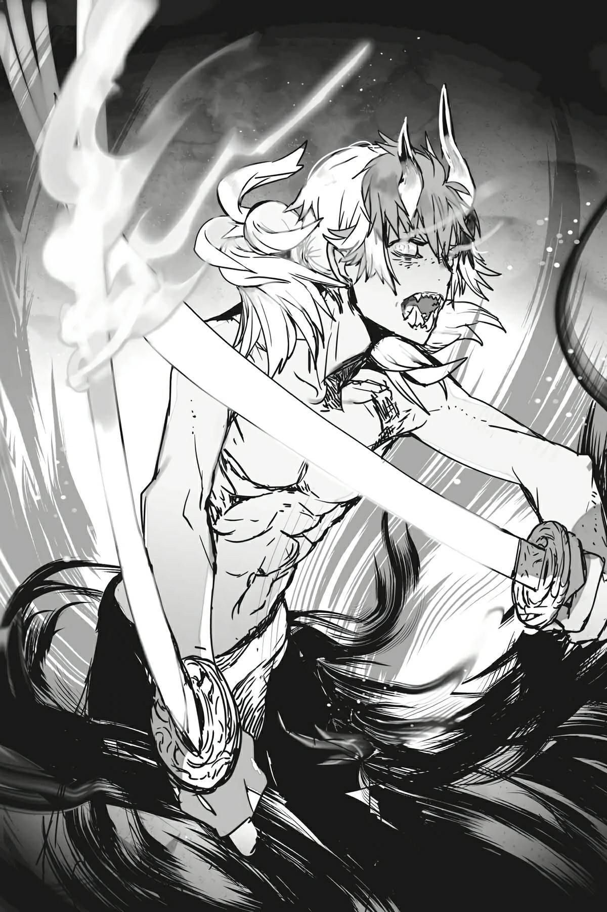

# Chương X1: Cựu Kiếm Vương Reigar
*(X1: The Former Sword-King Reigar)*

Ta đã chiến đấu bằng tất cả khả năng của mình.

Nhìn lại cuộc đời, hơn nửa thời gian của ta đã trôi qua trên sa trường, những ngày tháng nhuốm sắc bạc của thép lạnh và sắc đỏ của máu tươi.

Ta từng kiêu hãnh.

Là Kiếm Vương, người đứng đầu Đế quốc Renxandt, phòng tuyến cuối cùng của nhân loại. Ta từng tự phụ mình chính là người bảo hộ của loài người.

Ta đã từng mơ ước.

Rằng một ngày nào đó, ta sẽ tiêu diệt hoàn toàn quỷ tộc và mang lại nền hòa bình vĩnh cửu.

Thuở niên thiếu, ta thực sự tin mình có thể làm được điều đó.

Nhưng thế giới không dễ dàng lay chuyển như vậy.

Cái chết luôn là kẻ đồng hành thường trực của ta.

Dù xác kẻ thù chất cao vô tận, ta cũng đã chứng kiến ngần ấy chiến hữu trở về với Thần Ngôn.

Bản thân ta cũng đã vô số lần cận kề với cái chết.

Và rồi ta sớm kiệt quệ...

...trước những ngày tháng chiến đấu không hồi kết, điệu nhảy không ngừng nghỉ với tử thần này.

Ta bắt đầu nghi ngờ.

Tại sao chúng ta phải chiến đấu?

Con người và ác quỷ hiến dâng sinh mạng của mình chỉ để kéo dài một cuộc chiến vô tận.

Họ đều chết theo cùng một cách: bê bết máu, gào thét, và đầy rẫy hối tiếc.

Không có chỗ cho hy vọng hay ước mơ trên chiến trường. Chỉ có chém giết.

Ta từng chiến đấu vì niềm kiêu hãnh, vì những ước mơ của mình.

Nhưng chẳng mấy chốc, tất cả bắt đầu phai nhạt.

Khi đã quá mỏi mệt vì phải dành những ngày tháng bên cạnh tử thần, ta bắt đầu tự hỏi ý nghĩa của cuộc xung đột này là gì.

Dù vậy, ta không còn lựa chọn nào khác ngoài việc tiếp tục chiến đấu.

Bởi ta là Kiếm Vương.

Kiếm sĩ mạnh nhất còn sống, người lãnh đạo Đế quốc Renxandt.

Sát cánh cùng chiến hữu của mình, vị pháp sư mạnh nhất còn sống, ta có sứ mệnh dẫn dắt nhân loại đến chiến thắng.

Và vì mục tiêu đó, số mệnh định sẵn ta phải đứng trên chiến trường cho đến cuối đời.

"Sức mạnh thần bí của ta tồn tại là để bảo vệ những người vô tội."

Luôn ở bên cạnh ta, vị pháp sư vô song Ronandt đã nói vậy mà không một chút nghi ngờ.

Lão luôn trung thành với đức tin của mình và không ngần ngại sử dụng sức mạnh vì chúng.

Ta từng ghen tị với lối sống giản đơn, chân thành của lão, sự kiên định trong niềm tin và sự tự tin của lão.

Sự sẵn lòng chiến đấu không lay chuyển vì lý tưởng của lão ngay cả khi bị bao vây bởi cái chết.

Dù đôi khi lão có thể lập dị và khó lường, người đàn ông tên Ronandt chắc chắn là một anh hùng.

Đó là lý do tại sao ta tin rằng chỉ cần nhân loại còn Ronandt, họ sẽ an toàn mà không cần đến ta.

Dù nếu ta nói điều đó với lão, chắc chắn lão sẽ quát lên: "Ngươi đang nói cái thứ ngu ngốc gì thế?!"

Và thế là, khi Ma Vương tiền nhiệm bị đánh bại, ta đã từ giã thế sự.

Thực tế là quỷ tộc đã đến giới hạn, và do đó cả hai bên đều không còn sức lực để chiến đấu, điều này càng thúc đẩy ta quyết định.

Không có chiến tranh, ta không còn vai trò gì để đóng diễn nữa.

Ta đã dành hơn nửa đời mình trên sa trường, nên ta xuất sắc trong việc vung kiếm và chỉ huy quân đội, nhưng ta không có thiên phú trị quốc.

Trong chiến trận, ít nhất ta có thể đóng vai trò là một thủ lĩnh quân sự tạm ổn.

Nhưng trong một kỷ nguyên không có chiến tranh, người dân cần một vị vua hiền triết có thể giữ cho đế quốc ổn định, chứ không phải một kẻ mà tài năng duy nhất chỉ nằm trên chiến trường.

Ta thoái vị khỏi ngôi vị Kiếm Vương, tuyên bố con trai ta là người kế vị, rồi rời đi.

Có lẽ ta đang bị trừng phạt.

Hoặc giả đây chính là lý do ta có mặt ở đây.

Vài ngày qua, ta có thể nhận thấy điều gì đó bất thường trên núi. Cũng rõ ràng là nguyên nhân của sự hỗn loạn đó đang tiến về phía ta.

Lũ rồng sống ở Dãy núi Huyền Bí đã cố gắng ngăn cản nó, nhưng cuộc chiến của chúng đã vô ích, bởi sinh vật ấy đang tiếp cận ngày một gần hơn, không thèm che giấu địch ý của mình.

Ta không biết điều gì sẽ xảy ra một khi nó đến nơi này, nhưng khi ngay cả lũ rồng cũng không thể ngăn cản nó, ta đoán những gì nó làm tiếp theo là điều hiển nhiên.

Một sự tàn phá thảm khốc sẽ đổ ập xuống vùng đất này.

Trong dãy núi này, chỉ có ta là đủ sức mạnh để chống lại nó.

Nói vậy chứ, sau nhiều năm rời xa chiến trường, ta không còn sở hữu sức mạnh như xưa nữa.

Ngay cả khi còn ở thời đỉnh cao, ta cũng không thể nói chắc mình sẽ ra sao trước một sinh vật mà ngay cả rồng cũng không thể cản bước.

Dù vậy, ta không có lựa chọn nào khác ngoài việc khiêu chiến kẻ xâm nhập này.

Ta phải trả món nợ cho vùng đất này vì đã cho phép ta sống yên bình ở đây suốt những năm qua.

"Hừm..."

Ta thở dài một tiếng thật to, hy vọng trục xuất lớp rỉ sét đã tích tụ trong cơ thể suốt thời gian dài rời xa sa trường.

Như thể để trút bỏ hơi ấm ta đã tích lũy trong những thời khắc hòa bình này.

Mọi người khác đều đã được sơ tán.

May mắn thay, vì ngôi làng nằm dưới chân Dãy núi Huyền Bí nên dân số rất ít.

Cuộc sơ tán diễn ra nhanh chóng, nên trong trường hợp xấu nhất, ngay cả khi ngôi làng bị hủy diệt trong cuộc đụng độ sắp tới, tổn thất nhân mạng sẽ không đáng kể.

Tất nhiên, ta muốn tránh điều đó, nên ta đang đứng đợi cách ngôi làng một khoảng.

Ta đã chuẩn bị sẵn sàng để chặn đánh kẻ địch.

Bộ giáp ta mặc khi còn làm Kiếm Vương vẫn ở lại quê hương. Nó thuộc về ngai vàng và đế quốc, chứ không phải ta.

Vì ta đã thoái vị, ta không còn quyền sử dụng nó nữa.

Thay vào đó, ta mặc bộ giáp dự phòng được chế tạo bằng phương tiện của riêng mình.

Nó có thể không so được với bộ giáp Kiếm Vương ta để lại, nhưng nó vẫn là trang bị hạng nhất: Toàn bộ set đồ được làm từ di cốt của Hắc Long quý hiếm.

Hắc Long, giống như Quang Long, hiếm khi xuất hiện trước con người.

Nói chung, loài rồng rất ít khi được nhìn thấy trừ khi có kẻ xâm nhập vào lãnh địa của chúng, nhưng đối với trường hợp của Hắc Long và Quang Long, lãnh địa của chúng không dễ xác định như vậy.

Bộ giáp của ta được cho là làm từ nguyên liệu của một con Hắc Long mà vị anh hùng thế hệ trước đã vô tình đánh bại cách đây vài đời.

Ta đã để lại một bộ giáp khác của riêng mình ở đế quốc.

Nó có khả năng làm suy yếu đối thủ.

Tất cả loài rồng đều có thể giảm bớt hiệu ứng của ma pháp, nhưng Hắc Long còn sở hữu thuộc tính Nguyền Rủa.

Nếu ngươi chém đối thủ bằng một thanh kiếm làm từ vật liệu Hắc Long, nó sẽ làm suy giảm sức mạnh cũng như ma lực của chúng.

Với khả năng làm suy yếu ma pháp tiềm ẩn, thanh kiếm có thể cắt đứt khả năng thi triển gần như mọi phép thuật của đối phương.

Bộ giáp cũng có khả năng phòng ngự ma pháp mạnh mẽ.

Nó rất phù hợp với ta, vì ta thành thạo cận chiến hơn.

Nó vẫn kém hơn một chút so với bộ giáp Kiếm Vương của ta, báu vật của đế quốc được làm từ vật liệu của một con Nữ hoàng Taratect mà vị anh hùng tiền nhiệm đã đánh bại với cái giá là gần như toàn bộ quân đội của mình. Dù vậy, đây vẫn là một thanh kiếm và bộ giáp mạnh mẽ mà không nghi ngờ gì sẽ được nhiều thống lĩnh lừng danh thèm muốn.

Tuy nhiên, ngay cả khi có bộ giáp đó bên mình lúc này, ta nghi ngờ nó cũng không mang lại nhiều sự an ủi.

Suy cho cùng, ngay cả rồng thực sự cũng không thể ngăn cản sinh vật này.

Kìm nén nỗi bất an, ta kiểm tra lại công tác chuẩn bị một lần nữa.

Ta đã sẵn sàng nhất có thể.

Ta cũng mang theo tất cả các loại dược phẩm phục hồi của mình: một loại dược phẩm cao cấp có thể chữa lành vết thương chí mạng ngay tức khắc, dược phẩm phục hồi ma lực và thể lực, và thậm chí cả dược phẩm giải trừ trạng thái bất thường, tất cả đều nằm trong chiếc túi [Lưu trữ Không gian] nhỏ treo bên hông ta.

Những lọ dược phẩm và bản thân chiếc túi có giá trị bằng cả một gia tài nhỏ, nhưng vì ta sắp sửa đối mặt với cái chết, ta sẽ không ngần ngại sử dụng chúng.

Ta rất có thể sẽ chết.

Nếu rồng không thể ngăn cản sinh vật này, ta không thấy có cơ hội chiến thắng nào.

Tất cả những gì ta có thể làm là câu kéo nhiều thời gian nhất có thể để những dân làng khác chạy trốn.

Ta thậm chí còn không biết liệu sự hy sinh này có ý nghĩa gì hay không.

Liệu có khoảng cách nào đủ để ngăn cản một kẻ địch mạnh mẽ thế này tìm ra họ không?

Nỗi sợ duy nhất của ta lúc này không phải cái chết của bản thân, mà là liệu ta có câu kéo đủ thời gian cho họ chạy thoát hay không.

Liệu cái chết của ta có ý nghĩa hay không.

Nhưng chắc chắn điều đó vẫn tốt hơn là không làm gì cả.

Một cái chết trên chiến trường phù hợp với ta hơn là việc chỉ già đi và chờ đợi cái chết.

Nghĩ đến vô số mạng người đã bị đôi tay này cướp đi, việc ra đi thanh thản trong giấc ngủ sẽ là một kết cục không tương xứng, nói một cách nhẹ nhàng nhất.

Nhưng ta đã chấp nhận điều này.

Dù phương thức ta rời bỏ thế giới này có thể chứng minh là vô nghĩa, người ta sẽ rất khó tìm thấy ý nghĩa trong cái chết hay chiến tranh nói chung.

Đó là kết luận ta đạt được sau khi thoát khỏi chiến trận và biết đến hòa bình trong một thời gian.

Cuối cùng, chiến tranh không có ý nghĩa gì cả.

Trong bức tranh lớn hơn, nó có thể là vì lợi ích của đất nước hay người dân, nhưng đối với một cá nhân, không có ý nghĩa nào được tìm thấy trong cái chết.

Tất cả những gì quan trọng là liệu hoàn cảnh của cái chết có thể được chấp nhận hay không.

Và ngay lúc này, ta đã chấp nhận chúng.

Như vậy là đủ tốt cho ta rồi.

Ta đã quyết định đây sẽ là nơi người đàn ông từng được biết đến như Kiếm Thần qua đời.

Với quyết tâm sắt đá, ta chờ đợi thời khắc của mình đến.

Và rồi, nó sớm đến.

"Thật bất ngờ," ta lẩm bẩm vô thức.

Từ sự hiện diện áp đảo cảm nhận được, ta đã tưởng tượng ra vô số ác linh gớm ghiếc, nhưng sinh vật trước mặt ta là một dạng nhân hình và trông giống như một cậu thiếu niên.

Nhưng bất chấp vẻ ngoài trẻ trung đó, cậu ta sở hữu hào quang của một con ác quỷ ăn thịt người.

Chỉ riêng việc đối mặt với cậu ta cũng đủ khiến ta toát mồ hôi đầm đìa bên trong bộ giáp.

Cứ như thể tất cả sự xấu xa và tàn bạo trên thế giới này đã kết tinh vào duy nhất một cậu bé này vậy.

"Graaaaaah!"

Con ác quỷ gầm lên.

Đồng thời, con rồng vẫn đang chiến đấu chống lại cậu ta trút hơi thở cuối cùng.

Hửm? Cơ thể con ác quỷ vừa phát sáng trong một khoảnh khắc. Đó là gì vậy?

Vết thương của nó đang lành lại?

Trận chiến của họ chắc chắn phải khốc liệt ngoài sức tưởng tượng, bởi cả rồng lẫn ác quỷ đều đầy rẫy những vết thương sâu hoắm, nhưng giờ đây thương tích của con ác quỷ đã biến mất trong một tia sáng.

Có lẽ cậu ta đã làm chủ được một loại ma pháp trị liệu cực kỳ tiên tiến nào đó, dẫu ta chưa từng nghe nói có loại nào mạnh mẽ đến thế này.

Dù sao đi nữa, giờ đây những vết thương cậu ta gánh chịu khi chiến đấu với lũ rồng đã được chữa lành, ta đoán cơ hội chiến thắng của mình thấp hơn bao giờ hết.

Ta từng nuôi giữ một chút hy vọng nhỏ nhoi, nhưng có vẻ ngay cả điều đó cũng đặt sai chỗ rồi.

"Không có gì trên đời diễn ra suôn sẻ cả, nhỉ?"

Nghe thấy giọng nói của ta, con ác quỷ quay ngoắt lại và lao thẳng về phía ta với một tiếng gầm đáng sợ khác.

"Graaaaaah!"

Vậy là sẽ không có cuộc trò chuyện nào với cậu ta rồi.

Khi nhìn thấy hình dáng nhân hình của cậu ta, ta đã nghĩ có thể có cơ hội nào đó để chúng ta giao tiếp và giải quyết mọi chuyện bằng lời nói, nhưng cậu ta không có dấu hiệu nào cho thấy mình hiểu tiếng người cả.

Ngay cả khi hiểu, vẫn có những trận chiến mà người ta không thể tránh khỏi, giống như cuộc chiến chống lại quỷ tộc vậy.

Nếu có gì khác, việc biết đối thủ của mình thú tính đến mức không thể lý luận được nghĩa là ta có thể chiến đấu mà không cần do dự.

"Ta là Reigar Baint Renxandt, Kiếm Thần, và ta khiêu chiến ngươi."

Ta nghi ngờ đối thủ hiểu lời giới thiệu của mình, nhưng vì cậu ta chắc chắn sắp giết ta, ta ước ao cậu ta nghe được tên mình.

Ta đoán đây là một cách khác để chấp nhận cái chết trên chiến trường.

Quả nhiên, con ác quỷ phớt lờ lời nói của ta và vung những thanh kiếm của nó lên.

Ta né một đường và đỡ một đường kiếm khác.

Phải, con ác quỷ sử dụng song kiếm, mỗi tay một thanh.

Mặc dù điều này cho phép người sử dụng có nhiều lựa chọn tấn công hơn, nhưng rất khó để duy trì sức tấn công và phòng ngự ở cả hai tay, nên đây là một phong cách hiếm khi được sử dụng.

Những thanh kiếm của con ác quỷ cũng được chế tạo theo kiểu dáng lạ lẫm: lưỡi kiếm thanh mảnh, hơi cong nhẹ.

Chúng trông thiên về tấn công hơn là phòng thủ, phù hợp với phong cách song kiếm của cậu ta.

Trên thực tế, có vẻ như cậu ta đã hoàn toàn từ bỏ phòng ngự.

Lao thẳng vào chiến trận một cách liều lĩnh, không bận tâm đến việc cơ thể mình có bị thương hay không... Ta đoán đó là cách một con ác quỷ nên hành động.

Nếu hai thanh kiếm thiên về tấn công đó chém trúng thanh kiếm của ta ở một góc chuẩn xác, chúng có thể sẽ bẻ gãy nó.

Đó là lượng sức mạnh ẩn sau đòn tấn công đầu tiên của cậu ta.

Thực tế, bất kỳ đòn tấn công nào của cậu ta cũng có thể dễ dàng kết liễu mạng sống của ta.

Như để chứng minh điều đó, lưỡi kiếm bị ta đỡ ra của con ác quỷ ngọt xới lướt qua nền đất cứng mà không gặp chút lực cản nào.

Từ khoảnh khắc đầu tiên nhìn thấy con quái thú này, ta đã biết cậu ta mạnh hơn ta, vì vậy ta đã đề phòng sẵn, nhưng điều này vượt xa bất cứ điều gì ta dự tính.

"Graaaaaah!"

Con ác quỷ lại gầm lên.

Bằng cách nào đó, chính âm thanh ấy đã tác động lên ta như một cú giáng mạnh.

Cơn đau nhức nhối xộc thẳng vào tai ta, gây ra sự đau đớn tột cùng về mặt thể xác.

Ngay cả khi không sử dụng kỹ năng, một tiếng gầm đơn thuần cũng đủ gây ra điều này sao?

Con ác quỷ giậm chân bước tới và vung kiếm một lần nữa.

Ta nhảy lùi lại, né tránh gần như quá đà sang một bên.

Nhưng con ác quỷ vượt qua toàn bộ khoảng cách khó khăn đó chỉ trong một bước chân, đáp xuống ngay vị trí ta vừa đứng vài giây trước.

Tia sét màu tím phóng ra thành một đường thẳng từ thanh kiếm trên tay trái của cậu ta.

Ta biết ngay mà. Một thanh ma kiếm.

Và là loại cực kỳ mạnh mẽ.

Ngay cả sau khi chém qua con rồng đó, những thanh kiếm của cậu ta không có lấy một dấu vết hư hại.

Bất chấp sự mỏng manh của chúng, có thể an tâm nói rằng những lưỡi kiếm này cực kỳ chắc chắn.

Vì vậy, có lẽ giả định của ta rằng chúng không được chế tạo để phòng thủ cũng là sai lầm. Nếu ta tấn công mà không cân nhắc điều đó, đó có thể là dấu chấm hết cho ta.

Và dù con ác quỷ này trông như đang vung kiếm điên cuồng trong cơn cuồng nộ vô tri, phong cách chiến đấu của cậu ta không chỉ có sức mạnh thô bạo. Nếu không, cậu ta đã không thể tận dụng sức mạnh của ma kiếm.

Dù có vẻ như đã mất đi lý trí, con ác quỷ đang vận dụng tốt các kỹ thuật cực kỳ tiên tiến.

Kiếm thuật của cậu ta thiếu đi sự trau chuốt, nhưng cậu ta dường như nắm giữ rất chắc các kiến thức cơ bản.

Không sinh vật mất trí nào có thể chiến đấu theo cách này.

Thật là một đối thủ nguy hiểm.

Nếu cậu ta chỉ đơn thuần là hoành hành bằng sức mạnh thô bạo, thì cậu ta sẽ dễ đối phó hơn nhiều.

Ta phải luôn cảnh giác.

Biết đâu cơn điên loạn này chỉ là một màn kịch. Mọi khả năng cần được xem xét.

Các chỉ số của cậu ta vốn đã vượt trội hơn ta rất nhiều.

Bao nhiêu sự cẩn trọng cũng không bao giờ là thừa.

Con ác quỷ vung kiếm.

Một đòn tấn công vụng về, giống như một đứa trẻ đang giận dỗi ăn vạ.

Nhưng nếu bất kỳ đòn tấn công nào trong số đó trúng đích, đó sẽ là kết cục của ta.

Và ngay cả khi chuyển động của cậu ta có vẻ nghiệp dư, tốc độ vung kiếm của cậu ta vẫn nhanh hơn mức một người bình thường có thể nhìn thấy.

Ngay cả ta, người từng được mệnh danh là kiếm sĩ mạnh nhất thế giới, cũng chỉ vừa vặn theo kịp bằng mắt.

Chỉ bằng cách quan sát chuyển động của con ác quỷ và dự đoán quỹ đạo của các lưỡi kiếm, ta mới có thể đỡ hoặc né tránh các đòn đánh của cậu ta.

Nếu ta lơ là cảnh giác dù chỉ một tích tắc, mạng sống của ta sẽ tiêu tùng.

"Graaaaaah!"

Con ác quỷ gầm lên giận dữ và vung thanh kiếm bên tay phải.

Ngọn lửa bùng lên từ lưỡi kiếm, bao trùm lấy cơ thể con ác quỷ.

Hóa ra cả hai thanh kiếm của cậu ta đều là ma kiếm, chứ không chỉ thanh kiếm lôi bên tay trái.

Vẫn được bao bọc trong ngọn lửa, con ác quỷ giương cao kiếm và lao tới.

Nhưng trong khi một đòn tấn công trực diện có thể là chuyện khác, ngọn lửa rực rỡ thậm chí không hề thiêu rụi chủ nhân của nó chỉ là mồi ngon cho trang bị Hắc Long của ta!

Ngay khi thanh ma kiếm của ta chạm vào ngọn lửa, sức mạnh nguyền rủa của Hắc Long đã rút cạn năng lượng của nó, làm suy yếu ngọn lửa cho đến khi chúng biến mất hoàn toàn.

Tận dụng sự kinh ngạc của con ác quỷ, ta vung kiếm và chém một nhát duy nhất lên cơ thể cậu ta.

Nhưng nhát chém của ta quá nông, và da của cậu ta rất dai.

Thay vì cảm giác lưỡi kiếm cắm vào xương thịt, ta chỉ cảm nhận được thanh kiếm của mình bị bật ra bởi thứ gì đó cứng rắn. Chưa nói đến việc cắt vào da thịt, kiếm của ta thậm chí không hề đâm xuyên qua da của cậu ta.

Tuy nhiên, sức mạnh của Hắc Long vẫn tiếp cận được cậu ta.

Dù ta không thể thấy rõ sự khác biệt, lời nguyền của Hắc Long chắc chắn đã làm giảm các chỉ số của cậu ta.

Dù mức độ giảm có nhỏ thế nào đi nữa, nếu ta tiếp tục chém cậu ta, cuối cùng ta có thể làm suy yếu cậu ta đến mức lưỡi kiếm của ta có thể đâm thủng lớp da đó.

Tất nhiên, ta biết rất rõ việc đó sẽ khó khăn đến nhường nào.

Và ta không có cách nào biết được liệu mình có thể làm cậu ta bị thương hay không ngay cả khi đã làm suy yếu được cậu ta.

Lời nguyền của Hắc Long rất mạnh mẽ, nhưng có giới hạn về mức độ nó có thể làm giảm chỉ số của mục tiêu.

Nếu ta chạm tới ngưỡng giới hạn đó, liệu ta có thể gây sát thương cho cậu ta không?

Và ngay cả khi có thể, ta vẫn sẽ phải tiếp tục chém cho đến khi bào mòn được HP của cậu ta.

Tỷ lệ thành công của ta gần như bằng không.

Trong khi ta phải tung ra hàng trăm hay hàng ngàn đòn tấn công để đánh bại cậu ta, con ác quỷ chỉ cần chém trúng ta đúng một lần.

Cơ hội duy nhất của ta phụ thuộc vào việc kéo dài trận chiến mà ở đó ta không được phép lơ là cảnh giác dù chỉ một khắc.

Ngay cả thế, ta vẫn không biết liệu mình có giành chiến thắng được hay không.

Ta chưa bao giờ chiến đấu trong một trận chiến khó khăn đến thế này, ngay cả khi còn làm Kiếm Vương.

Nhưng ta đã biết điều đó ngay từ đầu.

Thực tế là ta có thể nhìn thấy dù chỉ một cơ hội chiến thắng nhỏ nhoi nhất đã là vận may tốt hơn ta mong đợi.

Ta sẽ câu giờ, đúng như kế hoạch.

Nếu đối thủ của ta là một sinh vật khổng lồ như rồng, ta có lẽ đã không thể làm được đến mức này.

Nhưng con ác quỷ này có hình nhân hình và còn thiếu kỹ năng.

Nếu ta có thể câu giờ trước cậu ta bất chấp việc chỉ số kém xa, thì có lẽ đó đã là điều tốt nhất ta có thể hy vọng.

Vì vậy, ta sẽ tiếp tục câu giờ, đồng thời bám víu vào tia hy vọng chiến thắng mong manh nhất.

Ngay cả khi ta phải sử dụng đến từng kỹ thuật cuối cùng mà ta đã thuần thục trong suốt thời gian làm Kiếm Thần.

Bao nhiêu thời gian đã trôi qua rồi?

Cảm giác như thể một khoảnh khắc và một cõi vĩnh hằng đã trôi qua cùng một lúc.

Con ác quỷ này cho đến nay là đối thủ mạnh nhất ta từng đối mặt.

Và đây cũng có lẽ là trận chiến dài nhất mà ta từng tham gia.

Mặt trời đã mọc rồi lặn bao nhiêu lần rồi?

Kể từ khi phải gạt bỏ mọi suy nghĩ không thiết yếu, ta đã sớm mất dấu thời gian từ lâu.

Càng tập trung, ta càng cảm thấy ý thức của mình đang phai nhạt dần.

Ta quên đi mục đích của mình, tất cả chỉ để dành thêm nhiều sự tập trung hơn cho cuộc chiến.

Chính bản sắc của ta đã bị hy sinh cho đại cuộc. Ta chỉ còn là một cái xác được rèn giũa cho trận chiến.

Ta chưa bao giờ tưởng tượng rằng, ở độ tuổi này, ta lại có thể chạm tới những đỉnh cao kiếm thuật vĩ đại hơn nữa.

Chém đứt cả sấm sét. Thật tuyệt nếu có thể truyền lại trải nghiệm này cho một đệ tử, mặc dù ta nghi ngờ liệu có ai có thể bắt chước được nó hay không.

A, nhưng hồi kết đã cận kề rồi.

Thực tế là việc ta có những suy nghĩ này đã là minh chứng rõ ràng cho điều đó.

Ta đã đẩy bản thân đến giới hạn và từ bỏ mọi ý nghĩ để tập trung vào trận chiến, nhưng trạng thái tinh thần đó đã bắt đầu phai nhạt.

Bởi ta đang chạm tới giới hạn thể lực của mình.

Ta đã ngăn chặn mọi đòn tấn công của con ác quỷ: những nhát chém từ kiếm, những ngọn lửa đáng sợ, những tia chớp dữ dội, tất cả.

Nhưng dù tránh được các đòn đánh trực diện, ta vẫn phải chịu sát thương.

Việc đỡ những thanh kiếm của con ác quỷ đã bào mòn xương cốt ta.

Lửa nóng đã thiêu sém da ta.

Và ánh chớp cùng tiếng đùng đoàng của sấm sét không ngừng tấn công các giác quan của ta.

Bộ giáp Hắc Long của ta, thứ đã bảo vệ ta vô số lần trong suốt trận chiến, đã dần mất đi hình dạng ban đầu và không còn sức mạnh để bảo vệ ta nữa.

May mắn thay, bằng việc hy sinh bộ giáp đó, ta đã có thể bào mòn ma lực của con ác quỷ.

Không lâu trước khi bộ giáp vỡ nát, con ác quỷ đã ngừng sử dụng các khả năng của ma kiếm. Ta đoán cậu ta đã cạn kiệt ma lực và không còn khả năng kích hoạt chúng nữa.

Nhờ sự hy sinh của bộ giáp, ta cũng có thể hồi phục vết thương trong vài kẽ hở quý giá giữa các đợt tấn công của con ác quỷ bằng cách uống dược phẩm trị liệu, cũng như dược phẩm ma lực và thể lực.

Ta đã nhét vào túi [Lưu trữ Không gian] của mình nhiều dược phẩm nhất có thể—đủ để chiến đấu liên tục trong hai hoặc ba ngày.

Và ta tự tin rằng mình đã chiến đấu với tất cả khả năng của mình trong suốt thời gian qua.

Thực tế, ta thậm chí có thể đã thể hiện sức mạnh trong trận chiến này nhiều hơn những gì ta từng có trong thời hoàng kim của mình.

Mặc dù kiếm của ta đã rỉ sét sau một thời gian dài rời xa chiến trường, nhưng dường như nó đã trở lại với toàn bộ sức mạnh và thậm chí còn hơn thế nữa.

Ta đã mài giũa các kỹ năng của mình vượt qua cả trạng thái trước đây, chỉ vì không có gì kém hơn là đủ để chạm tới đối thủ.

Yet ngay cả bây giờ, ta vẫn không thể đánh bại cậu ta.

Với mỗi chuyển động, ta cảm thấy cơ bắp của mình rách ra và xương cốt vỡ vụn.

Với mỗi hơi thở, ta nếm trải vị máu. Ta nhăn mặt vì đau đớn.

Việc ta vẫn còn đứng vững trên đôi chân này không gì khác ngoài một phép màu.

Dù có vẻ như phép màu đã đi đến hồi kết.

Giáp của ta đã vỡ, và ta đã cạn kiệt từng lọ dược phẩm cuối cùng trong kho dự trữ của mình.

Ta thậm chí đã uống cả các loại dược phẩm hồi phục trạng thái bất thường, chỉ để làm dịu cơn khát và xoa dịu cơn đói của mình.

Ta không thể bước thêm một bước nào nữa.

Thế nhưng ta sẽ không hạ kiếm xuống.

Ngay cả bây giờ khi nó đã nứt nẻ đến mức không thể sửa chữa và sẽ không chịu nổi một đòn đánh nào nữa.

Đây sẽ là những suy nghĩ cuối cùng của ta.

Ta đã chiến đấu với tất cả khả năng của mình và vượt qua cả giới hạn đó.

Đây chắc chắn phải là ý nghĩa của việc thực sự chiến đấu đến chết.

Ta đã cận kề cái chết trên chiến trường nhiều lần, nhưng đây là lần đầu tiên ta vắt kiệt sức lực của mình đến tận cùng giới hạn, cả về thể xác lẫn tinh thần.

Trong luyện tập, ta từng kiệt sức đến mức ngã quỵ.

Ta từng bị bất tỉnh bởi những vết thương gần như chí mạng.

Nhưng không điều nào trong số đó đáng sợ như sự kiệt quệ này.

Cơ thể ta thực sự đã tan hoang.

Thế nhưng lòng ta lại nhẹ nhõm đến lạ lùng.

Có lẽ là vì, trong trận chiến với con ác quỷ này, ta đã vứt bỏ những thứ không cần thiết.

Không ước mơ, không kiêu hãnh, chỉ có sức mạnh thuần túy của thanh kiếm.

Ta vung lưỡi kiếm bằng tất cả sức mạnh của mình, không cảm thấy bất kỳ nghĩa vụ hay nỗi sợ hãi cái chết nào.

Phải, đây là một kết cục phù hợp với ta hơn nhiều so với bất kỳ cái chết thanh thản nào trong giấc ngủ.

Bởi ngay cả sau ngần ấy thời gian rời xa sa trường, ta vẫn vô cùng vui sướng trước cơ hội được chiến đấu hết mình.

Cuối cùng, ta không có lựa chọn nào khác ngoài việc sống bằng kiếm và chết bằng kiếm.

Và còn gì may mắn hơn khi được chấp nhận số phận đó trong cái chết?

Hầu hết những người ngã xuống trên chiến trường đều chết vô nghĩa, không chấp nhận số phận của mình trong cuộc đời.

Ta không biết liệu có ý nghĩa nào trong sự hy sinh này không. Nhưng ta có thể chấp nhận nó.

Có lẽ đó là lý do tại sao, dẫu ta đã đặt cược cả linh hồn mình vào trận chiến này và sắp sửa chịu một thất bại hoàn toàn, ta không hề cảm thấy oán hận.

Trên thực tế, ta cảm thấy hạnh phúc.

Thế nhưng, giờ đây khi ta không thể bước thêm bước nào nữa, con ác quỷ vẫn không ra tay hạ sát ta.

Chúng ta chỉ đơn giản là nhìn chằm chằm vào nhau, mặt đối mặt, không ai nhúc nhích dù chỉ một inch.

Một sự im lặng kỳ lạ bao trùm lấy cả hai. Đột nhiên, con ác quỷ thả lỏng tư thế và cúi đầu xuống.

Có lẽ cậu ta đã tỉnh táo lại... hay là không?

Cơ thể con ác quỷ vẫn tỏa ra một luồng sát khí đáng sợ.

Ta không biết con quỷ này đến từ đâu hay chuyện gì đã xảy ra trong quá khứ của cậu ta.

Nhưng sau khi đọ kiếm lâu như vậy, ta đã hiểu được cậu ta.

Cậu ta chắc chắn đã phải trải qua một bi kịch khủng khiếp trong quá khứ, đánh giá từ tiếng gào thét câm lặng mà ta cảm nhận được trong cổ họng cậu ta, và những đường kiếm của cậu ta nói lên nỗi buồn cùng sự phẫn nộ khôn nguôi.

Mặc dù đã mất đi lý trí và chỉ biết đến chiến đấu, một phần nào đó trong cậu ta vẫn đang than khóc cho sự mất kiểm soát của mình.

Và trong suốt trận chiến của chúng ta, ta có thể thấy rằng cậu ta đang học hỏi từ kiếm thuật của ta.

Sự thành thạo kiếm thuật của con ác quỷ đã tiến bộ vượt bậc trong suốt trận chiến, đến mức cậu ta đã vượt xa trình độ nghiệp dư ban đầu rất nhiều.

Việc tiếp tục nỗ lực cải thiện ngay giữa trận chiến, thậm chí là trong vòng vây của sự điên loạn, là điều gần như không tưởng.

Kỹ năng kiếm của cậu ta trở nên sắc bén hơn sau mỗi nhát chém, chuyển động của cậu ta ngày càng hiệu quả hơn, và cậu ta trở thành một đối thủ đáng gờm hơn gấp vô hạn khi thời gian trôi qua.

Cuối cùng, tất cả những gì ta có thể làm chỉ là đỡ các nhát chém của cậu ta; phản công không còn là một lựa chọn khả thi nữa.

Việc chỉ đơn thuần đỡ và né tránh cũng tiếp tục trở nên khó khăn hơn.

Cậu ta thực sự phải có một thiên phú xuất chúng mới có thể tiến bộ nhiều đến thế trong một thời gian ngắn như vậy.

Về điểm đó, ta không khỏi cảm thấy tiếc nuối.

Nếu cậu ta không bị chế ngự bởi cơn điên loạn, nếu ta có thể dạy dỗ cậu ta một cách đàng hoàng, cậu ta đã có thể chạm tới đỉnh cao tối thượng của kiếm thuật.

Ta nghi ngờ việc mình lại từng nghĩ như vậy về một kẻ đang cố gắng giết mình cho đến tận bây giờ.

"Danh hiệu [Thần Kiếm], minh chứng cho sự thăng hoa của lưỡi kiếm. Ta truyền lại nó cho ngươi."

Ta mở miệng và nói với con ác quỷ.

Cậu ta ngẩng đầu lên và lại giơ cao những thanh kiếm của mình.

Một khoảnh khắc sau, kiếm của ta gãy đôi, và chút sức lực cuối cùng cũng rời bỏ cơ thể ta.

Chỉ khi nhìn thấy vệt máu phun ra, ta mới nhận ra mình đã bị chém.

"Tuyệt vời."

Ta không còn lời nào khác.

Ta không thể truyền lại tất cả các kỹ thuật ta đã mài giũa trong cuộc đời này.

Nhưng trong trận chiến này, ta đã phô diễn cho đối thủ thấy rất nhiều trong số chúng.

Nếu ta có thể để lại dù chỉ một vài kỹ thuật trong đó, ta cũng đã mãn nguyện rồi.

Ta sống bằng kiếm, và giờ ta sẽ chết bằng kiếm.

Mặc dù ta đã nghi ngờ ý nghĩa của việc chiến đấu trong một thời gian dài, cuối cùng ta cũng đã thông suốt với nó.

Ronandt. Chiến hữu của ta. Bạn của ta.

Nếu ngươi chứng kiến cái chết này của ta, ngươi chắc chắn sẽ lên lớp dạy đời ta vì sự vô trách nhiệm này.

Nhưng ta hài lòng.

Dẫu có vô trách nhiệm thế nào đi nữa, ta giao lại đế quốc... và nhân loại... vào tay ngươi đấy.

***

"Hắt... xì!"

"Cái quái gì thế?! Ghê quá đi mất, Sư phụ! Người phun hết nước miếng lên người tôi rồi!"

"Hừm. Xin lỗi nhé. Chắc hẳn có ai đó đang nói xấu sau lưng ta."

"Chắc chắn là toàn điều xấu rồi."

"Nói nhảm gì thế! Nếu ngươi chịu lắng nghe kỹ hơn, chắc chắn dân chúng đang ca tụng tên tuổi của ta!"

"Ồ vâng, chắc thế. Khoan đã, Sư phụ, người đang khóc đấy à?"

"Hửm? Lạ thật đấy. Chắc có hạt bụi nào lọt vào mắt ta lúc hắt hơi thôi."

"Chắc hạt bụi đó phải to bằng quả núi mới khiến người khóc được."

"Im miệng đi con nhóc này. Đây, làm thêm bài tập về nhà đi."

"Cái gì cơ?! Ông là đồ ác quỷ! Có khi tôi sẽ giết ông rồi trốn khỏi cái địa ngục này mất thôi!"

"Oa-ha-ha! Không có thời gian nghỉ ngơi trên con đường dẫn đến đỉnh cao của thần bí thuật đâu! Ngươi sẽ không thấy ta chết cho đến khi chạm tới đỉnh cao nhất đâu!"

---

[◀ Chương trước: Đoạn phụ: Mối thâm thù bí mật của Quỷ tộc kỳ cựu](interlude_the_veteran_demons_secret_feud.md) | [Chương tiếp theo: Chương 2: Đến Lâu đài Ma Vương](02_arrival_at_the_demon_lords_castle.md)
